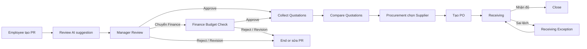

# User Flow - ProcureAI

## Main flow

## Role flows

| Role | Primary flow |
|---|---|
| Employee | Tạo PR → Review AI → Submit → Theo dõi trạng thái → Phối hợp Receiving |
| Manager | Xem PR → Budget visibility → Approve / Reject / Revision / Chuyển Finance |
| Finance | Kiểm tra Budget → Approve hoặc Reject theo policy |
| Procurement | Thu thập Quotation → Review extraction → Compare → Chọn Supplier → Tạo PO |
| Admin | Quản lý RBAC, danh mục, Budget và Audit Trail |

## Flow constraints

- Không Collect Quotations trước khi PR được Approve.
- Không tạo PO trước khi PR được Approve và Supplier được chọn.
- Không Close trước khi Receiving và đối soát `PR ↔ PO ↔ Receiving` hoàn tất.
- AI không thay thế quyết định của người có thẩm quyền.
