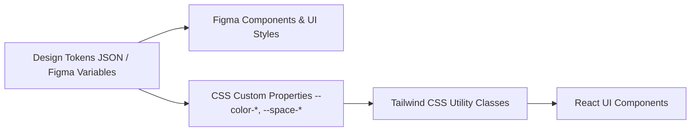

# 🎨 ProcureAI - Design Tokens & Styleguide (Quy Chuẩn Thiết Kế & Hệ Thống Token)

> **Dự án:** ProcureAI - AI-Assisted Procurement & Purchase Approval System  
> **Figma File:** [Group 1 Figma Design (Node: 0-1)](https://www.figma.com/design/Nc2pw0GQqNe3EzENakz79z/Group-1?node-id=0-1&p=f&t=FaKBsIFcslHisgTk-0)  
> **Định dạng:** Tuân thủ tiêu chuẩn [W3C Design Tokens Community Group Specification](https://design-tokens.github.io/community-group/format/)  
> **Tài liệu liên quan:** [`figma_specifications.md`](./figma_specifications.md), [`ui_component_library.md`](./ui_component_library.md), [`user_flows_and_wireframes.md`](./user_flows_and_wireframes.md)

---

## 1. Triết Lý Thiết Kế & Kiến Trúc Token (Design Philosophy & Architecture)

Hệ thống token của ProcureAI đóng vai trò là **Source of Truth duy nhất (Single Source of Truth)** giữa file thiết kế Figma và mã nguồn frontend (Tailwind CSS / CSS Variables). Mọi thay đổi về màu sắc, kiểu chữ hoặc khoảng cách đều bắt nguồn từ bảng token này.



### Quy Ước Đặt Tên (Naming Convention)
- **Figma Variables:** Định dạng gạch chéo phân cấp: `category/name/scale` (Ví dụ: `color/primary/600`).
- **CSS Variables:** Định dạng tiền tố gạch ngang: `--category-name-scale` (Ví dụ: `--color-primary-600`).
- **Tailwind Classes:** Tiện ích lớp: `bg-primary-600`, `text-primary-700`, v.v.

---

## 2. Bảng Màu Chuẩn (Color Palette & Semantic Tokens)

Màu sắc trong ProcureAI được tinh chỉnh để đạt độ tương phản chuẩn **WCAG 2.1 AA** (tỷ lệ tương phản tối thiểu 4.5:1 đối với văn bản thông thường và 3:1 đối với đồ họa/giao diện).

### 2.1 Màu Thương Hiệu & Tương Tác Chính (Primary Indigo)

| Figma Variable | CSS Variable | Giá Trị Hex | Tương Phản Text | Mục Đích Sử Dụng |
| :--- | :--- | :--- | :--- | :--- |
| `color/primary/50` | `--color-primary-50` | `#EEF2FF` | N/A (Nền) | Nền mục menu active, highlight dòng được chọn |
| `color/primary/100` | `--color-primary-100` | `#E0E7FF` | N/A (Nền) | Hover nhẹ trên nền sáng |
| `color/primary/200` | `--color-primary-200` | `#C7D2FE` | N/A (Viền) | Viền component trạng thái active |
| `color/primary/500` | `--color-primary-500` | `#6366F1` | 3.5:1 | Trạng thái phụ, focus ring |
| `color/primary/600` | `--color-primary-600` | `#4F46C6` | **4.9:1 (Trắng)** | **Màu nút Primary, icon chính, active tabs** |
| `color/primary/700` | `--color-primary-700` | `#4338A8` | **6.1:1 (Trắng)** | Trạng thái Hover / Pressed của nút Primary |
| `color/primary/800` | `--color-primary-800` | `#3730A3` | 7.8:1 | Chữ nhấn mạnh, tiêu đề phân hệ quan trọng |

### 2.2 Màu Trung Tính & Bề Mặt (Neutral Slate & Surface)

| Figma Variable | CSS Variable | Giá Trị Hex | Mục Đích Sử Dụng |
| :--- | :--- | :--- | :--- |
| `color/canvas` | `--color-canvas` | `#F5F6F8` | Màu nền toàn bộ ứng dụng (App background canvas) |
| `color/surface` | `--color-surface` | `#FFFFFF` | Nền Card, Panel, Modal, Data Table |
| `color/surface/muted` | `--color-surface-muted` | `#F9FAFB` | Nền Header bảng, hàng chẵn, vùng phụ |
| `color/border/subtle` | `--color-border-subtle` | `#EAECF0` | Đường kẻ chia dòng nhẹ (Divider) |
| `color/border` | `--color-border` | `#D0D5DD` | Đường viền Form input, viền card |
| `color/text/900` | `--color-text-900` | `#101828` | Tiêu đề chính (Page heading), text có độ ưu tiên cao |
| `color/text/700` | `--color-text-700` | `#344054` | Nhãn Form (Labels), nội dung Body chính |
| `color/text/500` | `--color-text-500` | `#667085` | Placeholder input, ghi chú nhỏ, metadata |
| `color/text/on-primary` | `--color-text-on-primary` | `#FFFFFF` | Chữ trắng hiển thị trên nút hoặc badge đậm màu |

### 2.3 Màu Ngữ Nghĩa Trạng Thái (Semantic Status Colors)

| Trạng Thái | Figma Variable | Hex | Nền Nhạt (50) | Chữ/Viền Đậm (700/600) | Ý Nghĩa Trong Quy Trình |
| :--- | :--- | :--- | :--- | :--- | :--- |
| **Success** | `color/success/600` | `#16803C` | `#ECFDF3` | `#027A48` | `Approved`, `Received`, `Closed`, Nút Phê duyệt |
| **Warning** | `color/warning/700` | `#B54708` | `#FFFAEB` | `#B54708` | `Revision Requested`, Vượt Budget, Nút Chuyển Finance |
| **Danger** | `color/danger/600` | `#B42318` | `#FEF3F2` | `#B42318` | `Rejected`, Lỗi hệ thống, Sai lệch giao hàng, Nút Từ chối |
| **Info / AI** | `color/info/600` | `#026AA2` | `#F0F9FF` | `#026AA2` | Trợ lý AI, Gợi ý so sánh báo giá, Đang thu thập |
| **Draft** | `color/neutral/600` | `#475467` | `#F2F4F7` | `#344054` | Trạng thái bản nháp đang soạn thảo |

---

## 3. Hệ Thống Kiểu Chữ (Typography Scale)

- **Phông chữ chủ đạo:** **Inter** (Dự phòng: `ui-sans-serif, system-ui, -apple-system, BlinkMacSystemFont, "Segoe UI", Roboto, sans-serif`).
- **Quy tắc hiển thị số tiền/tài chính:** Luôn kích hoạt thuộc tính OpenType: `font-variant-numeric: tabular-nums` để các con số thẳng hàng khi so sánh cột dọc.

| Token Kiểu Chữ | Size / Line-height | Font Weight | Letter Spacing | Ứng Dụng Trong Giao Diện |
| :--- | :--- | :--- | :--- | :--- |
| `--text-page-title` | `28px / 36px` | 700 (Bold) | `-0.02em` | Tiêu đề chính từng trang (H1) |
| `--text-section-title` | `20px / 28px` | 600 (SemiBold) | `-0.01em` | Tiêu đề các khối/card chức năng (H2) |
| `--text-subsection` | `16px / 24px` | 600 (SemiBold) | `0em` | Tiêu đề nhóm thông tin nhỏ, Card header (H3) |
| `--text-body` | `14px / 20px` | 400 (Regular) | `0em` | Nội dung văn bản thông thường, mô tả |
| `--text-body-strong` | `14px / 20px` | 600 (SemiBold) | `0em` | Nhãn Form, tên cột trong bảng, dữ liệu quan trọng |
| `--text-caption` | `12px / 18px` | 400 (Regular) | `0em` | Chú thích chân bảng, thời gian tạo, helper text |
| `--text-button` | `14px / 20px` | 600 (SemiBold) | `0em` | Nhãn trên các nút bấm (Button labels) |
| `--text-kpi-number` | `28px / 36px` | 700 (Bold) | `-0.02em` | Chỉ số thống kê tài chính, số tiền tổng (Tabular) |
| `--text-badge` | `12px / 16px` | 600 (SemiBold) | `0.01em` | Chữ trong huy hiệu trạng thái (Status badge) |

---

## 4. Hệ Thống Khoảng Cách & Lưới (Spacing, Grid & Layout Scale)

Dựa trên hệ thống cơ số 4px (**4px Grid System**).

```text
4px  ──> 8px  ──> 12px ──> 16px ──> 24px ──> 32px ──> 48px ──> 64px
(-1)     (-2)     (-3)     (-4)     (-6)     (-8)     (-12)    (-16)
```

| Spacing Token | Kích Thước (px) | Kích Thước (rem) | Áp Dụng Điển Hình |
| :--- | :--- | :--- | :--- |
| `--space-1` | `4 px` | `0.25 rem` | Khoảng cách viền badge, icon và nhãn nhỏ |
| `--space-2` | `8 px` | `0.50 rem` | Khoảng cách giữa icon và chữ trong button, gap inline |
| `--space-3` | `12 px` | `0.75 rem` | Padding dọc của ô nhập liệu (Input Y padding) |
| `--space-4` | `16 px` | `1.00 rem` | Padding ngang button, padding trong của Card nhỏ |
| `--space-5` | `20 px` | `1.25 rem` | Khoảng cách giữa các nhóm trường form |
| `--space-6` | `24 px` | `1.50 rem` | Padding của Card lớn, Modal dialog, Gutter cột |
| `--space-8` | `32 px` | `2.00 rem` | Padding trang Desktop (Outer Page Padding) |
| `--space-10` | `40 px` | `2.50 rem` | Chiều cao chuẩn của nút bấm và input (Height 40px) |
| `--space-12` | `48 px` | `3.00 rem` | Chiều cao hàng trong bảng dữ liệu (Table Row Height) |

---

## 5. Bo Góc, Đổ Bóng & Hiệu Ứng Bề Mặt (Radius & Shadows)

### 5.1 Bo Góc (Border Radius)

| Radius Token | Giá Trị | Áp Dụng Cho Thành Phần |
| :--- | :--- | :--- |
| `--radius-sm` | `4 px` | Tooltip, checkbox, tag nhỏ |
| `--radius-md` | `6 px` | **Input field, Button, Dropdown menu** |
| `--radius-lg` | `8 px` | **Card container, Bảng dữ liệu (Table), Modal dialog** |
| `--radius-xl` | `12 px` | Drawer panel trượt từ cạnh phải, AI Assistant Card |
| `--radius-full` | `9999 px` | **Status Badge (Viên thuốc), Avatar người dùng** |

### 5.2 Đổ Bóng (Box Shadows / Elevation)

| Shadow Token | Giá Trị CSS | Mục Đích |
| :--- | :--- | :--- |
| `--shadow-xs` | `0 1px 2px rgba(16, 24, 40, 0.05)` | Bề mặt Input field khi un-focus, nút thứ cấp |
| `--shadow-sm` | `0 1px 3px rgba(16, 24, 40, 0.1), 0 1px 2px rgba(16, 24, 40, 0.06)` | Thẻ Card thông tin, khối thống kê |
| `--shadow-md` | `0 4px 8px -2px rgba(16, 24, 40, 0.1), 0 2px 4px -2px rgba(16, 24, 40, 0.06)` | Dropdown select menu, Popover, Datepicker |
| `--shadow-lg` | `0 12px 16px -4px rgba(16, 24, 40, 0.08), 0 4px 6px -2px rgba(16, 24, 40, 0.03)` | Hộp thoại Modal, Drawer trượt |
| `--focus-ring`| `0 0 0 3px rgba(79, 70, 198, 0.25)` | Viền sáng khi tab focus vào nút hoặc ô nhập liệu |

---

## 6. Bộ Biểu Tượng Chuẩn (Iconography Standards)

Hệ thống sử dụng bộ icon vector chuẩn từ **Lucide Icons** (độ dày nét stroke: `1.75px` hoặc `2.0px`).

| Ý Nghĩa Giao Diện | Tên Icon Lucide | Kích Thước Chuẩn | Ngữ Cảnh Sử Dụng |
| :--- | :--- | :--- | :--- |
| **AI Assistant** | `Sparkles` | `18px` | Trợ lý chuẩn hóa PR, Đề xuất NCC |
| **Phê duyệt thành công** | `CheckCircle2` | `16px / 20px` | Nút Approve, Trạng thái Approved |
| **Từ chối** | `XCircle` | `16px / 20px` | Nút Reject, Trạng thái Rejected |
| **Chờ xử lý** | `Clock` | `16px` | Trạng thái Pending Approval |
| **Yêu cầu chỉnh sửa** | `RotateCcw` | `16px` | Trạng thái Revision Requested |
| **Chuyển Finance / Ngân sách** | `Landmark` | `16px` | Nút Send to Finance, Phân hệ Budget |
| **Cảnh báo vượt / Bất thường** | `AlertTriangle` | `16px / 20px` | Cảnh báo giá chênh ≥20%, Vượt hạn mức |
| **Thu thập báo giá** | `FileSpreadsheet` | `16px` | Tải lên báo giá, Trích xuất OCR |
| **So sánh đánh giá** | `Scale` | `16px` | Ma trận so sánh NCC |
| **Đơn đặt hàng (PO)** | `ShoppingCart` | `16px` | Tạo đơn PO, Danh mục PO |
| **Giao nhận kho** | `PackageCheck` | `16px` | Tiếp nhận hàng, Đối soát 3 bên |
| **Khóa / Hoàn tất** | `Lock` | `16px` | Trạng thái Closed, Không thể sửa |

---

## 7. Quy Chuẩn Responsive & Breakpoints

| Tên Điểm Cắt | Kích Thước (px) | Hành Vi Giao Diện Ứng Xử |
| :--- | :--- | :--- |
| **Mobile (`sm`)** | `< 768 px` | - Sidebar thu thành Drawer trượt ẩn.<br>- Bảng dữ liệu tự động chuyển dạng thẻ (Card rows).<br>- Các nút thao tác quan trọng dính đáy màn hình (Sticky Bottom Bar).<br>- Tối thiểu vùng chạm: `44 x 44 px`. |
| **Tablet (`md`)** | `768 px – 1199 px` | - Sidebar thu gọn về chế độ Icon-only (`64px`).<br>- Bảng dữ liệu cuộn ngang bên trong container riêng.<br>- Form nhập liệu chia 1 cột hoặc 2 cột linh hoạt. |
| **Desktop (`lg/xl`)** | `≥ 1200 px` | - Sidebar mở rộng cố định (`240px`).<br>- Nội dung chính đạt max-width tối ưu `1200px`.<br>- Form nhập PR bố cục 2 cột cố định (Trái: Form, Phải: AI Assistant). |

---

## 8. Nguyên Tắc Tiếp Cận Người Dùng Khuyết Tật (Accessibility - WCAG 2.1 AA)

1. **Không Dùng Màu Sắc Đơn Độc:** Không bao giờ thể hiện trạng thái chỉ bằng màu sắc. Mọi thông báo lỗi, cảnh báo hay trạng thái đều phải đi kèm **Icon nhận diện + Nhãn chữ rõ ràng**.
2. **Khả Năng Điều Hướng Bàn Phím (Keyboard Navigability):** Mọi nút bấm, link và trường nhập liệu đều phải kích hoạt được bằng phím `Tab` và có viền sáng focus hiển thị rõ ràng.
3. **Screen Reader Support:** Mọi icon-only button (nút đóng modal, nút tìm kiếm) bắt buộc phải có thuộc tính `aria-label` tương ứng (Ví dụ: `aria-label="Đóng hộp thoại"`).
