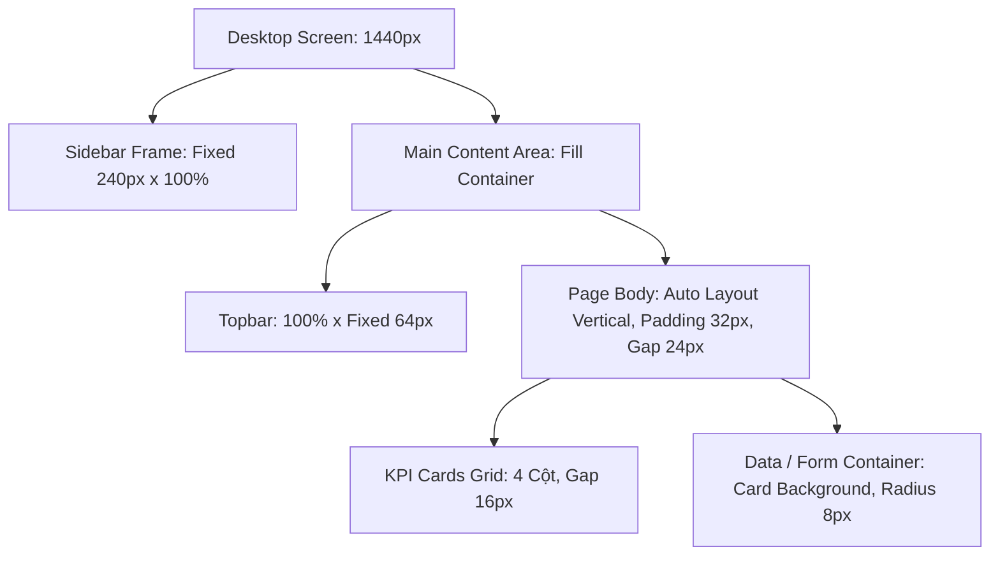

# 📐 ProcureAI - Figma Specifications & Architecture (Đặc Tả Chi Tiết Figma)

> **Dự án:** ProcureAI - AI-Assisted Procurement & Purchase Approval System  
> **Link Figma chính thức:** [Figma Design File - Group 1 (Node: 0-1)](https://www.figma.com/design/Nc2pw0GQqNe3EzENakz79z/Group-1?node-id=0-1&p=f&t=FaKBsIFcslHisgTk-0)  
> **Node ID gốc:** `0:1`  
> **Công nghệ đích:** React 18+ / TypeScript / Tailwind CSS / Django REST Framework  
> **Tài liệu tham chiếu:** [`design-system.md`](./design-system.md), [`design_tokens_and_styleguide.md`](./design_tokens_and_styleguide.md), [`ui_component_library.md`](./ui_component_library.md), [`user_flows_and_wireframes.md`](./user_flows_and_wireframes.md)

---

## 1. Tổng Quan & Cấu Trúc File Figma (File Overview & Page Structure)

File thiết kế Figma **Group-1** được tổ chức theo chuẩn Enterprise Design System với cấu trúc phân tầng nghiêm ngặt (Atomic Design & Role-based Organization).

### 1.1 Thông Số Canvas & Viewports Chuẩn

| Thiết Bị | Viewport Frame | Grid Layout | Padding Trang (Outer) | Gutter |
| :--- | :--- | :--- | :--- | :--- |
| **Desktop (Primary)** | `1440 x 1024 px` | 12 Cột (Fluid max 1200px) | `32 px` (240px cố định cho Sidebar) | `24 px` |
| **Tablet** | `1024 x 768 px` | 8 Cột | `24 px` (Sidebar thu gọn icon 64px) | `16 px` |
| **Mobile** | `390 x 844 px` | 4 Cột | `16 px` (Drawer trượt, content 100%) | `12 px` |

### 1.2 Cấu Trúc Trang (Page Hierarchy)

```text
📁 Figma: Group-1 (Nc2pw0GQqNe3EzENakz79z)
├── 📄 00_Cover & Readme            (Metadata, Versioning, Changelog, Design Team)
├── 📄 01_Design Tokens & Styles   (Variables: Color, Typography, Spacing, Radius, Shadow)
├── 📄 02_Component Library        (Master Components with Variants & Auto Layout)
├── 📄 03_Auth & Utility Screens   (Login, Session Expiry, 403 Forbidden, 404, Error 500)
├── 📄 04_Employee - PR Flow       (Request List, Create PR + AI Standardizer, PR Detail)
├── 📄 05_Manager - Approvals      (Queue, Approval Detail + Budget Panel, Reject/Revision Modal)
├── 📄 06_Finance - Budget Review  (Budget Review Queue, Detail, Cost Center Allocation)
├── 📄 07_Procurement - Sourcing   (Sourcing List, Quotation OCR Review, Comparison Matrix, PO)
├── 📄 08_Receiving & 3-Way Match  (Goods Receipt Entry, Discrepancy Alert, 3-Way Reconciliation)
├── 📄 09_Admin & System Logs      (User Management, RBAC Matrix, Categories, Audit Trail)
└── 📄 10_Interactive Prototype    (Connected Flows with Smart Animate & Overlay States)
```

---

## 2. Danh Sách Màn Hình & Đặc Tả Frame (Screen & Frame Specifications)

Mỗi màn hình trong Figma được đặt tên theo quy tắc chuẩn: `[Mã Phân Hệ]_[Tên Màn Hình]_[Viewport]_[Trạng Thái]`.

### 2.1 Nhóm Xác Thực & Hệ Thống (Auth & System)

| Frame Name | Route URL | Vai Trò (Roles) | Mô Tả & Chi Tiết UI | State Variants |
| :--- | :--- | :--- | :--- | :--- |
| `AUTH_Login_Desktop` | `/login` | Public | Đăng nhập hệ thống: Input Email/Username, Password (show/hide), Remember, Nút Login, Demo Role Quick Switcher | `default`, `filled`, `loading`, `error_invalid`, `locked` |
| `SYS_403_Forbidden_Desktop` | `/403` | All Roles | Màn hình chặn truy cập trái quyền: Minh họa ổ khóa an ninh, thông điệp rõ ràng, nút "Quay lại trang chính" | `default` |
| `SYS_404_NotFound_Desktop` | `/404` | All Roles | Màn hình trang không tồn tại: Minh họa tài liệu thất lạc, nút "Về Dashboard" | `default` |
| `SYS_Session_Expired_Modal` | `/login?expired=1`| All Roles | Modal cảnh báo hết phiên đăng nhập kèm bảo lưu `returnUrl` | `default`, `submitting` |

### 2.2 Nhóm Yêu Cầu Mua Sắm - Employee (`/requests`)

| Frame Name | Route URL | Vai Trò | Khối Thành Phần Chính | State Variants |
| :--- | :--- | :--- | :--- | :--- |
| `EMP_PR_List_Desktop` | `/requests` | Employee, All | Header + CTA `+ Tạo Yêu Cầu`, Bộ lọc trạng thái (Tabs), Tìm kiếm, Bảng danh sách PR (Mã PR, Tiêu đề, Danh mục, Tổng tiền, Trạng thái, Ngày tạo) | `populated`, `loading_skeleton`, `empty`, `no_results` |
| `EMP_PR_Create_Desktop` | `/requests/new` | Employee | Bố cục 2 cột (Ratio 7:5):<br>- Cột trái: Form nhập liệu tiêu đề, phòng ban, trung tâm chi phí, bảng Line Items động.<br>- Cột phải: **AI Restructure Assistant** (Khung Free-text note, nút "Chuẩn hóa bằng AI", gợi ý AI kèm `Use this`/`Dismiss`, Checklist bắt buộc). | `blank`, `ai_processing`, `ai_suggested`, `validated_ready`, `error_fields` |
| `EMP_PR_Detail_Desktop` | `/requests/:id` | Employee, All | Stepper tiến độ 7 bước (Horizontal), Tab Navigation (Tổng quan, Lịch sử phê duyệt, Báo giá, Đơn đặt hàng, Nhận hàng, Audit Log). Banner cảnh báo nếu cần chỉnh sửa (Revision Requested). | `draft`, `pending`, `revision_requested`, `approved`, `rejected` |

### 2.3 Nhóm Phê Duyệt - Manager (`/approvals`)

| Frame Name | Route URL | Vai Trò | Khối Thành Phần Chính | State Variants |
| :--- | :--- | :--- | :--- | :--- |
| `MGR_Approval_Queue_Desktop` | `/approvals` | Manager | Hàng chờ duyệt sắp xếp theo độ ưu tiên/thời gian gửi. Cột thông tin: Mã PR, Người yêu cầu, Phòng ban, Tổng ngân sách, Trạng thái Budget (Đủ / Vượt), Cảnh báo. | `populated`, `empty_inbox`, `loading` |
| `MGR_Approval_Detail_Desktop`| `/approvals/:id` | Manager | Bố cục 2 cột:<br>- Cột trái: Chi tiết đơn hàng, Line items, Mục đích kinh doanh, Đính kèm.<br>- Cột phải: **Budget Visibility Panel** (Hạn mức ngân sách, Đã dùng, Khả dụng, Sau PR này).<br>- Action Bar: Nút `Phê duyệt` (Success), `Yêu cầu chỉnh sửa` (Warning), `Chuyển Finance` (Info), `Từ chối` (Danger).<br>*(Nếu là PR của chính mình: Tự động ẩn action, hiện Alert "Không thể tự phê duyệt").* | `within_budget`, `over_budget_warning`, `self_approval_blocked` |
| `MGR_Reject_Modal` | Overlay | Manager | Modal nhập lý do từ chối / lý do chuyển Finance (bắt buộc ký tự) | `default`, `validation_error` |

### 2.4 Nhóm Thẩm Định Ngân Sách - Finance (`/budget`)

| Frame Name | Route URL | Vai Trò | Khối Thành Phần Chính | State Variants |
| :--- | :--- | :--- | :--- | :--- |
| `FIN_Budget_Review_Desktop` | `/budget` | Finance | Danh sách các PR vượt ngân sách hoặc cần đối soát đặc biệt được Manager chuyển sang. Thống kê KPI ngân sách theo Phòng ban/Cost Center. | `populated`, `empty`, `filter_applied` |
| `FIN_Budget_Detail_Desktop` | `/budget/:id` | Finance | Phân tích dòng tiền chi tiết, dữ liệu lịch sử chi tiêu của bộ phận yêu cầu, lịch sử ghi chú từ Manager, các nút phê duyệt giải ngân đặc biệt. | `review_ready`, `approved`, `rejected` |

### 2.5 Nhóm Mua Sắm & Báo Giá - Procurement (`/sourcing`)

| Frame Name | Route URL | Vai Trò | Khối Thành Phần Chính | State Variants |
| :--- | :--- | :--- | :--- | :--- |
| `PRO_Sourcing_List_Desktop` | `/sourcing` | Procurement | Danh sách PR đã duyệt (Approved) sẵn sàng để tìm kiếm nhà cung cấp & thu thập báo giá. | `populated`, `empty` |
| `PRO_Quotation_Upload_Desktop`| `/sourcing/:id/upload` | Procurement | Khu vực Drag-and-Drop file PDF/Excel báo giá nhà cung cấp, tiến trình xử lý OCR & AI Parsing. | `idle`, `uploading`, `parsing_complete`, `failed` |
| `PRO_OCR_Verification_Desktop`| `/sourcing/:id/verify` | Procurement | Giao diện Split-Screen (50/50):<br>- Nửa trái: Trình xem tài liệu PDF gốc.<br>- Nửa phải: Bảng số liệu do AI trích xuất (Tên NCC, Đơn giá, Thuế VAT, Chiết khấu, Điều khoản thanh toán) cho phép chỉnh sửa thủ công. | `diff_highlight`, `verified` |
| `PRO_Comparison_Matrix_Desktop`| `/sourcing/:id/compare`| Procurement | Ma trận so sánh đa tiêu chí (3 cột NCC cạnh nhau): Giá cả, Thời gian giao, Đánh giá uy tín, Bảo hành. Đánh dấu tốt nhất/tệ nhất. Panel **AI Sourcing Recommendation** & **Anomaly Alert** (cảnh báo giá cao bất thường ≥20%). Nút `Chọn Nhà Cung Cấp & Tạo PO`. | `recommendation_active`, `anomaly_detected`, `supplier_selected` |

### 2.6 Nhóm Đơn Đặt Hàng & Giao Nhận - PO & Receiving (`/orders`, `/receiving`)

| Frame Name | Route URL | Vai Trò | Khối Thành Phần Chính | State Variants |
| :--- | :--- | :--- | :--- | :--- |
| `PO_Detail_Desktop` | `/orders/:id` | Procurement, All | Thông tin PO chính thức được tạo từ Quotation đã chọn (Mã PO, NCC, Tổng thanh toán, Ngày hẹn giao). Dữ liệu bị khóa (Lock) không thể chỉnh sửa sai lệch. | `issued`, `partially_received`, `completed` |
| `REC_Goods_Receipt_Desktop` | `/receiving/:poId`| Warehouse / Assigned | Form ghi nhận giao nhận: Cột `Số lượng đặt (Ordered)`, `Đã nhận trước đó`, `Thực nhận đợt này`, `Còn lại`. Đính kèm hình ảnh biên bản giao hàng. | `full_match`, `partial_receipt`, `discrepancy_alert` |
| `REC_Three_Way_Match_Desktop`| `/receiving/:poId/match`| Finance, Procurement| Bảng đối soát 3 chiều: **PR (Yêu cầu) ⟷ PO (Đơn hàng) ⟷ GRN (Biên bản nhận hàng)**. Xác thực khớp 100% trước khi cho phép nút `Close Request` hoạt động. | `matched_ready_to_close`, `variance_blocked` |

### 2.7 Nhóm Quản Trị Hệ Thống - Admin (`/admin`, `/audit`)

| Frame Name | Route URL | Vai Trò | Khối Thành Phần Chính | State Variants |
| :--- | :--- | :--- | :--- | :--- |
| `ADM_User_Management_Desktop`| `/admin/users` | Admin | Bảng danh sách người dùng, phân quyền Role (E, M, F, P, A), trạng thái Active/Inactive, nút Reset mật khẩu. | `populated`, `user_drawer_open` |
| `ADM_Audit_Trail_Desktop` | `/audit` | Admin, All (phạm vi)| Nhật ký kiểm toán toàn vẹn: Thời gian (Timestamp chuẩn ISO), Tác nhân (Actor + Role), Thao tác (Action), Đối tượng (Object ID), Giá trị Trước/Sau (Diff), Lý do giải trình. Bộ lọc mạnh mẽ. | `populated`, `filtered`, `diff_view` |

---

## 3. Quy Chuẩn Auto Layout & Layout Grid Trong Figma

Mọi Frame và Component trong file thiết kế Figma tuân thủ 100% các nguyên tắc kỹ thuật sau:



### 3.1 Quy Tắc Đặt Chiều Rộng (Resizing Rules)
- **Top-level Container:** `Fill Container` theo chiều ngang (Horizontal Resizing) để co giãn linh hoạt khi đổi độ phân giải màn hình.
- **Sidebar & Fixed Columns:** `Fixed Width` (`240px` cho Sidebar Desktop, `64px` cho Sidebar thu gọn Tablet).
- **Buttons, Badges, Chips:** `Hug Contents` theo chiều ngang, `Fixed Height` (`40px` cho Default Button, `32px` cho Small Button, `24px` cho Badge).
- **Bảng dữ liệu (Data Table):** Container đặt `Fill Container`. Cột dữ liệu cố định min-width, cột thông tin chính (Title, Notes) đặt `Fill Container`.

### 3.2 Quy Ước Khoảng Cách (Spacing System Application)
- **Padding ngoài (Page Gutters):** `32px` (Desktop), `24px` (Tablet), `16px` (Mobile).
- **Khoảng cách giữa các Section:** `24px` hoặc `32px` (`--space-6` hoặc `--space-8`).
- **Khoảng cách giữa các thành phần trong Card:** `16px` (`--space-4`).
- **Khoảng cách giữa Label và Input field:** `6px` hoặc `8px` (`--space-2`).
- **Khoảng cách Icon và Text:** `8px` (`--space-2`).

---

## 4. Đặc Tả Tương Tác & Prototyping (Interactive Prototyping Specs)

Trong trang `10_Interactive Prototype`, các luồng tương tác được cấu hình như sau:

| Sự Kiện Bắt Đầu (Trigger) | Phần Tử Tác Động | Hành Động (Action) | Đích Đến (Destination) | Hiệu Ứng (Animation) |
| :--- | :--- | :--- | :--- | :--- |
| `On Click` | Button "Login" | Navigate to | Landing page theo vai trò đã chọn | Instant / Dissolve (200ms) |
| `On Click` | Button "+ Tạo yêu cầu" | Navigate to | `EMP_PR_Create_Desktop` | Smart Animate (250ms ease-out) |
| `On Click` | Button "AI Restructure" | Set Variable / Change to | Frame state: `ai_processing` → `ai_suggested` | Smart Animate (300ms) |
| `On Click` | Button "Use this" (AI) | Mutate Form Data | Điền dữ liệu chuẩn vào Form chính | Dissolve (150ms) |
| `On Click` | Row trong bảng PR | Navigate to | `EMP_PR_Detail_Desktop` | Smart Animate (200ms) |
| `On Click` | Button "Từ chối" (Reject)| Open Overlay | `MGR_Reject_Modal` (Center, Dim background #000000 40%) | Ease-in (200ms) |
| `On Click` | Tab "So sánh báo giá" | Switch View | `PRO_Comparison_Matrix_Desktop` | Instant |
| `On Hover` | Icon cảnh báo ngân sách | Open Tooltip | Tooltip hiển thị số tiền vượt chi tiết | Instant / Dissolve (100ms) |

---

## 5. Danh Mục Đầy Đủ Các Trạng Thái Thiết Kế (State Completeness Matrix)

Theo triết lý thiết kế của ProcureAI, **không màn hình nào chỉ có duy nhất trạng thái lý tưởng (Happy Path)**. Tất cả các frame trong Figma bắt buộc phải có đầy đủ 5 trạng thái cơ bản:

```text
┌────────────────────────────────────────────────────────────────────────┐
│                        5 TRẠNG THÁI BẮT BUỘC                           │
├───────────────┬────────────────────────────────────────────────────────┤
│ 1. Populated  │ Có đầy đủ dữ liệu hiển thị (Bình thường / Happy path)  │
│ 2. Loading    │ Trạng thái đang tải dữ liệu (Skeleton Shimmer loader)  │
│ 3. Empty      │ Chưa có bản ghi nào (Minh họa vui vẻ + Nút CTA hành động)│
│ 4. Error      │ Lỗi tải dữ liệu hoặc mất mạng (Icon cảnh báo + Thử lại)│
│ 5. Filtered   │ Bộ lọc tìm kiếm không ra kết quả (Nút "Xóa bộ lọc")   │
└───────────────┴────────────────────────────────────────────────────────┘
```

---

## 6. Liên Kết Kỹ Thuật (Developer Handoff Guide)

1. **Inspect Mode:** Lập trình viên sử dụng chế độ Dev Mode trên Figma (`Shift + D`) để đọc chính xác tên biến CSS Token thay vì lấy mã Hex thô.
2. **Bộ Icon:** File Figma sử dụng bộ icon chuẩn **Lucide Icons** (khớp 1:1 với thư viện `lucide-react` trong source code).
3. **Phông Chữ:** Toàn bộ bản thiết kế sử dụng phông chữ **Inter** (Google Fonts miễn phí chuẩn Web).
4. **Định dạng tiền tệ & số:** Hiển thị với font variant `tabular-nums` để các chữ số thẳng hàng dọc khi nằm trong bảng biểu hoặc số liệu KPI tài chính.
