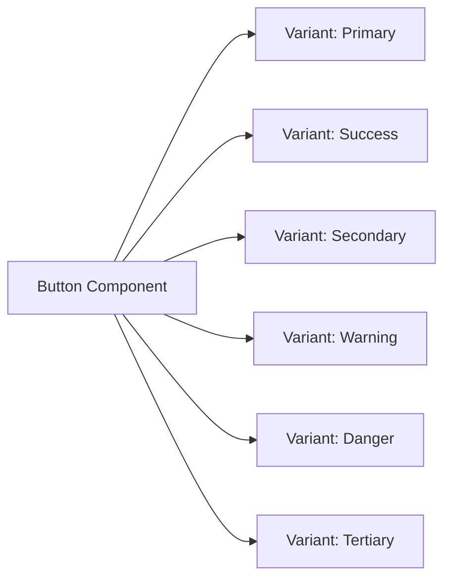
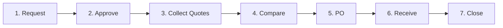

# 🧩 ProcureAI - UI Component Library Specification (Thư Viện Thành Phần UI)

> **Dự án:** ProcureAI - AI-Assisted Procurement & Purchase Approval System  
> **Figma Source:** [ProcureAI Group-1 Master Component Sheet](https://www.figma.com/design/Nc2pw0GQqNe3EzENakz79z/Group-1?node-id=0-1&p=f&t=FaKBsIFcslHisgTk-0)  
> **Thư viện triển khai:** React 18+ / TypeScript / Lucide Icons / Tailwind CSS  
> **Tài liệu tham chiếu:** [`design_tokens_and_styleguide.md`](./design_tokens_and_styleguide.md), [`figma_specifications.md`](./figma_specifications.md), [`user_flows_and_wireframes.md`](./user_flows_and_wireframes.md)

---

## 1. Tổng Quan Cấu Trúc Thành Phần (Component Architecture)

Thư viện giao diện được xây dựng theo phương pháp **Atomic Design**:
- **Atoms:** Nút (Button), Ô nhập liệu (Input), Huy hiệu (Status Badge), Icon, Tooltip.
- **Molecules:** Trường form có nhãn & báo lỗi, Thẻ KPI, Thanh tìm kiếm, Hàng bảng dữ liệu.
- **Organisms:** Khung ứng dụng (AppShell), Stepper tiến trình (Workflow Stepper), Khung trợ lý AI (AI Panel), Khung hạn mức ngân sách (Budget Panel), Ma trận so sánh báo giá (Quotation Matrix), Bảng đối soát 3 chiều (Reconciliation Table).

---

## 2. Đặc Tả Chi Tiết Thành Phần Cơ Bản (Core Atomic Components)

### 2.1 Nút Bấm (Button)

Thành phần tương tác chính kích hoạt các hành động người dùng.



#### Bảng Phân Loại Biến Thể (Variants)

| Biến Thể (Variant) | Màu Nền / Màu Chữ | Viền (Border) | Ngữ Cảnh Sử Dụng |
| :--- | :--- | :--- | :--- |
| `primary` | `primary-600` / `text-white` | Không | Tạo PR mới, Gửi phê duyệt, Chọn NCC, Tạo đơn PO |
| `success` | `success-600` / `text-white` | Không | Phê duyệt đơn (Approve), Xác nhận đối soát |
| `secondary` | `surface` (trắng) / `text-700`| `1px border` | Lưu nháp, Dùng gợi ý AI (`Use this`), Đóng |
| `warning` | `warning-700` / `text-white` | Không | Chuyển tiếp phòng Tài chính (Send to Finance) |
| `danger` | `danger-600` / `text-white` | Không | Từ chối (Reject), Xóa dòng, Hủy đơn |
| `tertiary` (Ghost) | Trong suốt / `text-700` | Không | Bỏ qua gợi ý AI (`Dismiss`), Xem chi tiết phụ |

#### Trạng Thái Tương Tác (States)

- **Default:** Trạng thái sẵn sàng.
- **Hover:** Tăng độ đậm màu nền lên 1 bậc (Ví dụ: `primary-600` → `primary-700`).
- **Focus:** Hiển thị viền `--focus-ring` (2px solid offset 2px).
- **Disabled:** `opacity: 0.5`, con trỏ `not-allowed`, vô hiệu hóa sự kiện click.
- **Loading:** Hiển thị vòng xoay spinner ở giữa, khóa click lặp lại, giữ nguyên kích thước nút.

---

### 2.2 Huy Hiệu Trạng Thái (Status Badge)

Dùng để phản ánh chính xác trạng thái của PR, PO hoặc quy trình mua sắm.

```text
[ ● Approved ]   [ ⏱ Pending Approval ]   [ ↺ Revision Requested ]   [ ✕ Rejected ]
```

#### Ma Trận 13 Trạng Thái Chuẩn Của Hệ Thống

| Tên Trạng Thái | Icon Lucide | Màu Nền (Background) | Màu Chữ & Icon | Ý Nghĩa Nghiệp Vụ |
| :--- | :--- | :--- | :--- | :--- |
| `Draft` | `FileEdit` | `#F2F4F7` (neutral-100) | `#344054` (neutral-700) | Đang soạn thảo bởi Employee |
| `Pending Approval` | `Clock` | `#EFF8FF` (info-50) | `#175CD3` (info-700) | Đang chờ Quản lý duyệt |
| `Revision Requested`| `RotateCcw` | `#FFFAEB` (warning-50) | `#B54708` (warning-700) | Bị trả về yêu cầu sửa thông tin |
| `Finance Review` | `Landmark` | `#FFFAEB` (warning-50) | `#B54708` (warning-700) | Đang chờ Tài chính kiểm tra ngân sách |
| `Approved` | `CheckCircle2` | `#ECFDF3` (success-50) | `#027A48` (success-700) | Đã được phê duyệt hợp lệ |
| `Rejected` | `XCircle` | `#FEF3F2` (danger-50) | `#B42318` (danger-700) | Đã bị từ chối |
| `Collecting` | `Files` | `#F0F9FF` (info-50) | `#026AA2` (info-700) | Đang thu thập báo giá NCC |
| `Comparing` | `Scale` | `#F0F9FF` (info-50) | `#026AA2` (info-700) | Đang so sánh và chọn NCC |
| `PO Issued` | `ShoppingCart` | `#EEF2FF` (primary-50) | `#4338A8` (primary-700) | Đơn đặt hàng đã được phát hành |
| `Partially Received`| `PackageOpen` | `#FFFAEB` (warning-50) | `#B54708` (warning-700) | Hàng mới giao nhận một phần |
| `Received` | `PackageCheck` | `#ECFDF3` (success-50) | `#027A48` (success-700) | Đã nhận đủ hàng theo đơn |
| `Receiving Exception`|`AlertTriangle`| `#FEF3F2` (danger-50) | `#B42318` (danger-700) | Có sự cố sai lệch số lượng/chất lượng |
| `Closed` | `Lock` | `#ECFDF3` (success-50) | `#027A48` (success-700) | Đã đối soát 3 bên và đóng hồ sơ |

---

### 2.3 Trường Nhập Liệu & Báo Lỗi Form (Form Inputs & Validation)

- **Cấu trúc trường:** Nhãn bắt buộc (`*`), Ô nhập liệu, Văn bản hướng dẫn (Helper text) hoặc Thông báo lỗi có icon `AlertCircle` đỏ.
- **Trạng thái:**
  - `Default`: Viền xám `--color-border` (`#D0D5DD`).
  - `Focus`: Viền sáng `--color-primary-600` kèm bóng mờ focus.
  - `Invalid`: Viền đỏ `--color-danger-600` (`#B42318`), nền phớt hồng `#FEF3F2`. Kèm thông báo lỗi chi tiết bên dưới.
  - `Disabled`: Nền xám `#F9FAFB`, text `#98A2B3`.

---

## 3. Đặc Tả Các Thành Phần Nâng Cao & Tích Hợp AI (Specialized Organisms)

### 3.1 Khung Trợ Lý Chuẩn Hóa AI (AI Restructure Assistant Panel)

Đây là thành phần cốt lõi của tính năng chuẩn hóa yêu cầu mua sắm tại màn hình tạo PR (`/requests/new`).

```text
┌────────────────────────────────────────────────────────────────────────┐
│ ✨ AI Procurement Assistant                                   [ Đang xử lý ]│
├────────────────────────────────────────────────────────────────────────┤
│ Gợi ý chuẩn hóa từ ghi chú tự do:                                     │
│ • Danh mục đề xuất: Thiết bị công nghệ thông tin (IT Hardware)        │
│ • Đơn giá dự kiến tham khảo: 24.500.000 ₫ / máy                       │
│ • Mã ngân sách gợi ý: BDG-IT-2026-Q1                                  │
│                                                                        │
│ [ ✔ Sử dụng gợi ý (Use this) ]    [ Chỉnh sửa ]    [ Bỏ qua (Dismiss) ] │
└────────────────────────────────────────────────────────────────────────┘
```

#### Đặc Tả Trạng Thái (States)

1. **State: Idle / Input Ready:**
   - Khung viền nét đứt màu xám nhạt hoặc icon `Sparkles`.
   - Lời mời: "Nhập ghi chú yêu cầu dạng tự do bên dưới và nhấn 'Chuẩn hóa bằng AI' để tự động điền danh mục và thông số."
2. **State: Loading / Shimmer:**
   - Hiển thị hiệu ứng sóng mờ (Shimmer animation) kèm thông điệp: *"AI đang phân tích danh mục và tra cứu lịch sử mua sắm..."*
   - Khóa nút "Gửi yêu cầu" để tránh xung đột dữ liệu.
3. **State: Suggestion Ready (Có gợi ý):**
   - Nền xanh nhạt `#F0F9FF`, viền `#B9E6FE`, icon `Sparkles` màu xanh đậm `#026AA2`.
   - Danh sách các trường được AI suy luận từ văn bản tự do.
   - **Hành vi nút bấm:**
     - `Use this`: Tự động điền dữ liệu gợi ý vào form chính bên trái, đánh dấu nhãn *"Đã điền bởi AI"*.
     - `Dismiss`: Đóng gợi ý, giữ nguyên dữ liệu hiện tại của người dùng.
4. **State: Error / Fallback:**
   - Thông báo lịch sự: *"Không thể tạo gợi ý lúc này. Bạn hoàn toàn có thể tiếp tục nhập liệu thủ công."*

---

### 3.2 Stepper Quy Trình 7 Bước (Workflow Stepper)

Hiển thị toàn cảnh hành trình của một yêu cầu mua sắm theo 7 giai đoạn bắt buộc:
`1. Tạo yêu cầu` ➔ `2. Phê duyệt` ➔ `3. Thu thập báo giá` ➔ `4. So sánh NCC` ➔ `5. Đơn hàng (PO)` ➔ `6. Nhận hàng` ➔ `7. Đóng hồ sơ`.



#### Quy Tắc Hiển Thị Trạng Thái Từng Bước (Step States)

- **Completed (Hoàn tất):** Icon `CheckCircle2` màu xanh lá (`#16803C`), đường nối màu xanh.
- **Current (Hiện tại):** Vòng tròn số thứ tự đậm màu tím (`#4F46C6`), chữ in đậm, hiển thị nhãn trạng thái con.
- **Upcoming (Chưa đến):** Vòng tròn màu xám nhạt (`#D0D5DD`), chữ xám nhạt (`#667085`).
- **Exception / Blocked (Bị chặn / Lỗi):** Icon `AlertTriangle` màu hổ phách hoặc `Lock` màu đỏ khi có sự cố phát sinh (Ví dụ: Vượt ngân sách hoặc sai lệch hàng hóa).

---

### 3.3 Khung Giám Sát Ngân Sách (Budget Visibility Panel)

Xuất hiện tại màn hình duyệt của Quản lý (`/approvals/:id`) và Tài chính (`/budget/:id`).

#### Cấu Trúc Thành Phần
1. **Thanh chỉ số KPI (Tabular Numbers):**
   - Hạn mức được cấp (Allocated Budget): Ví dụ `500.000.000 ₫`
   - Đã chi tiêu tính đến nay (Spent): Ví dụ `380.000.000 ₫`
   - Ngân sách còn lại (Available): Ví dụ `120.000.000 ₫`
2. **Thanh Tiến Trình Chi Tiêu (Progress Bar):**
   - Tỷ lệ hiển thị trực quan phần trăm đã dùng.
   - Màu xanh (`#16803C`) khi < 85%.
   - Màu vàng hổ phách (`#B54708`) khi 85% – 100%.
   - Màu đỏ cảnh báo (`#B42318`) khi vượt > 100%.
3. **Dòng Dự Báo Sau Phê Duyệt:**
   - `"Khả dụng sau yêu cầu này: 45.000.000 ₫"` hoặc `"VƯỢT HẠN MỨC 15.000.000 ₫ (Cần chuyển Finance)"`.

---

### 3.4 Ma Trận So Sánh Báo Giá & Cảnh Báo Giá Bất Thường (Quotation Matrix & Anomaly Detection)

Sử dụng trong màn hình phân hệ Mua sắm (`/sourcing/:id/compare`).

#### Cấu Trúc Ma Trận:
- Bảng hiển thị song song tối thiểu 3 nhà cung cấp (NCC A, NCC B, NCC C).
- Các dòng so sánh:
  - Tổng giá trước thuế / sau thuế.
  - Thời hạn giao hàng cam kết (ngày).
  - Điều khoản thanh toán (Net 30, COD, v.v.).
  - Thời gian bảo hành & chính sách hỗ trợ.
- **Thẻ Đề Xuất AI (AI Sourcing Recommendation Card):**
  - Highlight viền màu xanh sáng xung quanh cột nhà cung cấp được hệ thống chấm điểm cao nhất về mặt cân đối giá trị / chi phí.
  - Ghi rõ căn cứ giải thích (Rationale): *"NCC B có giá thấp hơn 8% so với trung bình và thời gian giao hàng sớm hơn 3 ngày."*
- **Cảnh Báo Bất Thường (Price Anomaly Alert Banner):**
  - Kích hoạt khi đơn giá của mặt hàng chênh lệch **≥ 20%** so với dữ liệu lịch sử mua sắm 6 tháng gần nhất.
  - Hiển thị badge đỏ `[ Cảnh báo giá cao bất thường +24.5% ]` kèm link xem báo cáo đối sánh giá cũ.

---

### 3.5 Bảng Đối Soát 3 Chiều (Three-Way Reconciliation Table)

Sử dụng tại bước hoàn tất tiếp nhận hàng hóa (`/receiving/:poId/match`).

```text
┌────────────────────────────────────────────────────────────────────────┐
│ BẢNG ĐỐI SOÁT 3 CHIỀU (THREE-WAY MATCH RECONCILIATION)                 │
├─────────────────┬──────────────┬──────────────┬──────────────┬─────────┤
│ Mặt hàng        │ PR Yêu Cầu   │ PO Đơn Hàng  │ GRN Thực Nhận│ Kết quả │
├─────────────────┼──────────────┼──────────────┼──────────────┼─────────┤
│ Laptop Dell 15" │ 10 chiếc     │ 10 chiếc     │ 10 chiếc     │ ✔ KHỚP  │
│ Chuột quang USB │ 10 chiếc     │ 10 chiếc     │ 8 chiếc      │ ⚠ LỆCH  │
└─────────────────┴──────────────┴──────────────┴──────────────┴─────────┘
```

- **Khi tất cả dòng đều Khớp (Match 100%):** Nút `Xác nhận hoàn tất & Đóng đơn (Close Request)` tự động chuyển sang màu xanh (Enabled).
- **Khi có dòng Lệch (Variance):** Nút Đóng đơn bị vô hiệu hóa (Disabled), hiển thị thông điệp hướng dẫn: *"Cần lập biên bản xử lý sai lệch hàng hóa trước khi đóng hồ sơ."*

---

## 4. Hướng Dẫn Tương Tác & Khả Năng Tiếp Cận (Accessibility & Focus Flow)

1. **Focus Trap trong Modals:** Khi Modal (như Modal từ chối phê duyệt) mở lên, tiêu điểm bàn phím (Focus) bắt buộc phải bị giữ lại bên trong hộp thoại, không cho phép phím `Tab` nhảy ra các phần tử mờ phía sau. Phím `Esc` luôn đóng modal an toàn.
2. **Thông Báo Trạng Thái Trực Tiếp (Live Regions):** Các thông báo động do AI sinh ra hoặc thông báo lỗi realtime phải sử dụng thuộc tính `aria-live="polite"` để phần mềm đọc màn hình thông báo kịp thời cho người khiếm thị.
3. **Kích Thước Vùng Chạm (Touch Targets):** Mọi icon button trên phiên bản Tablet/Mobile đều có diện tích tối thiểu `44 x 44 px` để đảm bảo thao tác ngón tay chính xác.
