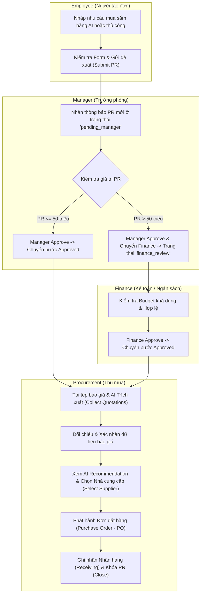

# 🔄 Luồng Trải Nghiệm & Sơ Đồ Giao Diện (User Flows & Wireframe Specs)

---

## 1. Sơ Đồ Luồng Tổng Thể (End-to-End Procurement User Flow)

---

## 2. Luồng Trải Nghiệm Chi Tiết Theo Vai Trò (Role-based Journeys)

1. **Employee Journey:** Dashboard $\rightarrow$ Click "Tạo đề xuất" $\rightarrow$ Nhập text tự do vào AI PR Standardizer $\rightarrow$ Click "Use this" $\rightarrow$ Kiểm tra thông tin $\rightarrow$ Submit PR $\rightarrow$ Theo dõi trạng thái trên Dashboard.
2. **Manager Journey:** WorkQueue Dashboard $\rightarrow$ Mở PR chờ duyệt $\rightarrow$ Xem Budget khả dụng $\rightarrow$ Click "Approve & Chuyển Finance" (với PR > 50tr) hoặc "Approve" (với PR $\le 50$tr).
3. **Finance Journey:** Mở danh sách đơn ở bước `Finance Review` $\rightarrow$ Kiểm tra hạn mức ngân sách $\rightarrow$ Nhập ghi chú duyệt $\rightarrow$ Click "Phê duyệt ngân sách".
4. **Procurement Journey:** Sourcing Page $\rightarrow$ Chọn PR đã Approve $\rightarrow$ Upload file Quotation (PDF/Excel) $\rightarrow$ Review AI extraction $\rightarrow$ Bấm Xác nhận $\rightarrow$ So sánh ma trận $\rightarrow$ Chọn NCC $\rightarrow$ Tạo PO $\rightarrow$ Ghi nhận Receiving.
