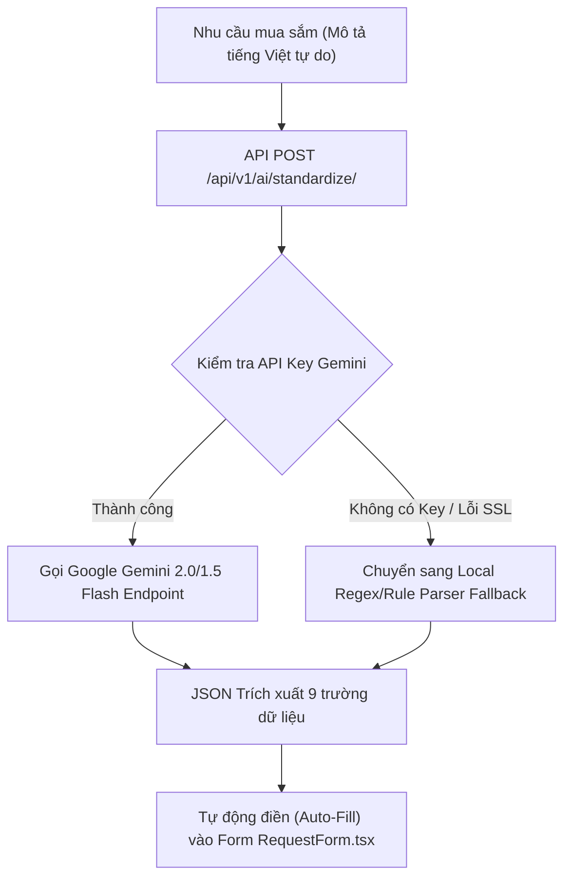

# 🤖 Tài Liệu Tích Hợp AI Gemini & Thuật Toán Recommendation (AI Engine Specification)

---

## 1. Tổng Quan Tích Hợp Google Gemini API

Hệ thống **ProcureAI** sử dụng mô hình trí tuệ nhân tạo thế hệ mới **Google Gemini (gemini-2.0-flash / gemini-1.5-flash)** để chuyển đổi các yêu cầu mua sắm bằng ngôn ngữ tự nhiên không cấu trúc thành biểu mẫu đề xuất mua sắm có cấu trúc (Structured Purchase Request).

- **SDK/Integration:** `urllib.request` (Thuần Python Native) tối ưu tốc độ Serverless.
- **Biến Môi Trường (API Keys):** Hỗ trợ linh hoạt các biến môi trường:
  - `GEMINI_API_KEY`
  - `Gemini_API_Key`
  - `gemini_api_key`

---

## 2. Quy Trình Chuẩn Hóa Yêu Cầu Đề Xuất (AI Standardization Flow)



### Trích Xuất 9 Trường Dữ Liệu Bắt Buộc (Extracted Fields):
1. **Title:** Tiêu đề mua sắm ngắn gọn.
2. **Category:** Danh mục sản phẩm (Thiết bị CNTT, Thiết bị văn phòng, In ấn...).
3. **Justification:** Mô tả lý do mua sắm chi tiết $\ge 20$ ký tự.
4. **Items List:** Danh sách mặt hàng (Tên, Thông số kỹ thuật, Số lượng, Đơn vị tính).
5. **EstUnitPrice:** Tự động dự toán đơn giá sản phẩm.
6. **RequiredBy:** Ngày cần hàng dự kiến (ISO Date YYYY-MM-DD).
7. **DeliveryLocation:** Địa điểm giao hàng.
8. **CostCenter:** Mã trung tâm chi phí (VD: `CC-IT-01`).
9. **BudgetCode:** Mã ngân sách tương ứng (VD: `BGT-IT-2026`).

---

## 3. Thuật Toán AI Đề Xuất Nhà Cung Cấp (AI Recommendation Engine)

Trong bước **Collect Quotations (Thu thập báo giá)** của bộ phận Thu mua (Procurement), hệ thống sử dụng **Thuật toán Ma trận Phân tích Đa tiêu chí (Multi-Criteria Scoring Matrix)** để chọn ra Nhà cung cấp tối ưu.

### 3.1 Công Thức Tính Điểm Đề Xuất (Scoring Formula)

$$\text{Final Score} = (S_{\text{Price}} \times 60\%) + (S_{\text{Delivery}} \times 20\%) + (S_{\text{Warranty}} \times 20\%) - P_{\text{Anomaly}}$$

Trong đó:
- **Price Score ($S_{\text{Price}}$):** $S_{\text{Price}} = \frac{\text{Min Total}}{\text{Quotation Total}} \times 100$
- **Delivery Score ($S_{\text{Delivery}}$):** $S_{\text{Delivery}} = \frac{\text{Min Delivery Days}}{\text{Quotation Delivery Days}} \times 100$
- **Warranty Score ($S_{\text{Warranty}}$):** $S_{\text{Warranty}} = \frac{\text{Quotation Warranty Months}}{\text{Max Warranty Months}} \times 100$
- **Anomaly Penalty ($P_{\text{Anomaly}}$):** Trừ **10 điểm** nếu phát hiện đơn giá cao hơn $\ge 20\%$ so với lịch sử giá tham chiếu.

---

## 4. Ma Trận Kiểm Thử Tự Động (Self-Test Validation Matrix)

Hệ thống đi kèm kịch bản kiểm thử độc lập tại `scratch/test_sourcing_flow.py` giúp tự động kiểm tra chính xác thuật toán AI Recommendation trên MongoDB Atlas Cloud:

```text
[★ AI RECOMMENDED (WINNER)] Công ty CP Đầu tư & Thương mại Việt Quốc tế: Score = 92.5/100
    • Price Score (60%): 98.6/100
    • Delivery Score (20%): 100.0/100 (Giao nhanh nhất: 2 ngày)
    • Warranty Score (20%): 66.7/100 (Bảo hành: 24 tháng)
```
