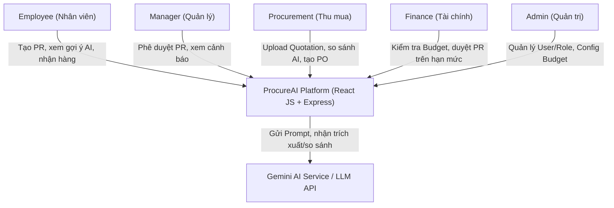

# ProcureAI System Architecture & Architecture Decision Records (ADR)

> **Hệ thống:** ProcureAI - Internal Procurement & Approval Platform  
> **Công nghệ chính:** React JS (Frontend) + Node.js/Express (Backend) + SQLite (Database)  
> **Phiên bản:** v1.0.0-final  
> **Đường dẫn file:** `docs/06-technical/architecture.md`  
> **Trạng thái:** Confirmed & Architecture Freeze  

---

## 1. Context & Container Architecture (C4 Model)

### 1.1 System Context Diagram (C4 Level 1)
Sơ đồ tương tác giữa 5 nhóm người dùng (Employee, Manager, Procurement, Finance, Admin) với hệ thống ProcureAI và dịch vụ AI bên ngoài.



### 1.2 Container Diagram (C4 Level 2)
Kiến trúc tổng thể các container và thành phần kỹ thuật cấu thành ProcureAI:

```mermaid
graph TB
    subgraph Client Tier
        SPA["React JS Single-Page Application<br/>(Vite + React JS + Modern CSS)"]
    end

    subgraph Application Tier (Node.js / Express Server)
        API["Express REST API Server"]
        AuthModule["Auth & RBAC Middleware<br/>(JWT Token & Permission Guard)"]
        WorkflowEngine["Procurement Workflow Engine<br/>(7-Step State Machine)"]
        BudgetService["Budget & Anomaly Service"]
        AIService["AI Integration Layer<br/>(Extraction, Comparison, Fallback)"]
        AuditService["Audit Trail Logger"]
    end

    subgraph Data & Storage Tier
        DB[("SQLite Database<br/>(prisma/dev.db)")]
        Storage["File Storage<br/>(Uploads: Quotation PDF/Excel)"]
    end

    SPA -->|REST API / JSON| AuthModule
    AuthModule --> API
    API --> WorkflowEngine
    API --> BudgetService
    API --> AIService
    WorkflowEngine --> AuditService
    WorkflowEngine --> DB
    BudgetService --> DB
    AIService --> DB
    API --> Storage
    AIService -->|LLM Structured API| ExternalAI["External AI / Gemini API"]
```

---

## 2. System Modules & Component Breakdown

| Module | Chức năng chính | Thành phần kỹ thuật |
|:---|:---|:---|
| **Auth & Security Guard** | Xác thực JWT Token, phân quyền RBAC cho 5 roles (Employee, Manager, Procurement, Finance, Admin) | `middleware/auth.js`, `middleware/rbac.js` |
| **Workflow State Engine** | Quản lý chuyển đổi trạng thái của PR qua 7 bước `DRAFT → SUBMITTED → APPROVED → QUOTATION_COLLECTED → PO_CREATED → RECEIVED → CLOSED` | `services/workflow.service.js` |
| **Budget & Anomaly Checker** | Kiểm tra hạn mức ngân sách phòng ban real-time, tính toán chênh lệch giá đơn hàng so với lịch sử (≥ 20%) | `services/budget.service.js` |
| **AI Integration Engine** | Chuẩn hóa thông tin PR, trích xuất dữ liệu Báo giá (Quotation Extraction), lập ma trận so sánh đa tiêu chí và fallback khi lỗi API | `services/ai.service.js` |
| **Audit Logger** | Ghi nhận tự động lịch sử thao tác, dấu thời gian, người thực hiện và dữ liệu trước/sau biến động | `services/audit.service.js` |

---

## 3. Architecture Decision Records (ADR)

### ADR-001: Modular Monolithic Architecture with React JS, Node.js/Express & SQLite

- **Bối cảnh (Context):** Dự án ProcureAI có phạm vi MVP 7 bước workflow khép kín, nhóm phát triển 5 thành viên cần triển khai nhanh, dễ chạy demo và không phụ thuộc dịch vụ Cloud DB bên ngoài.
- **Quyết định (Decision):** Lựa chọn kiến trúc **Monolithic** với Frontend **React JS**, Backend **Node.js/Express**, và Database **SQLite** lưu file trực tiếp trong dự án (`prisma/dev.db`).
- **Lý do & Giải thích Trade-off (Detailed Trade-off Analysis):**
  - **Lợi ích thu được (Gain):**
    1. **Triển khai cực kỳ đơn giản (Zero Cloud DB Setup):** SQLite chạy dưới dạng file cơ sở dữ liệu nhúng, không cần cài đặt Postgres/MySQL Server hay cấu hình kết nối mạng phức tạp. Người dùng chỉ cần `npm install` và `npm run dev` là chạy ngay.
    2. **Toàn vẹn Giao dịch (ACID Transactions):** Các bước chuyển đổi trạng thái workflow (`PR → PO → Receiving`) được thực thi hoàn toàn trong SQLite Transaction, đảm bảo 0% nguy cơ bất đồng bộ dữ liệu.
    3. **Tốc độ phát triển (Developer Velocity):** FE React JS tương tác mượt mà qua REST API Express JS.
  - **Đánh đổi chấp nhận (Trade-off / Cost):**
    1. **Khả năng ghi đồng thời (Concurrency Writes Limit):** SQLite khóa ghi ở cấp file (File-level lock) nên không thích hợp cho hàng chục nghìn lượt ghi đồng thời mỗi giây. Tuy nhiên với bài toán Mua sắm nội bộ doanh nghiệp (< 1.000 user, vài trăm PR/ngày), SQLite hoạt động cực kỳ mượt mà, phản hồi < 10ms.
    2. **Mở rộng chiều ngang (Horizontal Scaling):** Khi mở rộng ra nhiều backend server instance cần chuyển SQLite sang PostgreSQL (đã chuẩn bị sẵn Prisma ORM để chuyển đổi dialect chỉ trong 1 dòng config).
- **Trạng thái:** **APPROVED & IMPLEMENTED**.

---

### ADR-002: Direct Structured JSON Prompting with Schema Enforcement vs. Unstructured LLM Chatbot

- **Bối cảnh (Context):** Trợ lý AI trong hệ thống cần hỗ trợ 3 nhiệm vụ: Chuẩn hóa PR, trích xuất thông tin Quotation (PDF/Excel) và lập bảng so sánh.
- **Quyết định (Decision):** Sử dụng **Structured JSON Output (Response Schema)** với Zod validation và Fallback parser tự động, nghiêm cấm sử dụng giao diện Chatbot tự do không có cấu trúc.
- **Lý do (Rationale):**
  - Đảm bảo dữ liệu trích xuất từ báo giá luôn có đúng các trường (`unit_price`, `total_amount`, `valid_until`, `supplier_name`) để React JS render trực tiếp lên ma trận so sánh UI.
  - Loại bỏ hoàn toàn hiện tượng suy đoán sai định dạng (Hallucination formatting error).
- **Trạng thái:** **APPROVED**.

---

### ADR-003: SQLite Database with Prisma ORM

- **Bối cảnh (Context):** Dữ liệu quy trình mua sắm chứa mối quan hệ chặt chẽ giữa `User`, `Department`, `Budget`, `PurchaseRequest`, `Quotation`, `PurchaseOrder`, `Receiving` và `AuditLog`.
- **Quyết định (Decision):** Lựa chọn **SQLite** làm cơ sở dữ liệu chính cho MVP, tương tác thông qua **Prisma ORM**.
- **Lý do (Rationale):**
  - Đảm bảo ràng buộc khóa ngoại (Foreign Key Integrity) và kiểm soát toàn vẹn luồng ngân sách.
  - Prisma ORM cung cấp schema rõ ràng, migration tự động và seed dữ liệu mẫu đơn giản.
- **Trạng thái:** **APPROVED**.

---

## 4. Architectural Constraints & Non-Overengineering Proof

1. **Không over-engineer:** Sử dụng SQLite nhúng, không cần cấu hình Docker container DB phức tạp cho môi trường phát triển local.
2. **Tuân thủ Scope:** Chỉ xử lý 7 domain objects chính (`PurchaseRequest`, `Supplier`, `Quotation`, `Approval`, `PurchaseOrder`, `Receiving`, `Budget`).
3. **Bảo mật & RBAC:** Toàn bộ API đều được bảo vệ qua Middleware `authenticateToken` và `authorizeRoles([...])` ở phía Express JS Server.
