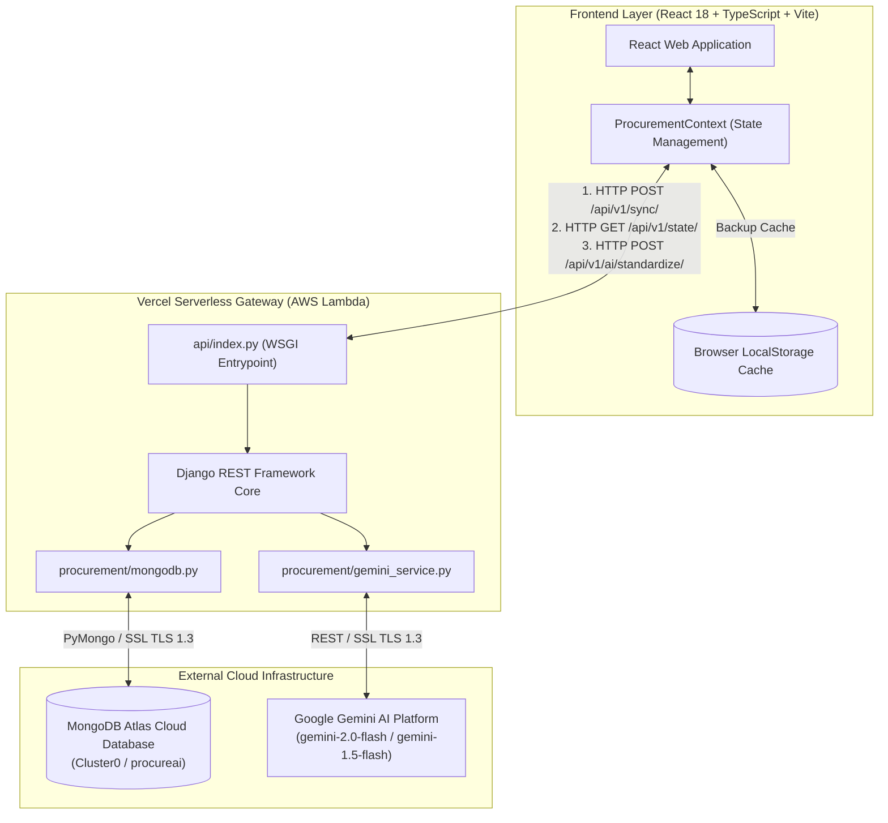
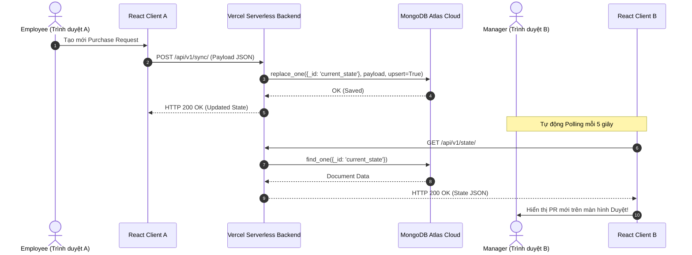

# 🏛️ Tài Liệu Kiến Trúc Backend (Backend Architecture Specification)

---

## 1. Tổng Quan Kiến Trúc (System Architecture Overview)

Hệ thống **ProcureAI Backend** được thiết kế theo mô hình **Cloud-Native Serverless Web Application** nhằm đáp ứng yêu cầu của doanh nghiệp về độ tin cậy, tính sẵn sàng cao, và đồng bộ dữ liệu đa người dùng theo thời gian thực (Real-time Multi-user Sync).

---

## 2. Các Thành Phần Chính Của Backend (Core Components)

### 2.1 Web Framework & API Routing
- **Framework:** Python 3.12 + Django 5.x.
- **Entry Point Serverless:** [api/index.py](file:///d:/LTUDDN/group-01%20-%20LTUDDN/api/index.py) chịu trách nhiệm nhận HTTP Requests từ Vercel Edge Router và định tuyến tới Django WSGI application.
- **URL Routing:** Các endpoint REST API được định nghĩa tại [config/urls.py](file:///d:/LTUDDN/group-01%20-%20LTUDDN/config/urls.py) và xử lý tại [procurement/views.py](file:///d:/LTUDDN/group-01%20-%20LTUDDN/procurement/views.py).

### 2.2 Đám Mây Tập Trung (MongoDB Atlas Cloud Storage)
- **Module:** [procurement/mongodb.py](file:///d:/LTUDDN/group-01%20-%20LTUDDN/procurement/mongodb.py).
- **Vai trò:** Đóng vai trò làm **Single Source of Truth** tập trung cho toàn bộ hệ thống Serverless trên Vercel.
- **Driver:** `pymongo` + `dnspython` với cơ chế Ping tự động kiểm tra kết nối SSL.

### 2.3 Tích Hợp AI Trí Tuệ Nhân Tạo (Gemini Service)
- **Module:** [procurement/gemini_service.py](file:///d:/LTUDDN/group-01%20-%20LTUDDN/procurement/gemini_service.py).
- **Chức năng:** Trích xuất, chuẩn hóa ngôn ngữ tự nhiên từ mô tả của người dùng thành Form Purchase Request hoàn chỉnh (9 trường dữ liệu) và đánh giá độ rủi ro/khớp danh mục.

---

## 3. Luồng Xử Lý Dữ Liệu Thời Gian Thực (Data Flow & Synchronization)

### 3.1 Luồng Đồng Bộ Dữ Liệu (Sync Flow)
1. Người dùng thực hiện thao tác (Tạo PR, Duyệt PR, Thu thập báo giá, Tạo PO,...).
2. Frontend cập nhật state nội bộ và gửi `POST /api/v1/sync/` chứa thông tin state mới.
3. Backend kiểm tra tính hợp lệ, đồng thời gọi `save_state_to_cache()` để thay thế bản ghi `current_state` trên MongoDB Atlas Cloud.
4. Các trình duyệt khác định kỳ 5 giây gọi `GET /api/v1/state/` để nạp dữ liệu mới nhất từ MongoDB Atlas Cloud và thực hiện **Smart Merge**.

---

## 4. Nguyên Tắc Bảo Mật & Phân Quyền (Security & Access Control)

- **CORS & CSRF:** Tích hợp `@csrf_exempt` cho các REST API JSON công khai và bảo mật qua header JWT/Session Token.
- **RBAC (Role-Based Access Control):** Cấu hình tại `FE/src/utils/permissions.ts` và kiểm tra quyền tại từng view backend:
  - `employee`: Chỉ được tạo & xem đơn mua sắm của mình/phòng ban.
  - `manager`: Phê duyệt đơn mua sắm dưới 50tr, hoặc Approve & chuyển Finance với đơn trên 50tr.
  - `finance`: Kiểm tra ngân sách (Budget Review) và duyệt các đơn trên 50tr hoặc vượt ngân sách.
  - `procurement`: Quản lý báo giá (Quotation), so sánh và tạo Purchase Order (PO).
  - `admin`: Quyền quản trị toàn diện hệ thống.
