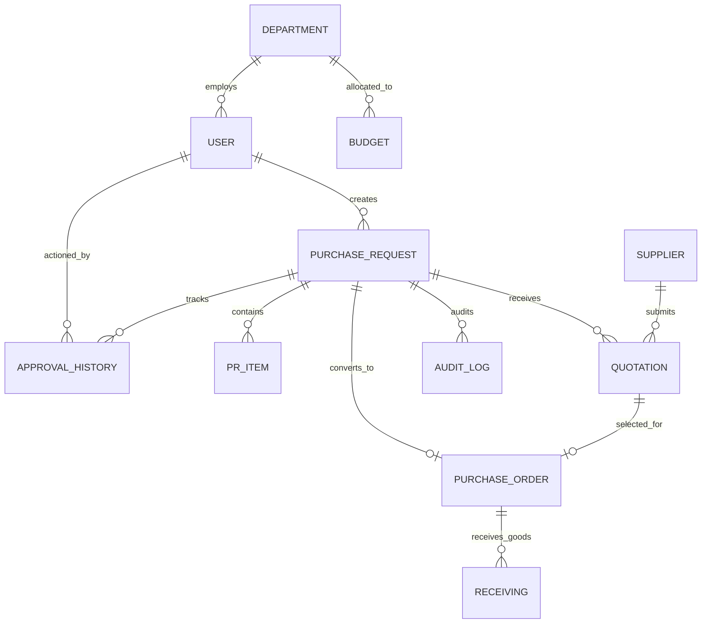

# ProcureAI Database Schema & Data Model Specification

> **Hệ thống:** ProcureAI - Internal Procurement & Approval Platform  
> **Database Engine:** SQLite (với Prisma ORM)  
> **Thành viên phụ trách:** Nguyễn Thị Thùy Dung (Backend Developer)  
> **Đường dẫn file:** `docs/06-technical/data-model.md`  
> **Trạng thái:** Confirmed  

---

## 1. ERD (Entity Relationship Diagram)

Sơ đồ ERD mô tả 8 thực thể dữ liệu chính trong SQLite tương ứng với 7 Output Domain Objects bắt buộc:

---

## 2. Comprehensive Entity Data Dictionary

### 2.1 Table: `Department` (Phòng ban)
| Field Name | Type | Constraints | Description |
|:---|:---|:---|:---|
| `id` | STRING (UUID) | PRIMARY KEY | Mã ID phòng ban |
| `code` | STRING | UNIQUE, NOT NULL | Mã viết tắt (VD: `IT`, `HR`, `FIN`) |
| `name` | STRING | NOT NULL | Tên phòng ban đầy đủ |
| `created_at` | DATETIME | DEFAULT NOW() | Thời gian tạo |

### 2.2 Table: `User` (Người dùng & Phân quyền RBAC)
| Field Name | Type | Constraints | Description |
|:---|:---|:---|:---|
| `id` | STRING (UUID) | PRIMARY KEY | Mã ID người dùng |
| `email` | STRING | UNIQUE, NOT NULL | Email đăng nhập |
| `password_hash` | STRING | NOT NULL | Mật khẩu mã hóa (Bcrypt) |
| `full_name` | STRING | NOT NULL | Họ và tên |
| `role` | ENUM | NOT NULL | `EMPLOYEE`, `MANAGER`, `PROCUREMENT`, `FINANCE`, `ADMIN` |
| `department_id` | STRING | FK -> `Department.id` | Mã phòng ban công tác |
| `is_active` | BOOLEAN | DEFAULT TRUE | Trạng thái tài khoản |

### 2.3 Table: `Budget` (Ngân sách phòng ban)
| Field Name | Type | Constraints | Description |
|:---|:---|:---|:---|
| `id` | STRING (UUID) | PRIMARY KEY | Mã ID hạn mức ngân sách |
| `department_id` | STRING | FK -> `Department.id` | Mã phòng ban |
| `fiscal_year` | INTEGER | NOT NULL | Năm tài chính (VD: 2026) |
| `allocated_amount` | DECIMAL(15,2) | NOT NULL, CHECK(>=0) | Tổng ngân sách cấp |
| `spent_amount` | DECIMAL(15,2) | DEFAULT 0 | Đã chi tiêu |
| `reserved_amount` | DECIMAL(15,2) | DEFAULT 0 | Đã giữ chỗ cho PR đang xử lý |

### 2.4 Table: `PurchaseRequest` (Yêu cầu mua sắm - PR Core)
| Field Name | Type | Constraints | Description |
|:---|:---|:---|:---|
| `id` | STRING (UUID) | PRIMARY KEY | Mã PR |
| `pr_number` | STRING | UNIQUE, NOT NULL | Số PR tự sinh (VD: `PR-2026-001`) |
| `title` | STRING | NOT NULL | Tiêu đề mua sắm |
| `category` | STRING | NOT NULL | Danh mục sản phẩm (VD: `IT Equipment`) |
| `requester_id` | STRING | FK -> `User.id` | ID người tạo PR |
| `department_id` | STRING | FK -> `Department.id` | ID phòng ban yêu cầu |
| `total_estimated_amount`| DECIMAL(15,2) | DEFAULT 0 | Tổng tiền dự kiến |
| `status` | ENUM | NOT NULL | `DRAFT`, `SUBMITTED`, `APPROVED`, `REJECTED`, `QUOTATION_COLLECTED`, `PO_CREATED`, `RECEIVED`, `CLOSED` |
| `requires_finance_approval`| BOOLEAN | DEFAULT FALSE | Cờ yêu cầu Finance duyệt (>50M hoặc vượt Budget) |
| `ai_normalized_notes` | TEXT | NULLABLE | Ghi chú chuẩn hóa tự động từ AI |
| `created_at` | DATETIME | DEFAULT NOW() | Thời gian tạo |
| `updated_at` | DATETIME | AUTO-UPDATE | Thời gian cập nhật cuối |

### 2.5 Table: `PRItem` (Chi tiết các mặt hàng trong PR)
| Field Name | Type | Constraints | Description |
|:---|:---|:---|:---|
| `id` | STRING (UUID) | PRIMARY KEY | Mã chi tiết sản phẩm |
| `pr_id` | STRING | FK -> `PurchaseRequest.id` | Khóa ngoại tới PR |
| `item_name` | STRING | NOT NULL | Tên mặt hàng/dịch vụ |
| `quantity` | INTEGER | NOT NULL, CHECK(>0) | Số lượng |
| `unit_price` | DECIMAL(15,2) | NOT NULL, CHECK(>=0) | Đơn giá dự kiến |
| `historical_avg_price` | DECIMAL(15,2) | NULLABLE | Giá lịch sử dùng cho AI Anomaly check |

### 2.6 Table: `Supplier` & `Quotation` (Nhà cung cấp & Báo giá)
| Table | Column | Type & Constraints | Description |
|:---|:---|:---|:---|
| **Supplier** | `id`, `name`, `code`, `tax_id`, `contact_email` | PK UUID, Unique code/tax_id | Thông tin đối tác |
| **Quotation** | `id`, `pr_id` (FK), `supplier_id` (FK), `file_url`, `total_amount`, `valid_until`, `is_selected` | PK UUID, Total amount, Is selected flag | Dữ liệu báo giá & trích xuất AI |

### 2.7 Table: `PurchaseOrder` & `Receiving` (Đơn đặt hàng & Biên bản nhận hàng)
| Table | Column | Type & Constraints | Description |
|:---|:---|:---|:---|
| **PurchaseOrder**| `id`, `po_number` (Unique), `pr_id` (FK), `quotation_id` (FK), `total_amount`, `status` (`ISSUED`, `FULFILLED`, `CANCELLED`) | PK UUID, PO number | Đơn đặt hàng mua chính thức |
| **Receiving** | `id`, `po_id` (FK), `received_by_id` (FK), `received_quantity`, `status` (`PARTIAL`, `FULL`), `received_date`, `notes` | PK UUID, Quantity received | Ghi nhận nhận hàng |

---

## 3. Workflow Traceability to Database Data Engine

Tracing 1 quy trình mua sắm mẫu xuống từng thao tác DB:

1. **Submit PR (Step 1 -> Step 2):**
   - In `PurchaseRequest`: Set `status = 'SUBMITTED'`.
   - In `Budget`: Update `reserved_amount += total_estimated_amount`.
   - Insert into `ApprovalHistory` (`pr_id`, `action = 'SUBMITTED'`, `actor_id`).
2. **Approve PR (Manager / Finance):**
   - Check `User.role IN ('MANAGER', 'FINANCE')`.
   - Update `PurchaseRequest.status = 'APPROVED'`.
3. **Collect Quotations & Compare (Procurement):**
   - Insert rows into `Quotation` linked to `pr_id`.
   - AI updates `Quotation.ai_extracted_json`. Set `Quotation.is_selected = TRUE` for winning vendor.
   - Update `PurchaseRequest.status = 'QUOTATION_COLLECTED'`.
4. **Create PO (Procurement):**
   - Insert into `PurchaseOrder` (`po_number`, `pr_id`, `quotation_id`, `total_amount`).
   - Update `PurchaseRequest.status = 'PO_CREATED'`.
5. **Receive & Close (Employee / Procurement):**
   - Insert into `Receiving` (`po_id`, `received_quantity`, `status = 'FULL'`).
   - Update `PurchaseOrder.status = 'FULFILLED'`.
   - Update `PurchaseRequest.status = 'CLOSED'`.
   - Update `Budget`: `spent_amount += po.total_amount`, `reserved_amount -= pr.total_estimated_amount`.
