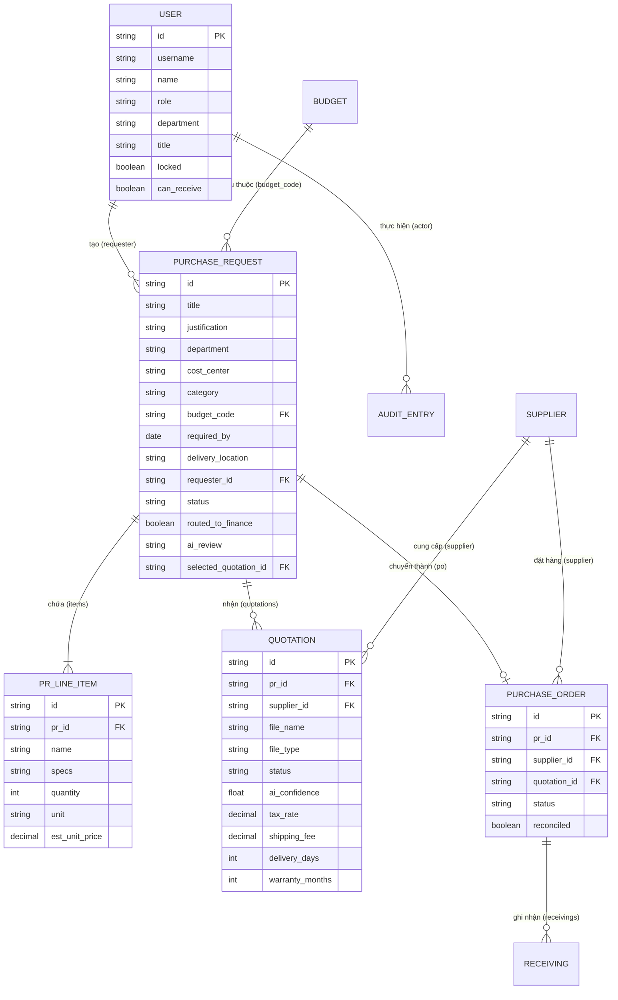

# 🗄️ Thiết Kế Cơ Sở Dữ Liệu (Database Design & Data Schema)

---

## 1. Tổng Quan Cơ Sở Dữ Liệu

Hệ thống **ProcureAI** kết hợp cấu trúc dữ liệu quan hệ (Relational Entity Mapping) với cơ chế lưu trữ tài liệu linh hoạt (**Document Database**) trên **MongoDB Atlas Cloud**:

- **Database Host:** `cluster0.bz9z4o7.mongodb.net`
- **Database Name:** `procureai`
- **Primary Collection:** `procure_state` (Document ID: `current_state`)
- **Secondary Relational Database (Local/Dev):** SQLite (`db.sqlite3`) thông qua Django ORM Models.

---

## 2. Chi Tiết Sơ Đồ Thực Thể (Entity Relationship Diagram - ERD)



---

## 3. Cấu Trúc Document JSON Trên MongoDB Atlas Cloud (`procure_state`)

Bản ghi duy nhất `_id: "current_state"` lưu giữ toàn bộ dữ liệu trạng thái hệ thống:

```json
{
  "_id": "current_state",
  "users": [
    {
      "id": "u-nam",
      "username": "nam.le",
      "name": "Lê Hoàng Nam",
      "email": "nam.le@company.com",
      "role": "employee",
      "department": "Công nghệ thông tin",
      "title": "Chuyên viên phần mềm",
      "locked": false,
      "canReceive": false
    }
  ],
  "requests": [
    {
      "id": "PR-2026-0105",
      "title": "Mua 5 laptop cấu hình mạnh",
      "justification": "Mua mới 5 laptop cấu hình mạnh, giao trước 15/10 tại tòa nhà tầng 8",
      "department": "Công nghệ thông tin",
      "costCenter": "CC-IT-01",
      "category": "Thiết bị CNTT",
      "budgetCode": "BGT-IT-2026",
      "requiredBy": "2026-10-15",
      "deliveryLocation": "Tòa nhà tầng 8",
      "requesterId": "u-nam",
      "status": "finance_review",
      "routedToFinance": true,
      "aiReview": "edited",
      "items": [
        {
          "id": "PR-2026-0105-i1",
          "name": "Laptop văn phòng 14\" hiệu năng cao",
          "specs": "CPU Intel Core i7 hoặc tương đương, RAM 16-32GB...",
          "quantity": 5,
          "unit": "chiếc",
          "estUnitPrice": 20000000
        }
      ]
    }
  ],
  "quotations": [],
  "suppliers": [],
  "orders": [],
  "receivings": [],
  "budgets": [],
  "categories": [],
  "audit": []
}
```

---

## 4. Thuật Toán Hợp Nhất Dữ Liệu Thông Minh (Smart Merging Algorithm)

Để đảm bảo không bị mất các dữ liệu mới tạo ở client khi thực hiện Polling định kỳ 5 giây, `ProcurementContext.tsx` triển khai thuật toán gộp:

```typescript
const mergedState: ProcurementState = {
  ...serverData,
  requests: [
    ...serverRequests,
    ...localOnlyRequests // Các PR mới tạo chưa kịp sync xong
  ],
  quotations: [...serverQuotations, ...localOnlyQuotations],
  orders: [...serverOrders, ...localOnlyOrders],
  receivings: [...serverReceivings, ...localOnlyReceivings],
};
```
