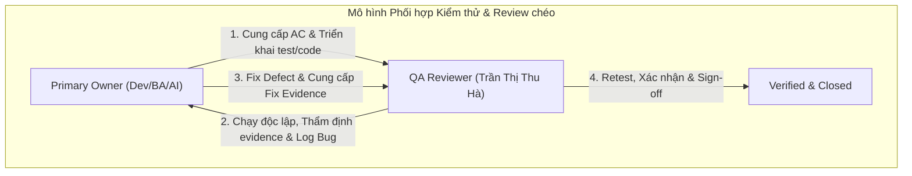
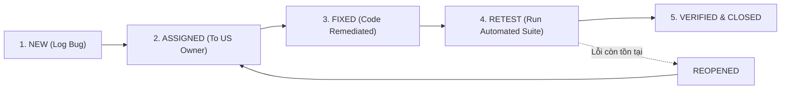

# Kế hoạch Kiểm thử Chi tiết (Test Plan) — ProcureAI

> **Mã tài liệu:** QA-03-PLAN  
> **Hệ thống:** ProcureAI — Internal Procurement & Approval Platform  
> **Phiên bản:** v1.0.0  
> **Thời điểm ban hành:** 2026-10-09T21:10:00+07:00  
> **Tác giả:** Senior QA Engineer & Test Automation Engineer  
> **Tài liệu tham chiếu:** [test-strategy.md](test-strategy.md), [us-ownership-matrix.md](us-ownership-matrix.md), [requirement-traceability-matrix.md](requirement-traceability-matrix.md), [taiga-backlog.md](../03-product/taiga-backlog.md)  

---

## 1. Giới thiệu & Mục tiêu Kế hoạch

Kế hoạch kiểm thử này chi tiết hóa việc thực thi chiến lược kiểm thử cho hệ thống **ProcureAI**. Tài liệu xác định rõ các đợt kiểm thử, phân công trách nhiệm giữa Primary Owner của từng User Story với QA Reviewer độc lập, quy trình quản lý defect và cơ chế thu thập bằng chứng thực thi theo đúng quy chuẩn dự án.

---

## 2. Kế hoạch Lịch trình & Phân bổ theo Sprint (Sprint Test Schedule)

Dựa trên kế hoạch Sprint trong [taiga-backlog.md](../03-product/taiga-backlog.md), các hoạt động kiểm thử được phân kỳ như sau:

| Giai đoạn | Mục tiêu Kiểm thử | User Stories liên quan | Trọng tâm Kiểm thử | Phương thức |
|:---|:---|:---|:---|:---:|
| **Sprint 1: Nền tảng PR & Quyền truy cập** | Kiểm thử tạo PR, kiểm tra thông tin, AI gợi ý và phân quyền 5 vai trò ban đầu | `US-01`, `US-02`, `US-03`, `GOV-01` | - Form PR validation<br/>- Khởi tạo PR Draft & Submit<br/>- Quy tắc No Self-Approval ban đầu | Tự động (Backend)<br/>+ Thủ công (UI) |
| **Sprint 2: Phê duyệt & Ngân sách** | Kiểm thử luồng phê duyệt của Manager, Finance Budget check và thu thập báo giá | `US-04`, `US-05`, `US-06` | - Chuyển trạng thái `APPROVED`<br/>- Cảnh báo vượt Budget phòng ban<br/>- Upload & liên kết Quotation với PR | Tự động (Backend)<br/>+ Thủ công (UI) |
| **Sprint 3: AI So sánh & Đơn mua hàng (PO)** | Kiểm thử AI so sánh báo giá, cảnh báo giá bất thường $\ge 20\%$ và tạo PO | `US-07`, `US-08` | - Trích xuất ma trận so sánh<br/>- Ngưỡng chênh lệch đơn giá $\ge 20\%$<br/>- Điều kiện tạo mã PO hợp lệ | Tự động (Backend)<br/>+ Thủ công (UI) |
| **Sprint 4: Nhận hàng, Đóng PR & Kiểm toán** | Kiểm thử nhận hàng thực tế, đóng PR, đối soát chi phí và ghi nhận Audit Trail | `US-09`, `US-10`, `GOV-02` | - Ghi nhận Receiving (đủ/thiếu)<br/>- Điều kiện đóng PR (`CLOSED`)<br/>- Toàn vẹn log Audit Trail | Tự động (Backend)<br/>+ Thủ công (UI) |
| **Final Regression & Security Audit** | Kiểm thử hồi quy toàn diện 7 bước, quét lỗi bảo mật và sẵn sàng release | Toàn bộ 12 Stories | - Chạy trọn vẹn Django integration suite<br/>- Rà soát lỗ hổng server-side No Self-Approval | Tự động 100% |

---

## 3. Phân công Trách nhiệm theo US Owner & Reviewer chéo

Mỗi User Story có sự phối hợp chặt chẽ giữa **Primary Owner** (chịu trách nhiệm thiết kế, triển khai và sửa lỗi) và **QA Reviewer** (độc lập thẩm định và nghiệm thu test evidence):



| User Story | Primary Owner | Trách nhiệm của Owner | Reviewer chéo (QA/Peer) | Trách nhiệm của Reviewer chéo |
|:---:|:---|:---|:---|:---|
| **US-01** | Trần Thị Kiều Giang *(Frontend)* | Thiết kế form PR, client validation, sửa lỗi UI | Trần Thị Thu Hà *(QA)* | Kiểm tra tính bắt buộc của các trường, test case `TC-WF-001` |
| **US-02** | Nguyễn Thị Thùy Dung *(Backend)* | State machine, cập nhật status timeline | Trần Thị Thu Hà *(QA)* | Xác minh chuyển đổi trạng thái hiển thị đúng, `TC-WF-002` |
| **US-03** | Nguyễn Trúc Lam *(AI Vault)* | AI prompt chuẩn hóa, logic parse gợi ý | Trần Thị Kiều Giang *(FE)* | Thẩm định giao diện AI panel, test `TC-AI-001` |
| **US-04** | Nguyễn Trương Thùy Dương *(BA/PO)* | Quy tắc nghiệp vụ duyệt, từ chối, chuyển Finance | Trần Thị Thu Hà *(QA)* | Kiểm thử luồng Manager duyệt, test `TC-WF-003` |
| **US-05** | Nguyễn Trương Thùy Dương *(BA/PO)* | Định nghĩa chính sách ngân sách, công thức cảnh báo | Nguyễn Thị Thùy Dung *(BE)* | Kiểm tra tính toán ngân sách `remaining`, test `TC-WF-002` |
| **US-06** | Nguyễn Trương Thùy Dương *(BA/PO)* | Quy tắc thu thập và liên kết báo giá | Trần Thị Thu Hà *(QA)* | Xác minh quan hệ Quotation ↔ PR, test `TC-WF-003` |
| **US-07** | Nguyễn Trúc Lam *(AI Vault)* | Thuật toán so sánh báo giá & cảnh báo $\ge 20\%$ | Nguyễn Thị Thùy Dung *(BE)* | Kiểm tra toán tử chênh lệch giá, test `TC-AI-002` |
| **US-08** | Nguyễn Thị Thùy Dung *(Backend)* | API tạo PO, ràng buộc Supplier được chọn | Trần Thị Thu Hà *(QA)* | Kiểm tra chặn tạo PO khi chưa Approve, test `TC-WF-004` |
| **US-09** | Nguyễn Thị Thùy Dung *(Backend)* | API nhận hàng Receiving, kiểm tra số lượng | Trần Thị Kiều Giang *(FE)* | Kiểm thử giao diện nhập biên bản nhận hàng, test `TC-WF-005` |
| **US-10** | Trần Thị Thu Hà *(QA/Tester)* | Kịch bản đối soát PR-PO-Receiving trước khi Close | Nguyễn Trương Thùy Dương *(PO)* | Nghiệm thu điều kiện đóng PR, test `TC-WF-006` |
| **GOV-01** | Nguyễn Thị Thùy Dung *(Backend)* | Triển khai RBAC Guard và chặn No Self-Approval | Trần Thị Thu Hà *(QA)* | Kiểm thử bảo mật bypass API, test `TC-SEC-001, 002` |
| **GOV-02** | Trần Thị Thu Hà *(QA/Tester)* | Mô hình dữ liệu AuditEntry, kiểm tra ghi vết | Nguyễn Thị Thùy Dung *(BE)* | Xác minh tính bất biến và đầy đủ của log, test `TC-AUD-001` |

---

## 4. Kế hoạch Quản lý Bằng chứng Kiểm thử (Evidence Management)

Tuân thủ nghiêm ngặt **GLOBAL RULE 1 & RULE 3**:
1. Không ghi đè bằng chứng của các lần chạy cũ.
2. Mỗi lần chạy kiểm thử chính thức phải khởi tạo một thư mục Run ID độc lập:
   ```
   docs/06-testing/evidence/RUN-YYYYMMDD-HHMMSS/
   ```
3. Mỗi thư mục Run ID bắt buộc phải thu thập các file sau:
   - `environment-summary.md`: Ghi nhận phiên bản OS, Python, Node, Git branch, commit hash.
   - `execution-summary.md`: Bảng tổng hợp số test thực thi, số test PASS/FAIL, thời gian chạy.
   - `execution-log.txt`: Raw console output đầy đủ của lệnh thực thi (ví dụ: `python manage.py test -v 2`).
   - `defect-log.md`: Danh sách defect mới phát sinh trong lần chạy (nếu có).
   - `migration-matrix.md` hoặc `traceability-update.md`: Bảng đối chiếu trạng thái test case tương ứng.

---

## 5. Quy trình Quản lý Defect (Defect Management Workflow)



### Tiêu chuẩn phân loại mức độ nghiêm trọng (Severity):
- **P1 - Blocker:** Lỗi an ninh (No Self-Approval bypass), sập test suite, lỗi gián đoạn chu trình 7 bước. Phải sửa ngay lập tức.
- **P2 - Critical:** Lỗi sai lệch tính toán tài chính (Budget committed/spent, Quotation VAT/Total).
- **P3 - Major:** Lỗi logic tính năng AI (không hiển thị cảnh báo khi chênh lệch $\ge 20\%$, gợi ý sai).
- **P4 - Minor:** Lỗi linter, typecheck cảnh báo, lỗi hiển thị UI không cản trở nghiệp vụ.

---

## 6. Danh mục Kịch bản Kiểm thử Dự kiến (Planned Test Cases Catalog)

| Mã Test Case | Hạng mục kiểm thử | Kịch bản kiểm thử dự kiến | Loại kiểm thử | Độ ưu tiên |
|:---|:---|:---|:---:|:---:|
| `TC-WF-001` | Purchase Request | Tạo PR hợp lệ và kiểm tra tính toán tổng tiền dự toán | Automated (Django) | P1 |
| `TC-WF-002` | PR Submit & Budget | Submit PR, chuyển sang `pending_manager`, giữ chỗ ngân sách (`committed`) | Automated (Django) | P1 |
| `TC-WF-003` | Manager Approval | Manager duyệt PR thành công $\rightarrow$ chuyển trạng thái `approved` | Automated (Django) | P1 |
| `TC-WF-004` | Purchase Order | Tạo PO từ báo giá được chọn $\rightarrow$ sinh mã PO `issued` | Automated (Django) | P1 |
| `TC-WF-005` | Receiving Goods | Nhận đủ 100% hàng hóa $\rightarrow$ tạo biên bản Receiving | Automated (Django) | P1 |
| `TC-WF-006` | Close PR | Đóng yêu cầu mua sắm $\rightarrow$ chuyển tiền giữ chỗ sang thực chi | Automated (Django) | P1 |
| `TC-SEC-001` | No Self-Approval (Simulated)| Kiểm tra quy tắc cấm Manager tự duyệt PR của chính mình | Automated (Django) | P1 |
| `TC-SEC-002` | No Self-Approval (API Guard)| Gửi request HTTP POST `/api/v1/sync/` cố tình tự duyệt $\rightarrow$ Chặn với HTTP 403 | Automated (Django API) | P1 (Cần bổ sung) |
| `TC-SEC-003` | RBAC 5 Vai trò | Kiểm tra Employee không thể truy cập action duyệt hay tạo PO | Automated / UI | P1 |
| `TC-BGT-001` | Budget Calculation | Công thức `remaining = allocated - committed` | Automated (Django) | P2 |
| `TC-BGT-002` | Budget 50M Flag | PR vượt quá 50M tự động bật cờ yêu cầu Finance xem xét | Automated (Django) | P2 |
| `TC-AI-001` | AI Standardizer | Chuẩn hóa thông số và gợi ý danh mục Thiết bị CNTT | Automated (Django) | P3 |
| `TC-AI-002` | AI Anomaly Warning | Cảnh báo giá bất thường khi đơn giá báo giá vượt $\ge 20\%$ | Automated (Django) | P3 |
| `TC-AI-003` | AI Recommendation | Đánh giá gợi ý nhà cung cấp tối ưu theo tiêu chí báo giá | Automated (Django) | P3 (Cần bổ sung) |
| `TC-AUD-001` | Audit Trail Logging | Ghi nhận đầy đủ actor, timestamp, action và thay đổi trạng thái | Automated (Django) | P2 |
| `TC-UI-001` | PR Form Validation | Chặn submit form khi thiếu tiêu đề hoặc danh mục trên giao diện | Manual (Browser) | P2 |
| `TC-UI-002` | Quotation Compare UI | Hiển thị ma trận so sánh 2 nhà cung cấp trên cùng một màn hình | Manual (Browser) | P3 |

---

## 7. Rủi ro Kế hoạch & Biện pháp Dự phòng (Contingency Plans)

1. **Rủi ro API Sync Backend chưa chặn No Self-Approval (`BUG-SEC-01`):**
   - *Biện pháp:* Ưu tiên xử lý trong đợt remediation tiếp theo. Bổ sung hàm kiểm tra `requester != current_user` trong `procurement/views.py` trước khi thực hiện test suite chính thức.
2. **Rủi ro thiếu Test Runner ở Frontend:**
   - *Biện pháp:* Trong giai đoạn hiện tại, toàn bộ các quy tắc nghiệp vụ, tính toán tiền tệ và state machine được bảo đảm 100% bằng bộ test tự động Django. Các giao diện người dùng được kiểm thử thông qua kịch bản thủ công có ghi nhận bằng chứng.
3. **Rủi ro thiếu Test Method cho AI Recommendation (`REQ-FR-14`):**
   - *Biện pháp:* Lập kế hoạch bổ sung `test_ai_recommendation_criteria` vào `procurement/tests_workflow.py` trong đợt kiểm thử tiếp theo để đạt độ phủ 100% Functional Requirements.
