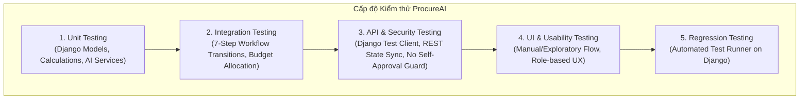
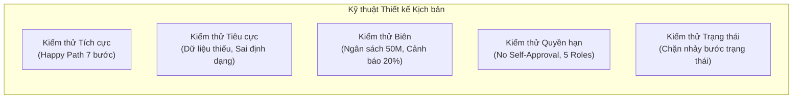

# Chiến lược Kiểm thử Hệ thống (Test Strategy) — ProcureAI

> **Mã tài liệu:** QA-03-STRAT  
> **Dự án:** ProcureAI — Internal Procurement & Approval Platform  
> **Phiên bản:** v1.0.0  
> **Thời điểm ban hành:** 2026-10-09T21:10:00+07:00  
> **Tác giả:** Senior QA Engineer & Test Automation Engineer  
> **Tài liệu căn cứ:** [qa-inventory.md](qa-inventory.md), [us-ownership-matrix.md](us-ownership-matrix.md), [requirement-traceability-matrix.md](requirement-traceability-matrix.md), [5.requirements.md](../01-discovery/5.requirements.md), [MVP_Scope.md](../01-discovery/MVP_Scope.md)  

---

## 1. Giới thiệu & Mục tiêu Chiến lược

Chiến lược này định hình toàn bộ phương pháp, cấp độ, công cụ và quy trình đảm bảo chất lượng phần mềm cho hệ thống **ProcureAI**, phản ánh chính xác kiến trúc công nghệ thực tế đang vận hành trong dự án: **Frontend React Vite (SPA)** kết nối với **Backend Django 5.x (Python 3.13) + SQLite3**.

### Mục tiêu cốt lõi:
1. Đảm bảo tính toàn vẹn 100% của chu trình mua sắm 7 bước (`DRAFT → SUBMITTED → APPROVED → QUOTATION_COLLECTED → PO_CREATED → RECEIVED → CLOSED`).
2. Bảo vệ tuyệt đối nguyên tắc an ninh nghiệp vụ: **Không tự phê duyệt (No Self-Approval)** và phân quyền chính xác cho 5 nhóm vai trò (`Employee`, `Manager`, `Procurement`, `Finance`, `Admin`).
3. Đảm bảo các tính năng AI (Chuẩn hóa PR, Cảnh báo giá bất thường $\ge 20\%$, Đề xuất báo giá) tuân thủ mô hình **Human-in-the-loop**, không bao giờ để AI tự động đưa ra quyết định mua sắm hoặc phê duyệt thay con người.
4. Xây dựng bộ kiểm thử có khả năng lặp lại (reproducible), dễ bảo trì, tích hợp vào quy trình phát triển.

---

## 2. Phạm vi Kiểm thử (Scope of Testing)

### 2.1 Trong phạm vi (In-Scope)
- **10 User Stories nghiệp vụ chính:** `US-01` đến `US-10` và **2 Governance Stories:** `GOV-01`, `GOV-02`.
- **18 Functional Requirements:** `REQ-FR-01` đến `REQ-FR-18` (Tạo PR, kiểm tra thông tin, AI gợi ý, theo dõi trạng thái, Manager duyệt, Finance check budget, thu thập báo giá, so sánh AI, cảnh báo $\ge 20\%$, tạo PO, nhận hàng, đóng PR).
- **3 Non-Functional Requirements:**
  - `REQ-NFR-01`: Tính toàn vẹn và nhất quán dữ liệu xuyên suốt các bảng (PR, PO, Quotation, Receiving, Budget, User).
  - `REQ-NFR-02`: Phân quyền RBAC 5 vai trò và Quy tắc cấm No Self-Approval ở cả tầng giao diện và tầng API.
  - `REQ-NFR-03`: Khả năng truy vết kiểm toán (Audit Trail) cho 100% thay đổi trạng thái quan trọng.
- **11 Business Rules:** `REQ-BR-01` đến `REQ-BR-11`.
- **API Contracts:** Các REST endpoints đồng bộ dữ liệu (`/api/v1/state/`, `/api/v1/sync/`).
- **Chất lượng mã nguồn:** Linting (ESLint), Type checking (TypeScript), Build bundle kiểm tra tính tương thích.

### 2.2 Ngoài phạm vi (Out-of-Scope)
- **Tích hợp Cổng thanh toán & Ngân hàng (Payment Gateway / Core Banking):** Thanh toán chuyển khoản thực tế không thuộc phạm vi MVP.
- **Đối soát Hóa đơn 3 chiều có Hóa đơn thuế (3-Way Matching with Tax Invoice):** Theo quyết định `DEC-002` và giả định `ASM-05`, việc tích hợp Hóa đơn điện tử (e-Invoice) được dời sang Phase 2. MVP chỉ đối soát giữa `PR ↔ PO ↔ Receiving`.
- **Kiểm thử tải cực đại (Stress / Distributed Load Testing):** Hệ thống phục vụ nội bộ doanh nghiệp vừa và nhỏ, không kiểm thử với quy mô hàng triệu requests/giây.
- **OCR Nhận diện văn bản chữ viết tay / tài liệu mờ nhòe:** Chỉ kiểm thử các file báo giá PDF/Excel có cấu trúc văn bản trích xuất được.

---

## 3. Các Cấp độ Kiểm thử (Test Levels)

| Cấp độ | Mục tiêu kiểm thử | Công nghệ / Framework | Phương thức thực hiện |
|:---|:---|:---|:---:|
| **Level 1: Model & Service Unit** | Tính toán số tiền (VAT, shipping, tổng tiền), công thức ngân sách (`remaining = allocated - committed`), logic chuẩn hóa dữ liệu AI | Django `TestCase`, Python `unittest` | **Tự động 100%** |
| **Level 2: Workflow Integration** | Chuyển đổi trạng thái tuần tự qua 7 bước, tính toàn vẹn quan hệ cha-con (PRLineItem, PO, Receiving) | Django `TestCase` in-memory DB | **Tự động 100%** |
| **Level 3: API & Security Contract** | Kiểm tra endpoint `/api/v1/state/`, `/api/v1/sync/`, mã trạng thái HTTP, chặn No Self-Approval ở tầng server | Django `Client`, HTTP JSON assertions | **Tự động 100%** |
| **Level 4: Frontend Component / UI** | Giao diện React, validation form client, hiển thị trạng thái, các tương tác modal/button | Trình duyệt Chrome/Edge (Thủ công / Usability Script) | **Thủ công** *(Chờ bổ sung test runner ở FE)* |
| **Level 5: Security & Role Guard** | Đảm bảo đúng vai trò mới thấy/bấm được thao tác; cố tình bypass qua HTTP request | Django Client + Manual browser inspection | **Kết hợp (Hybrid)** |
| **Level 6: AI Governance & Accuracy** | Kiểm tra ngưỡng cảnh báo giá $\ge 20\%$, Human-in-the-loop (không auto-save kết quả AI khi chưa xác nhận) | Django Test Service + Mock JSON datasets | **Tự động 100%** |

---

## 4. Công cụ và Hạ tầng Kiểm thử (Test Tools & Infrastructure)

### 4.1 Công cụ chính thức sử dụng
- **Backend Test Runner:** Django Built-in Test Framework (`django.test.TestCase`, `django.test.Client`) chạy trên nền Python 3.13.
  - *Lý do lựa chọn:* Tương thích tự nhiên với ORM, tự động tạo/hủy in-memory SQLite database, thời gian chạy cực nhanh (< 0.1 giây cho toàn bộ suite), không tạo rác dữ liệu trên đĩa cứng.
- **Frontend Quality Tools:**
  - `eslint`: Kiểm tra quy chuẩn cú pháp JavaScript/TypeScript trong `FE/`.
  - `tsc --noEmit`: Kiểm tra tính an toàn kiểu dữ liệu TypeScript.
  - `vite build`: Kiểm tra tính khả thi đóng gói mã nguồn sản phẩm.
- **Manual & Usability Protocol:**
  - Kịch bản kiểm thử trải nghiệm theo [usability-test-script.md](../03-product/usability-test-script.md) với 5 tài khoản mẫu tương ứng 5 vai trò.

### 4.2 Xử lý các công cụ / mã test cũ (Legacy Deprecation)
- Đánh dấu chính thức không sử dụng bộ `node:test` ([tests/workflow.test.js](../../tests/workflow.test.js)) và `vitest` ([tests/permissions.test.ts](../../tests/permissions.test.ts)) ở thư mục gốc vì các file này phụ thuộc vào mã nguồn Node.js/Express cũ không tồn tại. Toàn bộ kịch bản kiểm thử đã được chuyển đổi hoàn toàn sang bộ test Django ([tests_workflow.py](../../procurement/tests_workflow.py)).

---

## 5. Môi trường và Quản lý Dữ liệu Kiểm thử (Test Environment & Data Management)

### 5.1 Môi trường Kiểm thử (Test Environments)
1. **Môi trường Automated Unit/Integration (Automated Test Runner):**
   - Chạy hoàn toàn trên bộ nhớ đệm (In-memory SQLite: `file:memorydb_default?mode=memory&cache=shared`).
   - Mỗi test method được bọc trong một Database Transaction độc lập và tự động Rollback sau khi assert, đảm bảo tính cô lập (Test Isolation) tuyệt đối.
2. **Môi trường Manual / UI Verification (Local Dev Server):**
   - Backend Django chạy tại `http://127.0.0.1:8000/`.
   - Frontend React Vite dev server chạy tại `http://localhost:5173/` với proxy API sang backend.
   - Cơ sở dữ liệu dev: `db.sqlite3`.

### 5.2 Quản lý Dữ liệu Kiểm thử (Test Data Fixtures)
Dữ liệu test được chuẩn hóa và seed độc lập trong phương thức `setUp()` của từng test class:
- **Người dùng (Users - 5 Roles):**
  - `usr-emp-01` (`employee` - Phòng CNTT)
  - `usr-mgr-01` (`manager` - Phòng CNTT)
  - `usr-mgr-02` (`manager` - Ban Giám Đốc)
  - `usr-pro-01` (`procurement` - Phòng Thu mua)
  - `usr-fin-01` (`finance` - Phòng Tài chính)
  - `usr-adm-01` (`admin` - Ban Quản trị)
- **Ngân sách (Budgets):** `BGT-IT-2026` với hạn mức 500,000,000 VND.
- **Nhà cung cấp (Suppliers):** `sup-01` (Công ty Công nghệ Phong Vũ), `sup-02` (FPT Trading).
- **Dữ liệu giả lập AI:** Mock danh mục và tỷ lệ chênh lệch giá (ví dụ: đơn giá 25M so với dự toán 20M $\rightarrow$ chênh lệch 25% $\ge 20\%$).

---

## 6. Kỹ thuật và Chiến lược Kiểm thử (Test Design Techniques)

1. **Kiểm thử Tích cực (Positive / Happy Path Testing):**
   - Thực thi trọn vẹn luồng từ khi Employee tạo PR, qua các bước Approve $\rightarrow$ Quotation $\rightarrow$ PO $\rightarrow$ Receiving $\rightarrow$ Close PR thành công.
2. **Kiểm thử Tiêu cực (Negative Testing):**
   - Tạo PR thiếu thông tin bắt buộc (thiếu tiêu đề, danh mục, line items).
   - Tạo PO khi PR chưa được duyệt hoặc chưa chọn nhà cung cấp $\rightarrow$ Hệ thống phải chặn.
   - Ghi nhận nhận hàng vượt số lượng trong PO $\rightarrow$ Hệ thống báo lỗi.
3. **Kiểm thử Giá trị Biên (Boundary Value Analysis):**
   - **Ngưỡng Ngân sách Finance:** Giá trị PR chính xác bằng 50,000,000 VND vs 50,000,001 VND; ngân sách phòng ban còn lại bằng 0.
   - **Ngưỡng Cảnh báo Giá AI:** Đơn giá báo giá chênh lệch chính xác 19.9% (không cảnh báo) vs 20.0% (bật cảnh báo bất thường).
   - **Số lượng nhận hàng:** Nhận 0 món, nhận một phần (1/3), nhận đủ (3/3), nhận vượt (4/3).
4. **Kiểm thử Quyền truy cập & Ma trận RBAC:**
   - Employee cố gắng gọi endpoint duyệt PR.
   - Manager cố gắng tự bấm duyệt PR do chính mình tạo (**No Self-Approval Rule**).
5. **Kiểm thử Máy trạng thái (State Transition Testing):**
   - Chặn tuyệt đối việc "nhảy cóc" trạng thái (ví dụ: từ `DRAFT` nhảy thẳng lên `PO_CREATED` hoặc `CLOSED`).

---

## 7. Phân bổ Thứ tự Ưu tiên theo Mức độ Rủi ro (Risk-Based Prioritization)

| Mức độ | Định nghĩa rủi ro | Các hạng mục kiểm thử áp dụng | Hành động khi gặp lỗi |
|:---:|:---|:---|:---|
| **Critical (P1)** | Vi phạm an ninh, bypass No Self-Approval, mất mát dữ liệu hoặc crash hệ thống | - Chặn Manager tự duyệt PR của mình (`REQ-NFR-02`) - Toàn vẹn chu trình chuyển đổi trạng thái (`REQ-FR-07`) - API sync view security | **Release Blocker:** Dừng release ngay lập tức, sửa và retest 100% regression |
| **High (P2)** | Sai lệch tính toán tài chính, vượt ngân sách không cảnh báo, hỏng luồng PO/Receiving | - Tính toán ngân sách cam kết & chi tiêu (`REQ-FR-08, 09`) - Tính toán tiền báo giá (VAT, Total) (`REQ-FR-10`) - Logic tạo PO từ Báo giá (`REQ-FR-16`) | Sửa trong vòng 24h, yêu cầu retest kỹ lưỡng |
| **Medium (P3)** | Tính năng AI không phản hồi, cảnh báo giá sai lệch, giao diện hiển thị bất thường | - Thuật toán cảnh báo giá $\ge 20\%$ (`REQ-FR-15`) - Gợi ý AI Standardizer (`REQ-FR-03`) - Ghi nhận Audit Trail (`REQ-NFR-03`) | Lên lịch sửa trong sprint hiện tại |
| **Low (P4)** | Lỗi giao diện nhỏ, căn chỉnh lề, lỗi cú pháp linter không ảnh hưởng runtime | - Lỗi ESLint trong utility frontend (`DEFECT-04`) - Cảnh báo kiểu TypeScript không dùng đến | Sửa dọn dẹp (code clean-up) trước khi đóng sprint |

---

## 8. Tiêu chuẩn Đầu vào, Điều kiện Dừng & Tiêu chí Hoàn thành

### 8.1 Tiêu chuẩn Bắt đầu Kiểm thử (Entry Criteria)
- Mã nguồn ứng dụng vượt qua kiểm tra hệ thống (`python manage.py check` trả về 0 issues).
- Cấu trúc cơ sở dữ liệu đồng bộ (`python manage.py makemigrations --check --dry-run` trả về 0 pending changes).
- Gói ứng dụng Frontend build thành công (`npm run build` exit code 0).

### 8.2 Tiêu chuẩn Tạm dừng & Tiếp tục (Suspension & Resumption Criteria)
- **Tạm dừng (Suspend):** Nếu có lỗi crash ở mức độ import module làm sập toàn bộ test suite (như DEFECT-01/02 trước đây), việc kiểm thử tự động dừng lại để điều tra root cause.
- **Tiếp tục (Resume):** Sau khi sửa lỗi cú pháp/import và chạy lại lệnh kiểm tra hệ thống trả về PASS.

### 8.3 Tiêu chuẩn Hoàn thành (Exit / Sign-off Criteria)
- **100% Critical (P1) và High (P2) test cases đều PASS.** Không còn bất kỳ Open Blocker nào.
- Toàn bộ 18 Functional Requirements và 3 Non-Functional Requirements đều có trạng thái kiểm thử rõ ràng và có bằng chứng (Evidence) đối chiếu.
- Không có lỗi bảo mật liên quan đến No Self-Approval.
- Toàn bộ bằng chứng thực thi được lưu trữ có cấu trúc theo Run ID trong `docs/06-testing/evidence/`.

---

## 9. Phân loại Kiểm thử Tự động vs Thủ công & Giới hạn Hiện tại

| Hạng mục kiểm thử | Khả năng tự động hóa | Hình thức thực hiện | Giới hạn kỹ thuật trong môi trường hiện tại |
|:---|:---:|:---:|:---|
| Logic mô hình dữ liệu (Models) | **Có** | Django Test Runner (`tests.py`) | Không có |
| Quy trình nghiệp vụ 7 bước | **Có** | Django Test Runner (`tests_workflow.py`) | Không có |
| API Contract & Đồng bộ dữ liệu | **Có** | Django Client (`tests_workflow.py`) | Không có |
| Chặn No Self-Approval tại Backend API | **Có** | Django Client HTTP POST | Cần bổ sung logic chặn trong `views.py` để test pass thực tế |
| AI Standardizer & Anomaly Alert | **Có** | Django Unit Tests (`services.py`) | Cần dùng Mock data để không phụ thuộc API key ngoài |
| AI Recommendation Engine (`REQ-FR-14`)| **Có** | Cần viết thêm Django test method | Chưa có test code trong suite hiện tại |
| Giao diện người dùng React (UI/UX) | **Chưa** *(Hiện tại)* | Thủ công qua Browser | Chưa cài đặt Vitest/React Testing Library trong `FE/` |
| Quy trình cấp phép RBAC trên giao diện | **Chưa** *(Hiện tại)* | Thủ công đăng nhập 5 tài khoản | Kiểm tra thủ công nút disabled/hidden trên UI |
| Tương thích trình duyệt (Browser Matrix)| **Chưa** | Thủ công (Chrome, Edge) | Môi trường dev cục bộ, chưa có Selenium/Playwright grid |
