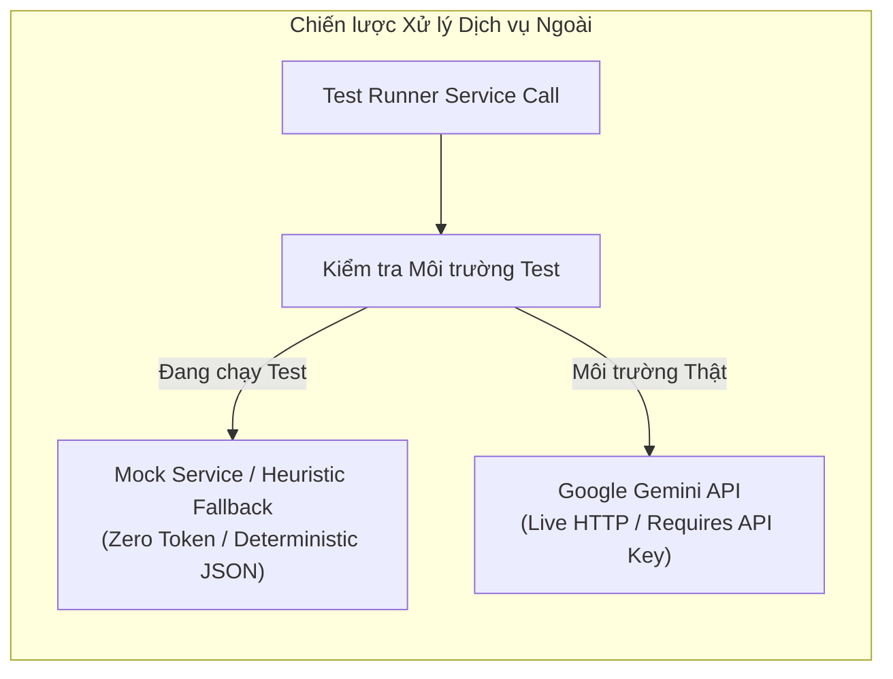

# Chiến lược Quản lý Dữ liệu Kiểm thử (Test Data Strategy) — ProcureAI

> **Mã tài liệu:** QA-05-DATA  
> **Hệ thống:** ProcureAI — Internal Procurement & Approval Platform  
> **Phiên bản:** v1.0.0  
> **Thời điểm ban hành:** 2026-10-09T21:22:00+07:00  
> **Tác giả:** Senior QA Engineer & Test Automation Engineer  
> **Tài liệu căn cứ:** [test-strategy.md](test-strategy.md), [test-environment.md](test-environment.md), [test-cases.md](test-cases.md)  

---

## 1. Nguyên tắc Quản lý Dữ liệu Kiểm thử (Core Principles)

1. **Nguyên tắc Cô lập Tuyệt đối (Zero Production Contamination):**
   - Tuyệt đối không dùng dữ liệu production thật cho kiểm thử.
   - Không cho phép các script kiểm thử kết nối hoặc ghi đè vào file database `db.sqlite3` đang dùng cho phát triển. Toàn bộ dữ liệu được sinh động trong bộ nhớ RAM (`in-memory database`).
2. **Tính Tái lập & Tiên tri (Predictable & Deterministic):**
   - Dữ liệu kiểm thử phải có giá trị cố định, rõ ràng, không sử dụng hàm sinh số ngẫu nhiên không kiểm soát (tránh gây flaky tests).
3. **Tự Dọn dẹp (Self-Cleaning / Ephemeral):**
   - Dữ liệu chỉ tồn tại trong vòng đời của từng test method. Sau khi test method assert xong, transaction tự động rollback, trả lại trạng thái sạch hoàn toàn cho test tiếp theo.

---

## 2. Danh mục Fixtures & Seed Data Chuẩn hóa (Standard Test Seed Data)

### 2.1 Bộ Người dùng Chuẩn (5 Roles RBAC Users)
Bộ fixture người dùng đại diện đầy đủ cho 5 vai trò theo quy định của hệ thống:

| ID | Username | Họ và tên | Vai trò (`role`) | Phòng ban (`department`) | Mục đích sử dụng trong Test |
|:---|:---|:---|:---:|:---|:---|
| `usr-emp-01` | `emp1` | Nguyễn Văn A | `employee` | Phòng CNTT | Người tạo PR chính, kiểm thử tạo PR bản nháp và submit |
| `usr-mgr-01` | `mgr1` | Trần Thị B | `manager` | Phòng CNTT | Quản lý cùng phòng, kiểm thử duyệt PR thành công |
| `usr-mgr-02` | `mgr2` | Hoàng Văn M | `manager` | Ban Giám Đốc | Quản lý độc lập khác phòng, kiểm thử duyệt chéo |
| `usr-pro-01` | `pro1` | Lê Văn C | `procurement` | Phòng Thu mua | Nhân viên thu mua, kiểm thử upload báo giá, chọn NCC, tạo PO |
| `usr-fin-01` | `fin1` | Phạm Thị D | `finance` | Phòng Tài chính | Kế toán/tài chính, kiểm thử kiểm tra ngân sách, cờ duyệt 50M |
| `usr-adm-01` | `adm1` | Vũ Đức E | `admin` | Ban Quản trị | Quản trị hệ thống, kiểm thử cấu hình và kiểm tra phân quyền |

### 2.2 Bộ Dữ liệu Ngân sách Phòng ban (Budget Seed)
- **Mã ngân sách:** `BGT-IT-2026`
- **Tên ngân sách:** Ngân sách Thiết bị CNTT Năm 2026
- **Phòng ban:** Phòng CNTT (`cost_center = 'CC-IT-01'`)
- **Năm tài chính:** `2026`
- **Hạn mức phân bổ (`allocated`):** `500,000,000 VND`
- **Số tiền tạm giữ ban đầu (`committed`):** `0 VND`
- **Số tiền thực chi ban đầu (`spent`):** `0 VND`
- **Trạng thái:** Hoạt động (`is_active = True`)

### 2.3 Bộ Dữ liệu Nhà cung cấp (Suppliers Seed)
1. **Nhà cung cấp 1:**
   - `id`: `sup-01`
   - `name`: Công ty Cổ phần Công nghệ Phong Vũ
   - `tax_code`: `0301234567`
   - `email`: `sales@phongvu.vn`
   - `categories`: `["Thiết bị CNTT", "Linh kiện điện tử"]`
2. **Nhà cung cấp 2:**
   - `id`: `sup-02`
   - `name`: Công ty TNHH Phân phối FPT (FPT Trading)
   - `tax_code`: `0309876543`
   - `email`: `b2b@fpt.com.vn`
   - `categories`: `["Thiết bị CNTT"]`

### 2.4 Dữ liệu Tham chiếu Giá Lịch sử (PriceReference Fixture)
Dữ liệu lịch sử phục vụ kiểm thử tính năng **AI Cảnh báo giá bất thường $\ge 20\%$ (`REQ-FR-15`)**:
- **Tên mặt hàng:** "Dell Latitude 5440"
- **Danh mục:** "Thiết bị CNTT"
- **Đơn giá dự toán chuẩn (Historical Benchmark Price):** `20,000,000 VND`
- **Ngưỡng biên kiểm thử (Threshold Cases):**
  - Đơn giá Báo giá A: `23,980,000 VND` (Tăng $+19.9\%$ $\rightarrow$ **Không bật cảnh báo**)
  - Đơn giá Báo giá B: `24,000,000 VND` (Tăng $+20.0\%$ $\rightarrow$ **Bật cảnh báo đỏ**)
  - Đơn giá Báo giá C: `25,000,000 VND` (Tăng $+25.0\%$ $\rightarrow$ **Bật cảnh báo đỏ**)

---

## 3. Chiến lược Mocking & Dịch vụ Giả lập (Mocking Strategy)



1. **Mocking Dịch vụ AI (External LLM API):**
   - *Vấn đề:* Gọi trực tiếp Google Gemini API trong các vòng lặp automated test sẽ tiêu tốn token, có nguy cơ bị Rate limit (`429`), phụ thuộc vào mạng Internet và phản hồi có tính ngẫu nhiên (non-deterministic).
   - *Giải pháp:* Trong phương thức kiểm thử, hệ thống sử dụng **Mock Service** hoặc fallback heuristic cục bộ (`run_ai_standardizer`, `evaluate_anomaly`). Hàm này phân tích từ khóa và tính toán công thức toán học thuần túy, trả về kết quả JSON có cấu trúc dự đoán được 100%.
2. **Mocking File Upload (PDF/Excel Báo giá):**
   - Dùng file nhị phân giả lập trong bộ nhớ (`SimpleUploadedFile("quote.pdf", b"%PDF-1.4 mock content...")`) của Django, không cần đọc/ghi file vật lý lên đĩa cứng.

---

## 4. Quy trình Setup & Teardown trong Kiểm thử

Mỗi lớp kiểm thử (Test Class) kế thừa từ `django.test.TestCase` tuân thủ quy trình vòng đời chuẩn:

```python
class ProcurementWorkflowIntegrationTests(TestCase):

    def setUp(self):
        """
        Khởi tạo sạch dữ liệu ban đầu trước MỖI test method.
        Chạy trong một Database Transaction độc lập.
        """
        # 1. Khởi tạo 5 người dùng chuẩn
        self.emp = User.objects.create(...)
        self.mgr = User.objects.create(...)
        self.pro = User.objects.create(...)
        self.fin = User.objects.create(...)
        self.adm = User.objects.create(...)

        # 2. Khởi tạo Ngân sách phòng ban
        self.budget = Budget.objects.create(...)

        # 3. Khởi tạo Nhà cung cấp & Giá tham chiếu
        self.supplier = Supplier.objects.create(...)

    def tearDown(self):
        """
        Tự động dọn dẹp sau MỖI test method.
        Django tự động rollback toàn bộ database transaction,
        không lưu bất kỳ dữ liệu rác nào.
        """
        pass
```

---

## 5. Danh mục Kiểm tra Tính Toàn vẹn Dữ liệu (Data Integrity Checklist)

Trước khi xác nhận hoàn thành một chu trình kiểm thử, bắt buộc kiểm tra các ràng buộc:
- [x] **No Orphan Records:** Không có PRLineItem nào tồn tại mà không liên kết với PurchaseRequest (`pr_id` không được null).
- [x] **Financial Integrity:** Tổng tiền dự toán của PR luôn bằng tổng của `(quantity * estimated_unit_price)` của các dòng con.
- [x] **Budget Balancing:** `Budget.allocated = Budget.remaining + Budget.committed + Budget.spent`.
- [x] **Audit Traceability:** Bất kỳ thao tác chuyển trạng thái nào đều sinh ra ít nhất một bản ghi trong `AuditEntry`.
