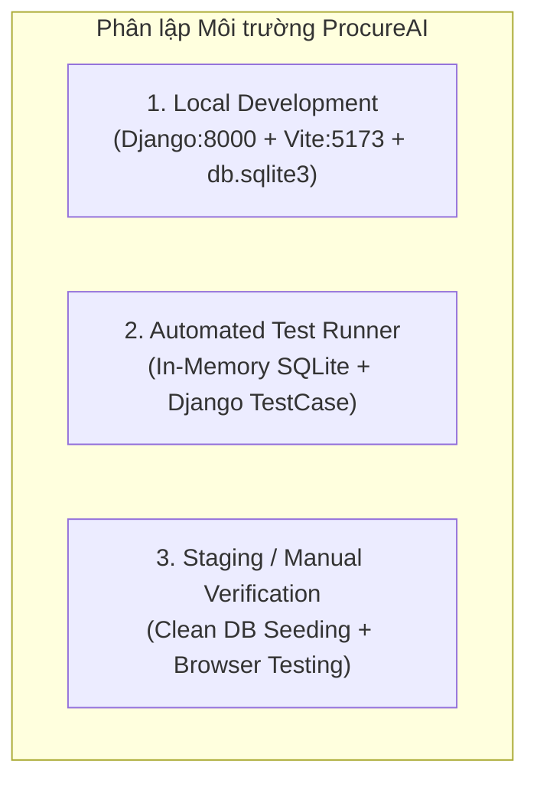

# Kế hoạch Môi trường Kiểm thử (Test Environment Plan) — ProcureAI

> **Mã tài liệu:** QA-05-ENV  
> **Hệ thống:** ProcureAI — Internal Procurement & Approval Platform  
> **Phiên bản:** v1.0.0  
> **Thời điểm ban hành:** 2026-10-09T21:22:00+07:00  
> **Tác giả:** Senior QA Engineer & Test Automation Engineer  
> **Tài liệu căn cứ:** [test-strategy.md](test-strategy.md), [test-plan.md](test-plan.md), [qa-inventory.md](qa-inventory.md)  

---

## 1. Hiện trạng Runtime, Package Manager & Công nghệ (Active Baseline)

Qua khảo sát thực tế môi trường máy trạm Windows, các phiên bản runtime và package manager đang hoạt động gồm:

| Thành phần | Phiên bản thực tế | Đường dẫn / Phạm vi | Nhận xét trạng thái |
|:---|:---|:---|:---|
| **Hệ điều hành** | Windows (PowerShell 5.1/7) | Local Workstation | Thực thi lệnh qua PowerShell; cần dùng `.cmd` cho các công cụ npm do policy script. |
| **Python Runtime** | `3.13.2` (64-bit) | Global / Virtualenv | Đã cài đặt đầy đủ; hỗ trợ cú pháp kiểu dữ liệu và async hiện đại. |
| **Backend Framework** | `Django 5.1.x` | `procurement/`, `config/` | Đã cấu hình ORM, REST sync views và SQLite database engine. |
| **Node.js Runtime** | `v24.10.0` (ESM native) | Global | Hỗ trợ chuẩn module ESM và Node test runner tích hợp (`node:test`). |
| **Package Manager** | `npm 11.6.1` (`npm.cmd`) | `FE/` | Quản lý dependencies cho ứng dụng Frontend React. |
| **Frontend Framework** | `React 18.3.1` + `Vite 5.2.0` | `FE/src/` | Single-Page Application (SPA), TypeScript 5.5, TailwindCSS 3.4. |
| **Cơ sở dữ liệu Dev** | `SQLite 3.x` | `db.sqlite3` (file 260KB) | Lưu trữ trạng thái tác nghiệp phát triển cục bộ. |
| **Cơ sở dữ liệu Test** | `SQLite in-memory` | `file:memorydb_default...` | Tự động sinh và hủy trong RAM bởi Django Test Runner. |

---

## 2. Ma trận Môi trường Kiểm thử (Test Environments Matrix)

Hệ thống phân lập thành 3 môi trường kiểm thử rõ ràng:



### 2.1 Môi trường Tự động (Automated Test Environment)
- **Cơ chế hoạt động:** Chạy qua `python manage.py test`.
- **Database:** SQLite In-memory (`file:memorydb_default?mode=memory&cache=shared`).
- **An toàn dữ liệu:** Mỗi test method được bọc trong một Database Transaction độc lập và tự động Rollback sau khi kết thúc. **Không bao giờ ghi đè, làm biến đổi hay xóa dữ liệu trong file `db.sqlite3` của dev/production.**
- **Mạng (Network):** Môi trường mạng nội bộ cô lập, không gọi tới external APIs của bên thứ ba (các dịch vụ AI được mock hoặc dùng thuật toán nội bộ).

### 2.2 Môi trường Kiểm thử Thủ công / Giao diện (Manual UI Verification Environment)
- **Backend:** `http://127.0.0.1:8000/` khởi chạy bằng `python manage.py runserver`.
- **Frontend:** `http://localhost:5173/` khởi chạy bằng `npm.cmd --prefix FE run dev`.
- **API Proxy:** Vite được cấu hình proxy tự động chuyển tiếp các request `/api/` về cổng 8000 của Django.

---

## 3. Quản lý Cấu hình & Bảo vệ Secret (Configuration & Secret Safety)

1. **Nguyên tắc an toàn Secret:**
   - Không hardcode API Key nhạy cảm (như Gemini API Key) vào mã nguồn kiểm thử công khai.
   - Biến môi trường được nạp thông qua file `.env` (đã nằm trong `.gitignore`).
2. **Kiểm tra cấu hình an toàn (Safe Config Inspection):**
   - Lệnh kiểm tra tính toàn vẹn cấu hình mà **không làm lộ secret key ra màn hình**:
     ```powershell
     python manage.py check
     ```
   - Xác nhận cấu hình bảo mật Django:
     ```powershell
     python -c "import os; from config import settings; print('SECRET_KEY configured:', bool(settings.SECRET_KEY), '| DEBUG:', settings.DEBUG)"
     ```
     *(Lệnh chỉ in cờ boolean `True/False`, không in chuỗi secret thật).*

---

## 4. Cô lập Kiểm thử & Tính Ổn định (Isolation & Reproducibility)

1. **Test Isolation (Tính cô lập):**
   - Đảm bảo trạng thái của Test Case A không ảnh hưởng tới Test Case B.
   - Toàn bộ dữ liệu người dùng, PR, Quotation, PO, Receiving được tạo mới trong phương thức `setUp()` của từng class và bị hủy sạch khi class/method kết thúc.
2. **Reproducibility (Khả năng chạy lại):**
   - Bộ test có thể chạy lặp lại 100 lần liên tiếp với cùng kết quả (deterministic), không bị hiện tượng flaky test do không phụ thuộc vào độ trễ mạng Internet hay trạng thái server bên ngoài.
3. **Immutability (Tính bất biến của cơ sở dữ liệu thật):**
   - File cơ sở dữ liệu thật `db.sqlite3` được bảo vệ tuyệt đối: quyền ghi của Django runner bị cô lập trong RAM.

---

## 5. Đề xuất Công cụ & Gói Thư viện Bổ sung (Pending Approval)

Hiện tại, thư mục `FE/` **chưa có Test Runner tự động** để kiểm thử các React component và file utility client. Dưới đây là phương án đề xuất (chờ phê duyệt, **chưa cài đặt** trong đợt QA-05):

| Gói đề xuất | Phiên bản đề xuất | Mục đích sử dụng | Rủi ro tương thích | Phương án Rollback |
|:---|:---:|:---|:---|:---|
| `vitest` | `^2.1.2` | Test runner siêu tốc cho Vite Frontend, thay thế file cũ bị lỗi | Xung đột nếu version Node cũ (hiện Node 24 tương thích tốt) | `npm.cmd --prefix FE uninstall vitest` |
| `@testing-library/react` | `^16.0.0` | Kiểm thử render UI component React, form submit, modal | Cần khớp version React 18.3 | `npm.cmd --prefix FE uninstall @testing-library/react` |
| `@testing-library/jest-dom` | `^6.5.0` | Cung cấp matcher DOM (`toBeInTheDocument`, `toBeDisabled`) | Không có rủi ro đáng kể | `npm.cmd --prefix FE uninstall @testing-library/jest-dom` |
| `jsdom` | `^25.0.0` | Giả lập môi trường trình duyệt trên môi trường dòng lệnh Node | Chiếm thêm dung lượng node_modules | `npm.cmd --prefix FE uninstall jsdom` |

> **RÀNG BUỘC TUÂN THỦ:** Các gói trên chỉ ở trạng thái **ĐỀ XUẤT**. Tuyệt đối không tự ý chạy `npm install` khi người dùng chưa có chỉ đạo chính thức.
