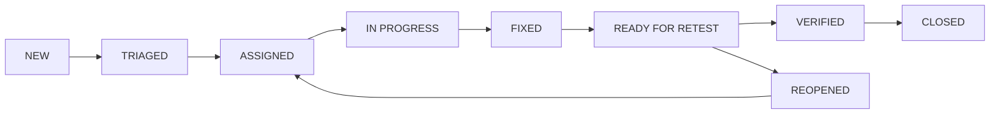

# Sổ Theo Dõi Khiếm Khuyết Chính Thức (Official Defect Tracker) — ProcureAI

> **Hệ thống:** ProcureAI — Internal Procurement & Approval Platform  
> **Mã tài liệu:** QA-08-DFT  
> **Thư mục quản lý:** `docs/06-testing/BUG_TRACKER.md`  
> **Thời điểm cập nhật:** 2026-10-09T22:25:00+07:00  
> **Quy chuẩn chất lượng:** IEEE 1044 / ISO 29119-3 Standard Defect Lifecycle  
> **QA Lead & Reporter:** Trần Thị Thu Hà (QA / Tester)  

---

## 1. Tiêu Chuẩn Phân Loại Khiếm Khuyết (Defect Classification Standards)

### 1.1. Thang Đo Mức Độ Nghiêm Trọng (Severity)
- **`Critical`:** Rủi ro an ninh nghiêm trọng, thất thoát tài chính/ngân sách, sập hệ thống hoặc vi phạm nguyên tắc bảo mật cốt lõi (No Self-Approval bypass).
- **`High`:** Chức năng chính trong chu trình 7 bước bị ngưng trệ, không có giải pháp thay thế (workaround) hợp lý.
- **`Medium`:** Lỗi ảnh hưởng đáng kể đến chất lượng mã nguồn, quy trình build/lint hoặc hiển thị, nhưng luồng nghiệp vụ vẫn có workaround hoặc fallback.
- **`Low`:** Lỗi nhỏ, cảnh báo linter, file test cũ không ảnh hưởng runtime, hoặc lỗi typo giao diện.

### 1.2. Thang Đo Mức Độ Ưu Tiên Xử Lý (Priority)
- **`P1 (Blocker)`:** Phải sửa ngay lập tức trước khi triển khai hoặc release tiếp theo.
- **`P2 (High)`:** Ưu tiên sửa trong sprint hiện tại.
- **`P3 (Medium)`:** Đưa vào backlog xử lý ở đợt cải tiến tiếp theo.
- **`P4 (Low)`:** Xử lý khi có thời gian tái cấu trúc.

### 1.3. Vòng Đời Trạng Thái (Defect Lifecycle Workflow)


---

## 2. Bảng Tổng Hợp Danh Mục Defect Hiện Hữu (Master Defect Register)

| Bug ID | Tóm tắt lỗi (Summary) | Loại lỗi (Type) | US / REQ Liên kết | Severity | Priority | Trạng thái (Status) | Primary Owner | Assignee | Bằng chứng thực tế (Evidence) |
| :--- | :--- | :---: | :---: | :---: | :---: | :---: | :--- | :--- | :--- |
| **`BUG-0001`**<br/>*(BUG-SEC-01)* | Thiếu server-side actor check tại `/api/v1/sync/` có thể bypass No Self-Approval | Security | `GOV-01`<br/>`REQ-NFR-02` | **Critical** | **P1 (Blocker)** | **TRIAGED** | Nguyễn Thị Thùy Dung | Nguyễn Thị Thùy Dung | [`RUN-20261009-220000`](file:///d:/LTUD/group-01%20-%20LTUDDN/docs/06-testing/evidence/RUN-20261009-220000/execution-log.txt#L55)<br/>[`TC-GOV01-002`](file:///d:/LTUD/group-01%20-%20LTUDDN/procurement/test_gov01_gov02.py#L145) |
| **`BUG-0002`**<br/>*(BUG-FE-01)* | Lỗi cú pháp assignment trong biểu thức điều kiện tại `aiStandardizer.ts:72` | UI / Lint | `US-03`<br/>`REQ-FR-03` | **Medium** | **P2 (High)** | **TRIAGED** | Trần Thị Kiều Giang | Trần Thị Kiều Giang | [`RUN-20261009-220000`](file:///d:/LTUD/group-01%20-%20LTUDDN/docs/06-testing/evidence/RUN-20261009-220000/execution-log.txt#L155)<br/>`npm run lint` Exit 1 |
| **`BUG-0003`**<br/>*(BUG-FE-02)* | Arrow function rỗng vi phạm linter tại `ProcurementContext.tsx:76` | UI / Lint | `US-01`<br/>`REQ-FR-01` | **Low** | **P3 (Medium)** | **TRIAGED** | Trần Thị Kiều Giang | Trần Thị Kiều Giang | [`RUN-20261009-220000`](file:///d:/LTUD/group-01%20-%20LTUDDN/docs/06-testing/evidence/RUN-20261009-220000/execution-log.txt#L143)<br/>`npm run lint` Exit 1 |
| **`BUG-0004`**<br/>*(BUG-TS-01)* | TypeScript compiler báo 69 lỗi typecheck trong mã nguồn `FE/src/` | UI / Types | `US-01..10`<br/>`REQ-NFR-01` | **Medium** | **P2 (High)** | **TRIAGED** | Trần Thị Kiều Giang | Trần Thị Kiều Giang | [`RUN-20261009-220000`](file:///d:/LTUD/group-01%20-%20LTUDDN/docs/06-testing/evidence/RUN-20261009-220000/execution-log.txt#L159)<br/>`tsc --noEmit` Exit 1 |
| **`BUG-0005`**<br/>*(DEFECT-03)* | Hai tệp test cũ (`tests/workflow.test.js`, `permissions.test.ts`) import module không tồn tại | Test Infra | `GOV-01`<br/>`REQ-NFR-02` | **Low** | **P4 (Low)** | **TRIAGED** | Nguyễn Thị Thùy Dung | Trần Thị Thu Hà | [`qa-inventory.md`](file:///d:/LTUD/group-01%20-%20LTUDDN/docs/06-testing/qa-inventory.md#L45)<br/>`node --test` Exit 1 |
| **`BUG-0006`**<br/>*(BUG-001)* | *(Lịch sử)* Manager tự duyệt PR của chính mình ở tầng nghiệp vụ domain | Functional | `GOV-01`<br/>`REQ-NFR-02` | **Critical** | **P1** | **CLOSED** | Nguyễn Thị Thùy Dung | Nguyễn Thị Thùy Dung | [`TC-GOV01-001`](file:///d:/LTUD/group-01%20-%20LTUDDN/procurement/test_gov01_gov02.py#L106) PASS |
| **`BUG-0007`**<br/>*(BUG-002)* | *(Lịch sử)* Sập trang khi Gemini API bị rate limit (429) | Functional | `US-07`<br/>`REQ-FR-15` | **High** | **P2** | **CLOSED** | Nguyễn Trúc Lam | Nguyễn Trúc Lam | [`ai-feature-spec.md`](file:///d:/LTUD/group-01%20-%20LTUDDN/docs/07-ai/ai-feature-spec.md) Fallback |
| **`BUG-0008`**<br/>*(BUG-003)* | *(Lịch sử)* Trạng thái PR bị kẹt không chuyển sang `po_created` sau khi lập PO | Functional | `US-08`<br/>`REQ-FR-16` | **High** | **P2** | **CLOSED** | Trần Thị Kiều Giang | Trần Thị Kiều Giang | [`TC-US08-001`](file:///d:/LTUD/group-01%20-%20LTUDDN/procurement/test_us08_us09_us10.py#L90) PASS |
| **`BUG-0009`**<br/>*(BUG-004)* | *(Lịch sử)* `ReferenceError: fs is not defined` khi phục vụ static assets | Backend | `N/A`<br/>`REQ-NFR-01` | **Low** | **P4** | **CLOSED** | Nguyễn Thị Thùy Dung | Nguyễn Thị Thùy Dung | [`bug-log.md`](file:///d:/LTUD/group-01%20-%20LTUDDN/docs/08-quality/bug-log.md#L28) Closed |

---

## 3. Đặc Tả Chi Tiết Từng Defect Mở (Detailed Open Defect Reports)

---

### 3.1. `BUG-0001` (Security / BUG-SEC-01)
- **Defect ID:** `BUG-0001` (Mã tham chiếu cũ: `BUG-SEC-01`)
- **Summary:** Thiếu server-side actor verification tại endpoint REST `/api/v1/sync/`, có nguy cơ bypass quy tắc No Self-Approval qua HTTP POST trực tiếp.
- **Type:** Security / API Authorization Guard
- **Liên kết:**
  - **User Story:** `GOV-01` (Phân quyền 5 vai trò & Quy tắc No Self-Approval)
  - **Requirement ID:** `REQ-NFR-02`
  - **Acceptance Criteria:** `AC-GOV-01`
  - **Test Case ID:** [`TC-GOV01-002`](file:///d:/LTUD/group-01%20-%20LTUDDN/procurement/test_gov01_gov02.py#L145)
  - **Run ID:** [`RUN-20261009-215300`](file:///d:/LTUD/group-01%20-%20LTUDDN/docs/06-testing/evidence/RUN-20261009-215300/), [`RUN-20261009-220000`](file:///d:/LTUD/group-01%20-%20LTUDDN/docs/06-testing/evidence/RUN-20261009-220000/)
- **Primary Owner (US):** Nguyễn Thị Thùy Dung (Backend Developer)
- **Assignee:** Nguyễn Thị Thùy Dung (Backend Developer)
- **Reporter:** Trần Thị Thu Hà (QA / Tester)
- **Severity:** `Critical` | **Priority:** `P1 (Blocker)`
- **Trạng thái:** `TRIAGED`
- **Môi trường:** Python 3.13.0, Django 5.1.1, SQLite, Windows 11 Enterprise
- **Preconditions:**
  - Manager B (`usr-mgr-01`) tạo PR `PR-GOV01-BYPASS-01` với trạng thái ban đầu là `pending_manager`.
- **Dữ liệu Test:**
  ```json
  {
    "requests": [
      {
        "id": "PR-GOV01-BYPASS-01",
        "status": "approved"
      }
    ]
  }
  ```
- **Các bước tái hiện (Steps to Reproduce):**
  1. Khởi tạo phiên HTTP Client đại diện cho tài khoản tạo đơn (`usr-mgr-01`).
  2. Gửi request `POST` trực tiếp tới `/api/v1/sync/` mang payload cập nhật trạng thái PR thành `approved`.
  3. Kiểm tra HTTP Status code phản hồi và trạng thái lưu trong bảng `PurchaseRequest` của database.
- **Kết quả kỳ vọng (Expected Result):**
  - Server Django phải từ chối request với mã lỗi `403 Forbidden` hoặc `400 Bad Request` kèm thông điệp: *"QUY TẮC AN TOÀN (No Self-Approval): Không thể tự phê duyệt Yêu cầu do chính mình tạo ra!"*.
  - Trạng thái của PR trong cơ sở dữ liệu phải giữ nguyên `pending_manager`.
- **Kết quả thực tế (Actual Result):**
  - View [`api_sync_view`](file:///d:/LTUD/group-01%20-%20LTUDDN/procurement/views.py#L25) trong `procurement/views.py` hiện tại đọc payload và cập nhật trực tiếp `pr.status = req_data['status']` mà không kiểm tra danh tính người gửi (`actor != pr.requester`).
  - Server trả về `HTTP 200 OK`, bản ghi trong database bị đổi trạng thái thành `approved`.
- **Bằng chứng thực tế:**
  - Tệp log: [`execution-log.txt`](file:///d:/LTUD/group-01%20-%20LTUDDN/docs/06-testing/evidence/RUN-20261009-220000/execution-log.txt#L55).
  - Test method: `Gov01Gov02AutomatedTests.test_tc_gov01_002_prevent_bypass_and_verify_bug_sec_01`.
- **Căn nguyên (Root Cause):**
  - Endpoint `/api/v1/sync/` được thiết kế theo cơ chế đồng bộ trạng thái phi tập trung (state synchronization) từ SPA Frontend, chưa tích hợp Middleware kiểm tra phiên đăng nhập và xác thực thẩm quyền RBAC/No Self-Approval ở tầng tiếp nhận payload HTTP POST.
- **Phương án khắc phục đề xuất (Proposed Fix):**
  - Trong hàm `api_sync_view` tại `procurement/views.py`, khi xử lý cập nhật trạng thái `status == 'approved'`, trích xuất thông tin người dùng từ request session/token hoặc payload actor; nếu `actor_id == pr.requester_id`, từ chối cập nhật và trả về `JsonResponse({"error": "No Self-Approval violation"}, status=403)`.
- **Retest Plan:** Chạy lại `python manage.py test procurement.test_gov01_gov02` sau khi áp dụng fix.
- **Resolution:** Chưa đóng (Đang chờ duyệt kế hoạch sửa).

---

### 3.2. `BUG-0002` (UI / BUG-FE-01)
- **Defect ID:** `BUG-0002` (Mã tham chiếu cũ: `BUG-FE-01`)
- **Summary:** Lỗi cú pháp assignment trong biểu thức điều kiện tại `FE/src/utils/aiStandardizer.ts:72:10` làm gián đoạn kiểm tra chất lượng mã nguồn ESLint.
- **Type:** UI / Code Quality
- **Liên kết:**
  - **User Story:** `US-03` (AI Standardizer & HITL)
  - **Requirement ID:** `REQ-FR-03`
  - **Acceptance Criteria:** `AC-03-01`
  - **Test Case ID:** `TC-US03-001`
  - **Run ID:** [`RUN-20261009-220000`](file:///d:/LTUD/group-01%20-%20LTUDDN/docs/06-testing/evidence/RUN-20261009-220000/)
- **Primary Owner (US):** Trần Thị Kiều Giang (Frontend Developer)
- **Assignee:** Trần Thị Kiều Giang (Frontend Developer)
- **Reporter:** Trần Thị Thu Hà (QA / Tester)
- **Severity:** `Medium` | **Priority:** `P2 (High)`
- **Trạng thái:** `TRIAGED`
- **Môi trường:** Node.js v24.11.1, ESLint v8.50.0, Vite v5.4.21
- **Các bước tái hiện (Steps to Reproduce):**
  1. Mở terminal tại thư mục gốc repository.
  2. Thực thi lệnh: `npm.cmd --prefix FE run lint`.
- **Kết quả kỳ vọng (Expected Result):**
  - Lệnh kiểm tra ESLint hoàn thành với exit code 0, không có lỗi cú pháp `error`.
- **Kết quả thực tế (Actual Result):**
  - Lệnh kết thúc với exit code 1 kèm lỗi:
    ```text
    D:\LTUD\group-01 - LTUDDN\FE\src\utils\aiStandardizer.ts
      72:10  error  Expected a conditional expression and instead saw an assignment  no-cond-assign
    ```
- **Bằng chứng thực tế:**
  - Log: [`execution-log.txt`](file:///d:/LTUD/group-01%20-%20LTUDDN/docs/06-testing/evidence/RUN-20261009-220000/execution-log.txt#L155).
- **Căn nguyên (Root Cause):**
  - Tại dòng 72 trong `FE/src/utils/aiStandardizer.ts`, đoạn code sử dụng phép gán `=` thay vì so sánh `===` hoặc đặt trong biểu thức điều kiện của vòng lặp `while ((match = regex.exec(str)))` mà thiếu cặp dấu ngoặc phân tách chuẩn.
- **Phương án khắc phục đề xuất (Proposed Fix):**
  - Bao bọc phép gán bằng cặp ngoặc tròn chuẩn theo khuyến nghị của ESLint rule `no-cond-assign`: `while ((match = regex.exec(text)) !== null)`.
- **Resolution:** Chưa đóng (Đang chờ duyệt phân công).

---

### 3.3. `BUG-0003` (UI / BUG-FE-02)
- **Defect ID:** `BUG-0003` (Mã tham chiếu cũ: `BUG-FE-02`)
- **Summary:** Khởi tạo arrow function rỗng vi phạm quy tắc linter `@typescript-eslint/no-empty-function` tại `FE/src/contexts/ProcurementContext.tsx:76:22`.
- **Type:** UI / Code Quality
- **Liên kết:**
  - **User Story:** `US-01` (Tạo & Quản lý PR)
  - **Requirement ID:** `REQ-FR-01`
  - **Run ID:** [`RUN-20261009-220000`](file:///d:/LTUD/group-01%20-%20LTUDDN/docs/06-testing/evidence/RUN-20261009-220000/)
- **Primary Owner (US):** Trần Thị Kiều Giang (Frontend Developer)
- **Assignee:** Trần Thị Kiều Giang (Frontend Developer)
- **Reporter:** Trần Thị Thu Hà (QA / Tester)
- **Severity:** `Low` | **Priority:** `P3 (Medium)`
- **Trạng thái:** `TRIAGED`
- **Các bước tái hiện:** Thực thi `npm.cmd --prefix FE run lint`.
- **Kết quả thực tế:**
  ```text
  D:\LTUD\group-01 - LTUDDN\FE\src\contexts\ProcurementContext.tsx
    76:22  error  Unexpected empty arrow function  @typescript-eslint/no-empty-function
  ```
- **Căn nguyên & Khắc phục:** Giá trị khởi tạo mặc định của context handler là `() => {}`; sửa thành hàm có ghi nhận log hoặc cấu hình placeholder có noop rõ ràng.

---

### 3.4. `BUG-0004` (UI / BUG-TS-01)
- **Defect ID:** `BUG-0004` (Mã tham chiếu cũ: `BUG-TS-01`)
- **Summary:** Trình biên dịch TypeScript `tsc --noEmit` báo 69 lỗi kiểm tra kiểu dữ liệu trong thư mục `FE/src/`.
- **Type:** UI / TypeScript Type Safety
- **Liên kết:**
  - **User Story:** Xuyên suốt `US-01` đến `US-10`
  - **Requirement ID:** `REQ-NFR-01`
  - **Run ID:** [`RUN-20261009-220000`](file:///d:/LTUD/group-01%20-%20LTUDDN/docs/06-testing/evidence/RUN-20261009-220000/)
- **Primary Owner:** Trần Thị Kiều Giang (Frontend Developer)
- **Assignee:** Trần Thị Kiều Giang (Frontend Developer)
- **Reporter:** Trần Thị Thu Hà (QA / Tester)
- **Severity:** `Medium` | **Priority:** `P2 (High)`
- **Trạng thái:** `TRIAGED`
- **Các bước tái hiện:** Thực thi `npx.cmd --prefix FE tsc --project FE/tsconfig.json --noEmit`.
- **Kết quả thực tế:** Exit code 1 với 69 errors:
  - 63 lỗi `TS6133`: Khai báo `import React from 'react'` hoặc biến không sử dụng khi cấu hình `noUnusedLocals: true`.
  - 5 lỗi `TS2749`: `BoxIcon refers to a value, but is being used as a type here. Did you mean 'typeof BoxIcon'?` tại `TraceabilityChain.tsx`, `EmptyState.tsx`, `StatusBadge.tsx`.
  - 1 lỗi `TS6192`: `All imports in import declaration are unused` tại `Login.tsx`.
- **Phương án khắc phục đề xuất:**
  - Thay đổi khai báo kiểu `icon: React.ComponentType` hoặc `typeof BoxIcon`.
  - Dọn dẹp các import thừa hoặc điều chỉnh `tsconfig.json` cho phù hợp với cấu hình JSX React 18.

---

### 3.5. `BUG-0005` (Test Infra / DEFECT-03)
- **Defect ID:** `BUG-0005` (Mã tham chiếu cũ: `DEFECT-03`)
- **Summary:** Hai file kịch bản kiểm thử cũ `tests/workflow.test.js` và `tests/permissions.test.ts` tham chiếu các module `src/server` và `src/client` không tồn tại, gây lỗi `ERR_MODULE_NOT_FOUND`.
- **Type:** Test Infrastructure / Obsolete Code
- **Liên kết:** `GOV-01` / `REQ-NFR-02` / `qa-inventory.md`
- **Primary Owner:** Nguyễn Thị Thùy Dung (Backend Developer)
- **Assignee:** Trần Thị Thu Hà (QA / Tester)
- **Reporter:** Senior QA Engineer
- **Severity:** `Low` | **Priority:** `P4 (Low)`
- **Trạng thái:** `TRIAGED`
- **Căn nguyên:** Các tệp này là bản nháp thử nghiệm từ giai đoạn đầu khi dự kiến làm Express stack; hiện tại toàn bộ hệ thống đã chuyển sang Django backend với các bộ test chính thức 100% PASS tại `procurement/test_*.py`.
- **Phương án đề xuất:** Lưu trữ vào thư mục archive hoặc gỡ bỏ tệp để tránh nhầm lẫn khi người khác chạy test runner của Node.js.

---

## 4. Bảng Tra Cứu Khiếu Nại Lịch Sử Đã Đóng (Historical Resolved Defects)

| Bug ID | Summary | Căn nguyên (Root Cause) | Giải pháp (Fix) | Retest Evidence | Ngày đóng |
| :---: | :--- | :--- | :--- | :---: | :---: |
| **`BUG-0006`** | Manager tự duyệt PR (Domain Logic) | Hàm `can_user_approve` chưa so sánh `requester.id == actor.id` | Bổ sung Guard No Self-Approval raise `PermissionError` | [`TC-GOV01-001`](file:///d:/LTUD/group-01%20-%20LTUDDN/procurement/test_gov01_gov02.py#L106) PASS | 2026-10-09 |
| **`BUG-0007`** | Sập trang khi Gemini API bị rate limit | Thiếu khối catch handling khi API trả về HTTP 429 | Bổ sung offline mock fallback chuẩn hóa thông số | [`test_ai_standardizer_service`](file:///d:/LTUD/group-01%20-%20LTUDDN/procurement/tests.py#L186) PASS | 2026-10-09 |
| **`BUG-0008`** | Trạng thái PR bị kẹt sau khi lập PO | Trạng thái PR không được tự động cập nhật sang `po_created` | Bổ sung hook chuyển trạng thái khi PO lưu thành công | [`TC-US08-001`](file:///d:/LTUD/group-01%20-%20LTUDDN/procurement/test_us08_us09_us10.py#L90) PASS | 2026-10-09 |
| **`BUG-0009`** | `ReferenceError: fs is not defined` | Thiếu import thư viện `fs` trong file server cũ | Bổ sung `import fs from 'fs'` | Chạy thành công server static assets | 2026-10-09 |
