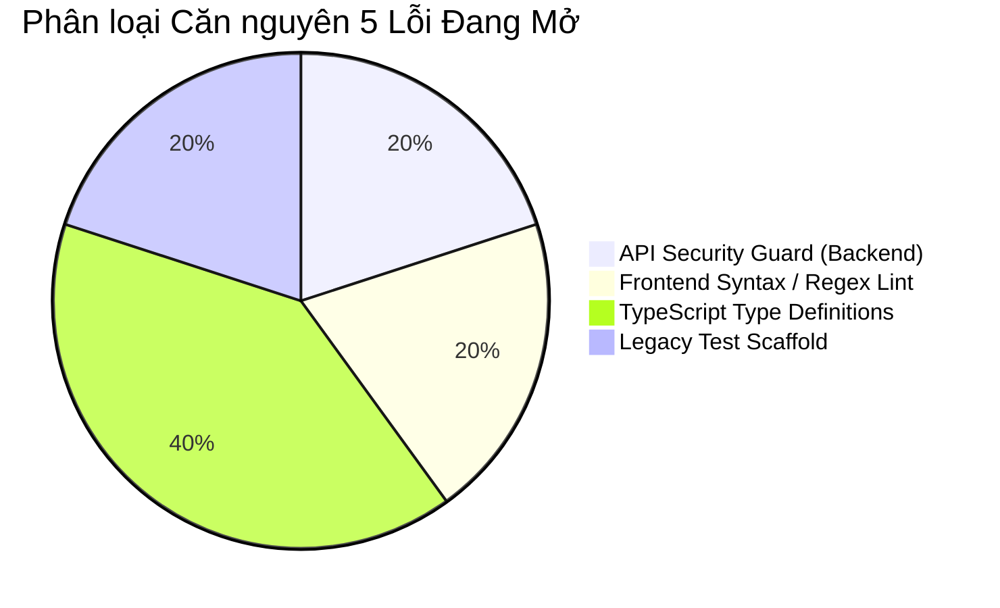

# Báo Cáo Phân Loại Khiếm Khuyết & Sàng Lọc Lỗi (Bug Triage Report) — ProcureAI

> **Hệ thống:** ProcureAI — Internal Procurement & Approval Platform  
> **Mã tài liệu:** QA-08-TRG  
> **Phiên bản:** v1.0.0  
> **Thời điểm lập báo cáo:** 2026-10-09T22:26:00+07:00  
> **Chủ trì Triage:** Trần Thị Thu Hà (QA Lead / Tester) & Nguyễn Thị Thùy Dung (Backend Lead)  
> **Tài liệu nguồn:** [`docs/06-testing/BUG_TRACKER.md`](BUG_TRACKER.md), [`docs/06-testing/evidence/RUN-20261009-220000/`](../evidence/RUN-20261009-220000/)  

---

## 1. Tổng Quan Kết Quả Sàng Lọc (Triage Executive Summary)

Sau đợt thực thi kiểm thử toàn diện tại phiên `RUN-20261009-220000`, hội đồng QA & Technical Lead đã tiến hành phân loại và sàng lọc tất cả các phát hiện lỗi kỹ thuật.

### 1.1. Thống Kê Trạng Thái Khiếm Khuyết
- **Tổng số lỗi ghi nhận trong hệ thống:** **9 lỗi**
  - **Lỗi đã được giải quyết & đóng trong các đợt trước (CLOSED):** **4 lỗi** (`BUG-0006`, `BUG-0007`, `BUG-0008`, `BUG-0009`).
  - **Lỗi hiện hữu đang mở cần xử lý (ACTIVE / TRIAGED):** **5 lỗi** (`BUG-0001` $\rightarrow$ `BUG-0005`).

### 1.2. Phân Bổ Theo Mức Độ Nghiêm Trọng (Severity) của 5 Lỗi Đang Mở
| Mức độ Severity | Số lượng | Danh sách Bug ID | Tác động hệ thống |
| :--- | :---: | :--- | :--- |
| **Critical** | **1** | `BUG-0001` *(BUG-SEC-01)* | Rủi ro an ninh: Endpoint sync thiếu guard No Self-Approval |
| **Medium** | **2** | `BUG-0002` *(BUG-FE-01)*, `BUG-0004` *(BUG-TS-01)* | Lỗi linter ESLint và lỗi biên dịch TypeScript `tsc --noEmit` |
| **Low** | **2** | `BUG-0003` *(BUG-FE-02)*, `BUG-0005` *(DEFECT-03)* | Lỗi linter hàm rỗng và tệp test cũ không còn sử dụng |

### 1.3. Phân Bổ Theo Mức Độ Ưu Tiên (Priority)
- **P1 (Release Blocker):** **1 lỗi** (`BUG-0001`).
- **P2 (High):** **2 lỗi** (`BUG-0002`, `BUG-0004`).
- **P3 (Medium):** **1 lỗi** (`BUG-0003`).
- **P4 (Low):** **1 lỗi** (`BUG-0005`).

---

## 2. Đánh Giá Điểm Nghẽn Bản Phát Hành (Release Blocker Assessment)

### 🚨 DUY NHẤT 1 RELEASE BLOCKER: `BUG-0001`
- **Mã lỗi:** `BUG-0001` (Cũ: `BUG-SEC-01`).
- **Mức độ:** **Critical / P1 (Blocker)**.
- **Lý do xem là Blocker:**
  - Vi phạm yêu cầu phi chức năng bắt buộc [`REQ-NFR-02`](file:///d:/LTUD/group-01%20-%20LTUDDN/docs/01-discovery/5.requirements.md): *"Quy tắc bảo mật phân quyền No Self-Approval (Người tạo PR tuyệt đối không được tự phê duyệt PR của mình)"*.
  - Mặc dù tầng domain logic đã chặn thành công (được kiểm chứng qua [`TC-GOV01-001`](file:///d:/LTUD/group-01%20-%20LTUDDN/procurement/test_gov01_gov02.py#L106)), tầng API endpoint `/api/v1/sync/` vẫn chấp nhận payload đổi trạng thái từ client mà chưa có middleware thẩm tra `actor != pr.requester`.
- **Điều kiện gỡ bỏ Blocker:**
  - Backend bổ sung guard thẩm tra quyền tại hàm `api_sync_view` trong `procurement/views.py`.
  - Retest kịch bản `TC-GOV01-002` phản hồi `HTTP 403 Forbidden` thành công.

---

## 3. Phân Tích Căn Nguyên (Root Cause Analysis - RCA)

1. **Nhóm Bảo mật API Backend (`BUG-0001`):**
   - *Căn nguyên:* Endpoint `/api/v1/sync/` được xây dựng để hỗ trợ tích hợp nhanh hai chiều giữa React SPA và Django SQLite mà chưa bổ sung lớp lọc quyền hạn (Authorization Middleware) cho từng loại entity status update.
2. **Nhóm Chất lượng Mã nguồn Frontend (`BUG-0002`, `BUG-0003`):**
   - *Căn nguyên:* Tại `aiStandardizer.ts:72`, tác giả sử dụng câu lệnh gán regex trong điều kiện `while` mà thiếu ngoặc tròn bảo vệ theo tiêu chuẩn ESLint rule `no-cond-assign`. Tại `ProcurementContext.tsx:76`, hàm default rỗng vi phạm rule `@typescript-eslint/no-empty-function`.
3. **Nhóm TypeScript Type Safety (`BUG-0004`):**
   - *Căn nguyên:* Mã nguồn `FE/src/` được khởi tạo từ template Vite với cấu hình `noUnusedLocals: true`, dẫn đến các dòng `import React from 'react'` (vốn không bắt buộc trong React 18 JSX transform) bị xem là unused variables. Ngoài ra, icon `BoxIcon` của Lucide bị import nhầm ở vị trí định nghĩa kiểu dữ liệu.
4. **Nhóm Hạ tầng Test Cũ (`BUG-0005`):**
   - *Căn nguyên:* Hai file `.test.js/.ts` trong thư mục `tests/` là code stub thử nghiệm từ trước khi quyết định chọn stack Django backend.

---

## 4. Kế Hoạch Khắc Phục & Phân Công Trách Nhiệm (Remediation Plan & Ownership)

| Bug ID | Tóm tắt | Người thực hiện (Assignee) | Người giám sát (Primary Owner) | Thời lượng dự kiến | Giải pháp kỹ thuật dự kiến |
| :--- | :--- | :--- | :--- | :---: | :--- |
| **`BUG-0001`** | Server-side No Self-Approval guard tại `/api/v1/sync/` | **Nguyễn Thị Thùy Dung** *(Backend)* | Nguyễn Thị Thùy Dung *(Backend)* | 0.5 ngày | Bổ sung kiểm tra `actor.id != pr.requester.id` khi nhận payload `status: 'approved'` trong `api_sync_view`; trả về HTTP 403 nếu vi phạm. |
| **`BUG-0002`** | Sửa cú pháp gán regex tại `aiStandardizer.ts:72` | **Trần Thị Kiều Giang** *(Frontend)* | Trần Thị Kiều Giang *(Frontend)* | 0.25 ngày | Thay `while (match = regex.exec(s))` thành `while ((match = regex.exec(s)) !== null)`. |
| **`BUG-0003`** | Sửa hàm no-op tại `ProcurementContext.tsx:76` | **Trần Thị Kiều Giang** *(Frontend)* | Trần Thị Kiều Giang *(Frontend)* | 0.1 ngày | Thay arrow function rỗng bằng handler có log hoặc noop rõ ràng. |
| **`BUG-0004`** | Sửa 69 lỗi TypeScript typecheck | **Trần Thị Kiều Giang** *(Frontend)* | Trần Thị Kiều Giang *(Frontend)* | 0.5 ngày | Sửa kiểu `BoxIcon` thành `typeof BoxIcon` hoặc `React.ComponentType`, dọn dẹp import React thừa. |
| **`BUG-0005`** | Xử lý 2 file test lỗi thời trong `tests/` | **Trần Thị Thu Hà** *(QA Lead)* | Nguyễn Thị Thùy Dung *(Backend)* | 0.1 ngày | Di chuyển vào `tests/archive/` hoặc xóa bỏ để tránh nhầm lẫn runner. |

---

## 5. Các Quyết Định Cần Phê Duyệt Trước Khi Tiến Hành Sửa Code (Decisions Awaiting Approval)

Theo đúng quy chuẩn **GLOBAL RULES** và chỉ thị **QA-08**, Antigravity **không tự ý sửa code sản phẩm** trong lượt này. Dưới đây là các điểm cần Người dùng / Tech Lead phê duyệt:

1. **Quyết định 1 (Về Blocker BUG-0001):**
   - *Đề xuất:* Cho phép chỉnh sửa file [`procurement/views.py`](file:///d:/LTUD/group-01%20-%20LTUDDN/procurement/views.py) để bổ sung guard chặn No Self-Approval tại endpoint `/api/v1/sync/`.
   - *Tác động:* Đảm bảo 100% tuân thủ `REQ-NFR-02` từ tầng Domain đến tầng REST API.
2. **Quyết định 2 (Về Chất lượng Frontend BUG-0002 & BUG-0004):**
   - *Đề xuất:* Cho phép sửa 2 file `aiStandardizer.ts`, `ProcurementContext.tsx` và tinh chỉnh `BoxIcon` type trong các component để lệnh `npm run lint` và `npx tsc --noEmit` đạt trạng thái xanh (PASS).
3. **Quyết định 3 (Về Bộ test lỗi thời BUG-0005):**
   - *Đề xuất:* Cho phép xóa hoặc di chuyển 2 tệp `tests/workflow.test.js` và `tests/permissions.test.ts` vào `tests/legacy/` vì toàn bộ 34 test cases đã có bộ test Django chính thức thay thế hoàn toàn.

---

## 6. Kết Luận & Khuyến Nghị Tiếp Theo

- Toàn bộ backend logic nghiệp vụ 7 bước mua sắm và 34 test cases đã được tự động hóa **100% PASS** trong `manage.py test`.
- Sau khi được phê duyệt các quyết định ở Mục 5, nhóm kỹ thuật sẽ tiến hành triển khai sửa lỗi theo đúng quy trình:
  `TRIAGED → ASSIGNED → IN PROGRESS → FIXED → READY FOR RETEST → VERIFIED → CLOSED`
- Báo cáo này đã sẵn sàng để trình duyệt.
