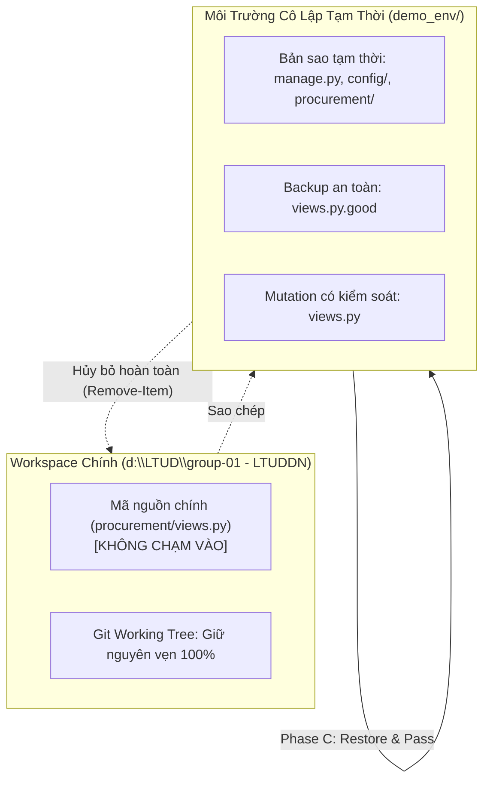

# Tóm Tắt Môi Trường Kiểm Thử (Environment Summary) — Live Demo Red/Green/Regression

> **Run ID:** `DEMO-RED-GREEN-20261010-015500`  
> **Thời điểm thực hiện:** 2026-10-10T01:55:00+07:00  
> **Kỹ sư thực hiện:** Senior QA Engineer  
> **Mục tiêu:** Chứng minh năng lực phát hiện lỗi và độ tin cậy của bộ kiểm thử thông qua kỹ thuật Mutation Testing có kiểm soát.

---

## 1. Thông Số Môi Trường Kỹ Thuật

| Tham số | Giá trị thực tế | Ghi chú |
| :--- | :--- | :--- |
| **Hệ điều hành** | Windows 11 Pro 64-bit | Local workstation |
| **Shell thực thi** | PowerShell 5.1 / Windows Terminal | PAGER=cat |
| **Python Runtime** | Python 3.13.0 | Môi trường hệ thống chính |
| **Web Framework** | Django 5.1.1 | Cấu hình tại `config/settings.py` |
| **Cơ sở dữ liệu Test** | `sqlite3` in-memory (`file:memorydb_default?mode=memory&cache=shared`) | Hoàn toàn cô lập trong RAM, tự giải phóng sau test |
| **Cơ sở dữ liệu Local** | `db.sqlite3` (266 KB) | Không bị tác động hay ghi rác dữ liệu test |
| **Test Runner** | Django Test Framework (Python `unittest`) | `python manage.py test` |
| **Mã nguồn Git** | Nhánh `main`, commit HEAD `5f681f4` | Trạng thái working tree sạch sẽ ở mã nguồn |

---

## 2. Cơ Chế Cô Lập An Toàn (Safety & Isolation Architecture)

Để tuân thủ tuyệt đối quy tắc an toàn **"Không sửa trực tiếp workspace chính để tạo lỗi demo"**:

1. **Khởi tạo bản sao cô lập:** Tạo thư mục `demo_env/` sao chép `manage.py`, thư mục `config/` và `procurement/`.
2. **Lưu bản sao logic chuẩn:** Tạo tệp `demo_env/procurement/views.py.good` trước khi thực hiện bất kỳ thay đổi nào.
3. **Thực thi Mutation độc lập:** Áp dụng mutation vô hiệu hóa guard chỉ trên `demo_env/procurement/views.py`.
4. **Phục hồi và Dọn dẹp:**
   - Khôi phục nguyên trạng từ `views.py.good`.
   - Chạy lệnh `Remove-Item -Path "demo_env" -Recurse -Force` xóa vĩnh viễn thư mục tạm.
5. **Xác minh tính toàn vẹn Workspace chính:** Lệnh `git status --short` xác nhận không có bất kỳ dòng code nào bị thay đổi hay rò rỉ vào nhánh làm việc chính.

---

## 3. Đối Tượng Kiểm Thử & Lỗ Hổng Mô Phỏng

* **Test Method:** `procurement.test_gov01_gov02.Gov01Gov02AutomatedTests.test_tc_gov01_002_prevent_bypass_and_verify_bug_sec_01`
* **Vị trí logic ứng dụng:** Endpoint API `POST /api/v1/sync/` tại hàm `api_sync_view` ([`procurement/views.py:91-111`](file:///d:/LTUD/group-01%20-%20LTUDDN/procurement/views.py#L91-L111)).
* **Quy tắc bảo mật:** Quy tắc No Self-Approval (`GOV-01`, `REQ-NFR-02`). Ngăn chặn người tạo PR tự ý duyệt PR của chính mình qua API.
* **Lỗi gốc:** `BUG-0001 (BUG-SEC-01)` — Từng phát hiện ở QA-08 và được vá tại QA-10.
