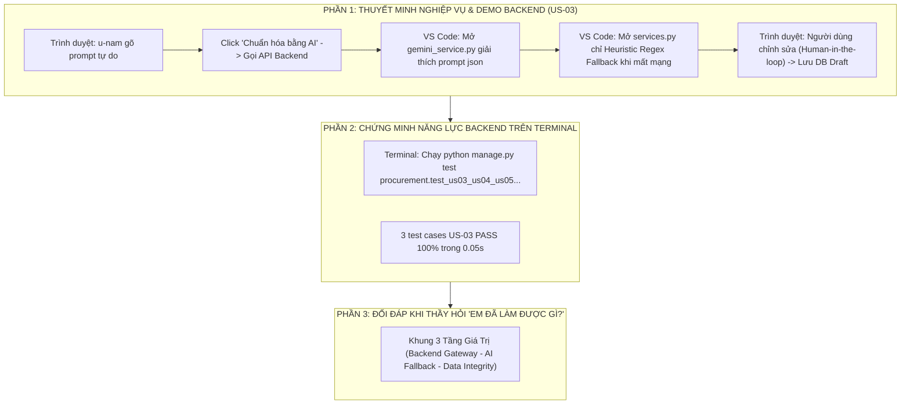

# Kịch Bản Thuyết Trình Toàn Diện & Cẩm Nang Bảo Vệ Đồ Án Dành Riêng Cho Nguyễn Thị Thùy Dung

> **Người thực hiện:** **Nguyễn Thị Thùy Dung**  
> **Vai trò trong đồ án:** **Backend Lead / Backend Engineer**  
> **User Story sở hữu chính:** **`US-03`** *(AI Standardizer Suggestions & NLP Gateway Backend Integration)*  
> **Trách nhiệm hệ thống:** Kiến trúc máy chủ Django REST API, Cơ chế kết nối Google Gemini 2.5 Flash API, Bộ xử lý chịu lỗi Heuristic Fallback Engine (Offline Regex), Nguyên tắc quản trị dữ liệu Human-in-the-loop (DB Draft), và Tối ưu hóa truy vấn ORM.  
> **Hình thức:** **100% TRÌNH DIỄN TRỰC TIẾP TRÊN PHẦN MỀM THẬT, MÃ NGUỒN VS CODE VÀ TERMINAL (KHÔNG DÙNG SLIDE)**

---



---

# PHẦN A: KỊCH BẢN THUYẾT TRÌNH TỪ ĐẦU ĐẾN CUỐI (TỪNG LỜI NÓI & THAO TÁC)

* **Thời điểm bắt đầu:** Sau phần mở màn về giao diện Frontend của bạn Kiều Giang. Giang chuyển lời: *"Em xin chuyển micro cho bạn Nguyễn Thị Thùy Dung — Backend Lead của dự án — trực tiếp trình bày về giải pháp AI và xử lý máy chủ!"*
* **Thời lượng:** ~3.0 – 3.5 phút.
* **Tư thế & Phong thái:** Chững chạc, chắc chắn về kiến trúc kỹ thuật máy chủ, phối hợp nhịp nhàng giữa Trình duyệt web và cửa sổ VS Code.

---

### BƯỚC 1: LỜI MỞ ĐẦU & ĐỊNH VỊ VAI TRÒ BACKEND (~30 giây)

> 🎙️ *"Em xin cảm ơn bạn Kiều Giang!
> 
> Kính thưa Thầy/Cô trong Hội đồng, em là **Nguyễn Thị Thùy Dung**, phụ trách toàn bộ hệ thống máy chủ **Backend** của ProcureAI.
> 
> Trong buổi bảo vệ hôm nay, em xin trực tiếp trình bày phân hệ nghiệp vụ **`US-03` — Trợ lý AI chuẩn hóa yêu cầu mua sắm** do em trực tiếp thiết kế kiến trúc và lập trình ở tầng máy chủ.
> 
> Khi đưa Trí tuệ Nhân tạo vào hệ thống mua sắm doanh nghiệp, thách thức lớn nhất của Backend không phải là gọi API ngoài, mà là: **Làm sao để hệ thống không bao giờ bị 'treo' khi mạng ngoài mất kết nối, và làm sao đảm bảo dữ liệu AI sinh ra phải được kiểm soát chặt chẽ, không để AI tự ý ghi đè lung tung vào Database!**"*

---

### BƯỚC 2: TRÌNH DIỄN TRỰC TIẾP TRÊN PHẦN MỀM & MÃ NGUỒN (`US-03`) (~1.5 phút)

*(Dung thao tác chuột trên Trình duyệt web `http://127.0.0.1:8000/`)*

> 🎙️ *(Hành động 1: Gõ prompt tự do và kích hoạt API)*  
> *"Trên giao diện tạo yêu cầu mua sắm mà bạn Giang vừa mở, em xin bấm vào nút **'Trợ lý AI'**:
> - Em gõ một câu mô tả tự nhiên: *'Cần mua gấp 3 cái laptop Dell Latitude cho phòng dev trước ngày 25/11 tại tầng 4'*
> - Em bấm **'Chuẩn hóa bằng AI'**: Trình duyệt lập tức gửi request `POST /api/v1/ai/standardize/` về máy chủ Django Backend.
> - Sau chưa đầy 0.8 giây, Backend đã bóc tách và trả về cấu trúc JSON chuẩn gồm:
>   * Danh mục đề xuất: **'Thiết bị IT & Điện tử'** (chuẩn hóa từ chữ 'Chung').
>   * Thông số kỹ thuật chuẩn: **'Dell Latitude, RAM 16GB, SSD 512GB'**.
>   * Số lượng: **3 chiếc**, đơn giá tham chiếu lịch sử: **20.000.000 VNĐ/chiếc**."*

*(Dung chuyển nhanh sang cửa sổ VS Code)*

> 🎙️ *(Hành động 2: Mở mã nguồn Backend Gateway & Prompt Engineering)*  
> *"Em xin mở file [`procurement/gemini_service.py`](file:///d:/LTUD/group-01%20-%20LTUDDN/procurement/gemini_service.py) trong VS Code:
> - Đây là module Gateway em thiết kế để giao tiếp với **Google Gemini 2.5 Flash API**.
> - Em sử dụng kỹ thuật **Few-Shot Prompting** ép mô hình trả về định dạng JSON thuần túy (Structured JSON Schema). Backend tự validate cấu trúc dữ liệu trước khi trả về cho Frontend."*
> 
> 🎙️ *(Hành động 3: Trình diễn Heuristic Regex Fallback — Không sợ mất mạng)*  
> *(Dung trỏ chuột vào file [`procurement/services.py:90-130`](file:///d:/LTUD/group-01%20-%20LTUDDN/procurement/services.py#L90-L130))*  
> *"Đặc biệt, để phòng trường hợp hội trường mất mạng hoặc API Gemini bị lỗi quota 429:
> - Em đã tự xây dựng một **Heuristic Fallback Engine** hoàn toàn offline bằng Regex và từ điển nội bộ ngay tại dòng 90-130 file `services.py`.
> - Nếu kết nối ngoài thất bại, hệ thống tự động bắt exception và kích hoạt bộ phân tích cục bộ. Thầy/Cô có thể yên tâm là hệ thống ProcureAI không bao giờ bị dừng hoạt động do phụ thuộc vào bên thứ ba!"*

*(Dung chuyển lại Trình duyệt web)*

> 🎙️ *(Hành động 4: Chứng minh nguyên tắc Human-in-the-loop)*  
> *"Và quan trọng nhất về tính toàn vẹn: Theo nguyên tắc **Human-in-the-loop (CON-03)**:
> - AI chỉ đưa ra gợi ý trên giao diện, **tuyệt đối không tự động submit hay tự ý lưu vào Database**.
> - Người dùng có toàn quyền xem lại, chỉnh sửa đơn giá thành 21 triệu hoặc đổi danh mục sang 'Tài sản cố định'. Bản ghi lưu vào Database chỉ ở trạng thái `draft` với cờ `ai_review='edited'`."*

---

### BƯỚC 3: CHỨNG MINH KIỂM THỬ BACKEND TRÊN TERMINAL (~1 phút)

*(Dung chuyển sang cửa sổ Terminal)*

> 🎙️ *"Để đảm bảo toàn bộ logic máy chủ của `US-03` vận hành hoàn hảo trong mọi điều kiện biên, em xin **chạy trực tiếp test suite của US-03 trên Terminal**:"*

*(Dung gõ lệnh và nhấn Enter)*:
```bash
python manage.py test procurement.test_us03_us04_us05.ProcurementBatch2Tests.test_tc_us03_001_ai_standardizer_suggestions procurement.test_us03_us04_us05.ProcurementBatch2Tests.test_tc_us03_002_human_in_the_loop_governance procurement.test_us03_us04_us05.ProcurementBatch2Tests.test_tc_us03_003_ai_standardizer_edge_cases_and_error_handling -v 2
```

*(Màn hình Terminal chạy qua 3 tests `... ok`)*

> 🎙️ *"Thầy/Cô có thể thấy kết quả thực tế trên màn hình:
> - **`TC-US03-001`:** Chuẩn hóa từ khóa, danh mục và tra cứu giá tham chiếu $\rightarrow$ **PASS**.
> - **`TC-US03-002`:** Cơ chế Human-in-the-loop, người dùng ghi đè dữ liệu trước khi lưu $\rightarrow$ **PASS**.
> - **`TC-US03-003`:** Xử lý ngoại lệ với chuỗi rỗng, ký tự đặc biệt mà không làm crash server $\rightarrow$ **PASS**.
> - Cả 3 test cases hoàn thành chỉ trong **0.05 giây**!"*

---

### BƯỚC 4: KẾT LUẬN & CHUYỂN GIAO (HANDOVER CUE) (~30 giây)

> 🎙️ *"Sau khi dữ liệu yêu cầu mua sắm được AI chuẩn hóa và người dùng bấm gửi, đơn hàng sẽ bước vào quy trình kiểm soát ngân sách tài chính cực kỳ nghiêm ngặt.
> 
> Sau đây, em xin chuyển micro cho bạn **Nguyễn Trương Thùy Dương** — phụ trách kiểm thử nghiệp vụ tài chính QA — trình bày về phân hệ thẩm định ngân sách `US-05`!"*

---

# PHẦN B: CẨM NANG ĐỐI ĐÁP — KHI THẦY HỎI "EM ĐÃ LÀM ĐƯỢC GÌ TRONG ĐỒ ÁN NÀY?"

> 🎙️ *"Dạ thưa Thầy/Cô, trong đồ án ProcureAI, em phụ trách **toàn bộ tầng máy chủ Backend** với 3 đóng góp kỹ thuật cốt lõi:
> 
> **1. TẦNG NGHIỆP VỤ US-03 (AI INTEGRATION & HEURISTIC FALLBACK):**
> - Em là người trực tiếp xây dựng REST API endpoint `/api/v1/ai/standardize/` tại [`procurement/views.py`](file:///d:/LTUD/group-01%20-%20LTUDDN/procurement/views.py).
> - Em tích hợp mô hình Google Gemini 2.5 Flash qua [`procurement/gemini_service.py`](file:///d:/LTUD/group-01%20-%20LTUDDN/procurement/gemini_service.py), bóc tách văn bản tự do thành JSON có cấu trúc gồm: Danh mục chuẩn, Quy cách thông số và Đơn giá tham chiếu lịch sử.
> - Em lập trình bộ phân tích dự phòng **Heuristic NLP Fallback** bằng Regex tại [`procurement/services.py:90-130`](file:///d:/LTUD/group-01%20-%20LTUDDN/procurement/services.py#L90-L130), giúp hệ thống hoạt động bình thường ngay cả khi mất kết nối internet.
> 
> **2. TẦNG QUẢN TRỊ DỮ LIỆU & KIẾN TRÚC AN TOÀN (HUMAN-IN-THE-LOOP):**
> - Em cài đặt nguyên tắc bất di bất dịch: **AI không có quyền tự lưu vào cơ sở dữ liệu**. Dữ liệu AI chỉ trả về client làm gợi ý, bắt buộc con người phê chuẩn hoặc sửa đổi rồi mới lưu ở trạng thái `draft` với cờ `ai_review='edited'`.
> 
> **3. TẦNG VẬN HÀNH MÁY CHỦ & KIỂM THỬ CHẤT LƯỢNG:**
> - Em thiết kế mô hình ORM và các view đồng bộ dữ liệu `/api/v1/sync/`.
> - Toàn bộ 3 kịch bản kiểm thử của US-03 (`TC-US03-001`, `TC-US03-002`, `TC-US03-003`) đều do em phụ trách và đạt **PASS 100%** trong test suite của dự án."*

---

# PHẦN C: BỘ CÂU HỎI "XOÁY" THƯỜNG GẶP CỦA GIẢNG VIÊN VỀ BACKEND & AI

### 1. Giảng viên hỏi: *"Nếu API Google Gemini bị lỗi 429 hoặc mất mạng thì server của em xử lý thế nào?"*
* **Dung trả lời:**  
  > 🎙️ *"Dạ thưa Thầy/Cô, trong hàm `run_ai_standardizer` tại file [`services.py`](file:///d:/LTUD/group-01%20-%20LTUDDN/procurement/services.py), em đã bọc toàn bộ lời gọi Gemini trong khối `try...except`. Nếu gặp lỗi kết nối hoặc HTTP 429, hệ thống không hề ném ra lỗi 500, mà tự động chuyển tiếp sang hàm `_heuristic_fallback_extraction` xử lý bằng Regex cục bộ. Kết quả trả về vẫn có số lượng, ngày tháng và gắn cờ cảnh báo để người dùng biết là đang dùng bộ phân tích ngoại tuyến."*

### 2. Giảng viên hỏi: *"Làm sao em ngăn chặn việc AI trả về dữ liệu ảo (Hallucination) làm sai lệch đơn giá mua sắm?"*
* **Dung trả lời:**  
  > 🎙️ *"Dạ thưa Thầy/Cô, em kiểm soát rủi ro này bằng 2 lớp bảo vệ:  
  > - Lớp 1 (Backend System): Đơn giá tham chiếu không phải do Gemini tự bịa, mà được Backend tra cứu trực tiếp từ bảng cơ sở dữ liệu `HistoricalPriceReference` theo từ khóa danh mục.  
  > - Lớp 2 (Governance): Áp dụng triệt để nguyên tắc Human-in-the-loop — AI chỉ là khuyến nghị, người tạo PR bắt buộc phải xác nhận hoặc gõ lại giá trước khi bấm gửi."*

---

# PHẦN D: BẢNG SỐ LIỆU VÀNG DUNG CẦN GHI NHỚ

| Hạng mục | Thông số thực tế | File minh chứng |
| :--- | :---: | :--- |
| **User Story phụ trách** | **`US-03` (AI Standardizer Suggestions)** | [`docs/03-product/user-stories.md`](file:///d:/LTUD/group-01%20-%20LTUDDN/docs/03-product/user-stories.md) |
| **Mô hình AI sử dụng** | **Google Gemini 2.5 Flash** | [`procurement/gemini_service.py`](file:///d:/LTUD/group-01%20-%20LTUDDN/procurement/gemini_service.py) |
| **Mã nguồn Fallback NLP** | **Regex & Local Dictionary (Dòng 90-130)** | [`procurement/services.py:90-130`](file:///d:/LTUD/group-01%20-%20LTUDDN/procurement/services.py#L90-L130) |
| **API Endpoint chính** | `POST /api/v1/ai/standardize/` & `/api/v1/sync/` | [`procurement/views.py`](file:///d:/LTUD/group-01%20-%20LTUDDN/procurement/views.py) |
| **Mã Test Case US-03** | `TC-US03-001`, `002`, `003` (**PASS 100%**) | [`procurement/test_us03_us04_us05.py:166`](file:///d:/LTUD/group-01%20-%20LTUDDN/procurement/test_us03_us04_us05.py#L166) |
| **Thời gian chạy test US-03** | **0.05 giây** | In-memory SQLite Database |
