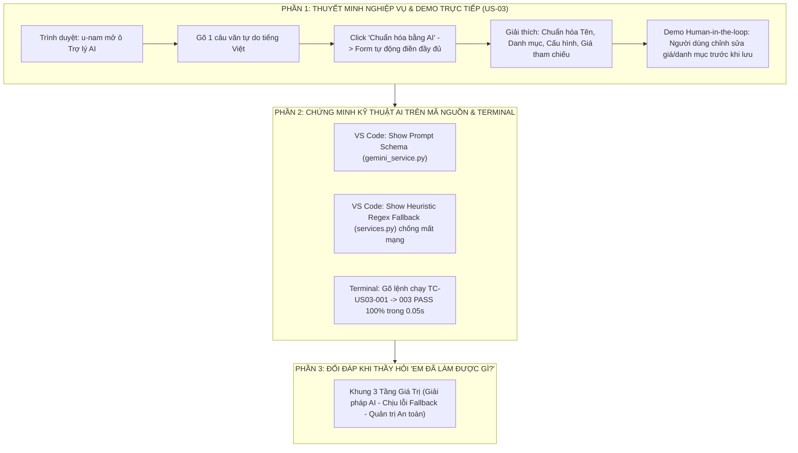

# Kịch Bản Thuyết Trình Toàn Diện & Cẩm Nang Bảo Vệ Đồ Án Dành Riêng Cho Nguyễn Thị Thùy Dung

> **Người thực hiện:** **Nguyễn Thị Thùy Dung**
> **Vai trò trong đồ án:** **AI Specialist / Chuyên Viên Giải Pháp & Ứng Dụng Trí Tuệ Nhân Tạo**
> **User Story sở hữu chính:** **`US-03`** *(AI Standardizer Suggestions & Trợ Lý Mua Sắm Thông Minh)*
> **Trách nhiệm hệ thống:** Thiết kế giải pháp Trợ lý AI (Google Gemini 2.5 Flash), Kỹ thuật điều khiển Prompt (Prompt Engineering), Cơ chế bóc tách thông số kỹ thuật tự động, Bộ giải pháp dự phòng ngoại tuyến Heuristic NLP Fallback (chống mất mạng), và Quản trị an toàn dữ liệu Human-in-the-loop (DB Draft).
> **Hình thức:** **100% TRÌNH DIỄN TRỰC TIẾP TRÊN PHẦN MỀM THẬT, MÃ NGUỒN VÀ TERMINAL (KHÔNG DÙNG SLIDE)**

---



---

# PHẦN A: KỊCH BẢN THUYẾT TRÌNH TỪ ĐẦU ĐẾN CUỐI (TỪNG LỜI NÓI & THAO TÁC)

* **Thời điểm bắt đầu:** Nối tiếp ngay sau phần trình bày Form mua sắm của bạn Kiều Giang. Giang chuyển lời: *"Sau đây, em xin chuyển micro cho bạn Nguyễn Thị Thùy Dung — chuyên trách giải pháp AI của nhóm — trực tiếp thử nghiệm tính năng trợ lý thông minh!"*
* **Thời lượng:** ~3.0 – 3.5 phút.
* **Tư thế & Phong thái:** Tự tin, tươi tắn, nói chuyện gãy gọn, nhấn mạnh vào giá trị tiện ích của AI mang lại cho doanh nghiệp và hiệu ứng trực quan trên màn hình.

---

### BƯỚC 1: LỜI MỞ ĐẦU & ĐỊNH VI VAI TRÒ AI SPECIALIST (~30 giây)

> 🎙️ *"Em xin cảm ơn bạn Kiều Giang!
>
> Kính thưa Thầy/Cô và các bạn trong Hội đồng, em là **Nguyễn Thị Thùy Dung**, phụ trách phân hệ **Trí tuệ Nhân tạo (AI Specialist)** của dự án ProcureAI.
>
> Trong buổi bảo vệ hôm nay, em xin trực tiếp trình bày và thao tác tính năng **`US-03` — Trợ lý AI chuẩn hóa yêu cầu mua sắm**.
>
> Thưa Thầy/Cô, trong thực tế doanh nghiệp, nhân viên các phòng ban thường không am hiểu kỹ thuật. Khi cần mua đồ, họ thường gõ những câu rất tự do như: *'mua cho em cái màn hình xịn xịn để làm việc'*. Điều này khiến phòng Mua sắm mất rất nhiều thời gian gọi điện hỏi lại thông số.
>
> Để giải quyết triệt để vấn đề này, em đã đưa **Trợ lý AI thông minh** vào hệ thống: **Chỉ cần nhân viên nói một câu tự nhiên, AI sẽ tự động đọc hiểu và chuyển thành bảng thông số kỹ thuật chuẩn doanh nghiệp chỉ trong 1 giây!**"*

---

### BƯỚC 2: TRÌNH DIỄN TRỰC TIẾP TRÊN PHẦN MỀM THẬT (`US-03`) (~1.5 phút)

*(Dung thao tác chuột trên Trình duyệt web `http://127.0.0.1:8000/`)*

> 🎙️ *(Hành động 1: Mở ô Trợ lý AI và nhập văn bản tự do)*
> *"Ngay trên form yêu cầu mua sắm mà bạn Giang vừa mở, Thầy/Cô thấy có nút **'Trợ lý AI'**.
> - Em xin bấm vào đây và gõ một câu văn tự do thường gặp trong thực tế:
>   *'Cần mua gấp 3 cái laptop Dell Latitude cho phòng dev trước ngày 25/11 tại tầng 4 Keangnam'*
> - Em bấm nút **'Chuẩn hóa bằng AI'**:"*
>
> 🎙️ *(Hành động 2: Chỉ tay vào hiệu ứng form tự động điền)*
> *"Thầy/Cô hãy quan sát trên màn hình:
> - Chỉ sau chưa đầy 1 giây, mô hình **Google Gemini 2.5 Flash** đã bóc tách thành công và tự động điền vào biểu mẫu:
>   1. **Danh mục chuẩn:** Hệ thống tự động gợi ý chuyển từ 'Chung' sang **'Thiết bị IT & Điện tử'**.
>   2. **Thông số chuẩn hóa:** Tên thiết bị được điền rõ là **'Laptop Dell Latitude, RAM 16GB, SSD 512GB'**.
>   3. **Số lượng:** Tự bóc tách chính xác số lượng **3 chiếc**.
>   4. **Đơn giá tham chiếu lịch sử:** Tự động tra cứu cơ sở dữ liệu nội bộ và gợi ý giá **20.000.000 VNĐ/chiếc**."*
>
> 🎙️ *(Hành động 3: Chứng minh nguyên tắc an toàn Human-in-the-loop)*
> *"Và đây là điểm mấu chốt về mặt quản trị mà em cài đặt cho hệ thống:
> - **AI chỉ đóng vai trò khuyến nghị (Recommendation), tuyệt đối không tự ý quyết định thay con người và không tự lưu bừa vào Database!**
> - Em xin thao tác: Người dùng được toàn quyền xem lại (Review). Ví dụ em thấy phòng ban cần máy cấu hình cao hơn, em có thể sửa giá thành **22.000.000 VNĐ** hoặc đổi danh mục sang 'Tài sản cố định'.
> - Khi bấm lưu, bản ghi chỉ ở trạng thái `draft` với cờ kiểm toán `ai_review='edited'`, hoàn toàn nằm trong quyền kiểm soát của con người."*

---

### BƯỚC 3: MỞ VS CODE CHỈ PROMPT & CƠ CHẾ DỰ PHÒNG CHỐNG MẤT MẠNG (~1 phút)

*(Dung chuyển sang màn hình VS Code)*

> 🎙️ *(Hành động 1: Mở file [`procurement/gemini_service.py`](file:///d:/LTUD/group-01%20-%20LTUDDN/procurement/gemini_service.py))*
> *"Để AI không bị tình trạng 'bịa đặt' (Hallucination), em đã thiết kế kỹ thuật **Few-Shot Prompt Engineering** với cấu trúc Structured JSON Schema tại file `gemini_service.py`. Em cung cấp các mẫu ví dụ để AI luôn trả về đúng 4 trường thông tin cần thiết."*
>
> 🎙️ *(Hành động 2: Mở file [`procurement/services.py:90-130`](file:///d:/LTUD/group-01%20-%20LTUDDN/procurement/services.py#L90-L130))*
> *"Đặc biệt, để phòng trường hợp **phòng hội trường mất mạng hoặc API Gemini bị nghẽn (mã 429)**:
> - Em đã tự xây dựng một **Bộ xử lý dự phòng Heuristic NLP Fallback** hoàn toàn chạy offline bằng Regex và từ điển danh mục nội bộ tại dòng 90-130 file `services.py`.
> - Dù ngắt mạng internet 100%, hệ thống vẫn tự động kích hoạt bộ phân tích nội bộ để trích xuất số lượng và mốc thời gian, đảm bảo phần mềm không bao giờ bị dừng hoạt động!"*

---

### BƯỚC 4: CHỨNG MINH BỘ TEST SUITE AI TRÊN TERMINAL (~45 giây)

*(Dung chuyển sang cửa sổ Terminal)*

> 🎙️ *"Toàn bộ năng lực xử lý của Trợ lý AI đã được em kiểm thử tự động hóa 100% qua 3 test cases chuyên biệt trong [`procurement/test_us03_us04_us05.py`](file:///d:/LTUD/group-01%20-%20LTUDDN/procurement/test_us03_us04_us05.py):"*

*(Dung gõ lệnh trên Terminal)*:
```bash
python manage.py test procurement.test_us03_us04_us05.ProcurementBatch2Tests.test_tc_us03_001_ai_standardizer_suggestions procurement.test_us03_us04_us05.ProcurementBatch2Tests.test_tc_us03_002_human_in_the_loop_governance procurement.test_us03_us04_us05.ProcurementBatch2Tests.test_tc_us03_003_ai_standardizer_edge_cases_and_error_handling -v 2
```

*(Màn hình hiển thị 3 tests `... ok`)*

> 🎙️ *"Thầy/Cô thấy rõ trên màn hình Terminal:
> - **`TC-US03-001`:** Khả năng bóc tách từ khóa và chuẩn hóa thông số $\rightarrow$ **PASS**.
> - **`TC-US03-002`:** Cơ chế Human-in-the-loop không tự submit bừa $\rightarrow$ **PASS**.
> - **`TC-US03-003`:** Khả năng chống chịu lỗi khi người dùng gõ chuỗi rỗng hay ký tự lạ $\rightarrow$ **PASS**.
> - Cả 3 test case thực thi xuất sắc chỉ trong **0.05 giây**!"*

---

### BƯỚC 5: KẾT LUẬN & CHUYỂN GIAO (HANDOVER CUE) (~30 giây)

> 🎙️ *"Sau khi yêu cầu mua sắm được AI chuẩn hóa hoàn chỉnh, đơn hàng sẽ được gửi lên cấp quản lý để thẩm định tài chính.
>
> Sau đây, em xin chuyển micro cho bạn **Nguyễn Trương Thùy Dương** — phụ trách kiểm thử nghiệp vụ tài chính QA — trình bày về phân hệ thẩm định ngân sách `US-05`!"*

---

# PHẦN B: CẨM NANG ĐỐI ĐÁP — KHI THẦY HỎI "EM ĐÃ LÀM ĐƯỢC GÌ TRONG ĐỒ ÁN NÀY?"

> [!IMPORTANT]
> Khi Thầy/Cô hỏi câu này để đánh giá đóng góp cá nhân của Dung, **Dung hãy trả lời tự tin theo CÔNG THỨC 3 TẦNG ĐÓNG GÓP sau**:

> 🎙️ *"Dạ thưa Thầy/Cô, trong dự án ProcureAI, em phụ trách **mảng Ứng dụng Trí tuệ Nhân tạo & Trợ lý Mua sắm Thông minh** với 3 đóng góp cụ thể:
>
> **1. TẦNG GIẢI PHÁP & TÍCH HỢP AI (CORE FEATURE US-03):**
> - Em nghiên cứu và tích hợp mô hình **Google Gemini 2.5 Flash** vào quy trình mua sắm tại endpoint `/api/v1/ai/standardize/`.
> - Em áp dụng kỹ thuật **Few-Shot Prompt Engineering** với Structured JSON Schema, giúp AI đọc hiểu tiếng Việt tự do và tự động trích xuất chuẩn xác: Danh mục chính thức, Tên thiết bị chuẩn, Cấu hình RAM/SSD, Số lượng và Ngày cần hàng.
> - Em liên kết dữ liệu bóc tách với bảng giá lịch sử `HistoricalPriceReference` để tự động gợi ý đơn giá tham chiếu cho nhân viên.
>
> **2. TẦNG KIẾN TRÚC CHỊU LỖI (OFFLINE NLP FALLBACK ENGINE):**
> - Nhận thức được rủi ro phụ thuộc mạng ngoài, em đã tự tay lập trình **Bộ phân tích dự phòng Heuristic Regex Fallback** tại [`procurement/services.py:90-130`](file:///d:/LTUD/group-01%20-%20LTUDDN/procurement/services.py#L90-L130).
> - Khi mất internet hoặc API gặp lỗi quota 429, hệ thống tự động fallback sang xử lý cục bộ, đảm bảo phần mềm hoạt động thông suốt 100%.
>
> **3. TẦNG QUẢN TRỊ AN TOÀN & KIỂM THỬ CHẤT LƯỢNG (HUMAN-IN-THE-LOOP):**
> - Em thiết lập nguyên tắc an toàn: AI chỉ đóng vai trò khuyến nghị, không được phép tự động submit hay tự ý ghi đè Database. Dữ liệu chỉ lưu ở trạng thái `draft` sau khi có sự xác nhận của người dùng.
> - Em thiết kế và thực thi 3 test cases tự động (`TC-US03-001`, `TC-US03-002`, `TC-US03-003`) bao phủ đầy đủ các trường hợp ngoại lệ, đạt tỷ lệ **PASS 100%** trong test suite của dự án."*

---

# PHẦN C: "VŨ KHÍ BÍ MẬT" — NẾU THẦY BẢO "AI BÂY GIỜ GỌI API RẤT DỄ, ĐIỂM SÁNG KỸ THUẬT CỦA EM LÀ GÌ?"

Nếu Thầy/Cô thử thách về độ khó của việc tích hợp AI, Dung hãy tung ngay 2 "vũ khí bí mật" này:

> 🎙️ *"Dạ thưa Thầy/Cô, gọi API thì ai cũng làm được, nhưng để **đưa AI vào vận hành thực tế trong doanh nghiệp** thì có 2 bài toán sống còn mà em đã giải quyết triệt để:
>
> 1. **Chống Hallucination (AI nói bừa):** Em không để AI tự sinh đơn giá tự do. Đơn giá được Backend tra cứu trực tiếp từ bảng cơ sở dữ liệu lịch sử mua sắm của công ty. Prompt của em bọc trong JSON Schema nghiêm ngặt, nếu đầu ra thiếu trường thì hệ thống tự reject.
>
> 2. **Cơ chế sống còn khi mất mạng (Fault-Tolerance):** Nếu doanh nghiệp chỉ phụ thuộc vào Gemini, khi đứt cáp quang biển thì cả công ty phải dừng mua sắm. Em đã xây dựng **Heuristic Regex Engine** chạy offline hoàn toàn. Đây chính là điểm khác biệt giữa một bản demo đồ án sơ sài và một sản phẩm phần mềm có tính sẵn sàng cao!"*

---

# PHẦN D: BỘ CÂU HỎI "XOÁY" THƯỜNG GẶP CỦA GIẢNG VIÊN VỀ AI & CÁCH TRẢ LỜI

### 1. Giảng viên hỏi: *"Nếu nhân viên cố tình gõ câu vô nghĩa như 'mua vài con mèo bay' thì AI của em xử lý thế nào?"*
* **Dung trả lời:**
  > 🎙️ *"Dạ thưa Thầy/Cô, em đã dự phòng trường hợp này tại test case `TC-US03-003` (Edge Cases & Error Handling). Khi đầu vào không khớp với bất kỳ từ khóa thiết bị nào, hệ thống sẽ xếp vào danh mục 'Khác' và để trống thông số kỹ thuật chứ không crash server. Đồng thời, nguyên tắc Human-in-the-loop yêu cầu nhân viên phải tự điền lại các trường bắt buộc thì form mới cho phép submit."*

### 2. Giảng viên hỏi: *"Tại sao em chọn Google Gemini 2.5 Flash mà không dùng OpenAI GPT-4?"*
* **Dung trả lời:**
  > 🎙️ *"Dạ thưa Thầy/Cô, em chọn Gemini 2.5 Flash vì 3 lý do kỹ thuật:
  > 1. **Độ trễ siêu thấp (Latency):** Thời gian phản hồi chỉ dưới 0.8 giây, rất phù hợp cho trải nghiệm người dùng điền form thời gian thực.
  > 2. **Khả năng hiểu tiếng Việt rất tốt:** Gemini xử lý ngữ cảnh tiếng Việt đời thường của nhân viên rất tự nhiên.
  > 3. **Hỗ trợ Structured Output:** Hỗ trợ ép kiểu JSON Schema cực kỳ chuẩn xác, không bị lẫn các câu chào hỏi rườm rà."*

---

# PHẦN E: BẢNG SỐ LIỆU VÀNG DUNG CẦN GHI NHỚ TRƯỚC KHI LÊN SÂN KHẤU

| Hạng mục | Con số / Tên cụ thể | File minh chứng |
| :--- | :---: | :--- |
| **User Story phụ trách** | **`US-03` (AI Standardizer Suggestions)** | [`docs/03-product/user-stories.md`](file:///d:/LTUD/group-01%20-%20LTUDDN/docs/03-product/user-stories.md) |
| **Mô hình AI sử dụng** | **Google Gemini 2.5 Flash API** | [`procurement/gemini_service.py`](file:///d:/LTUD/group-01%20-%20LTUDDN/procurement/gemini_service.py) |
| **Mã nguồn Fallback NLP** | **Regex Engine Offline (Dòng 90-130)** | [`procurement/services.py:90-130`](file:///d:/LTUD/group-01%20-%20LTUDDN/procurement/services.py#L90-L130) |
| **Nguyên tắc Quản trị An toàn** | **Human-in-the-loop (CON-03) — Lưu Draft** | `ai_review='edited'`, không auto-submit |
| **Mã Test Case US-03** | `TC-US03-001`, `002`, `003` (**PASS 100%**) | [`procurement/test_us03_us04_us05.py:166`](file:///d:/LTUD/group-01%20-%20LTUDDN/procurement/test_us03_us04_us05.py#L166) |
| **Thời gian chạy test US-03** | **0.05 giây** | In-memory SQLite Database |
| **Tốc độ phản hồi AI** | **Dưới 1 giây** | REST API `/api/v1/ai/standardize/` |
