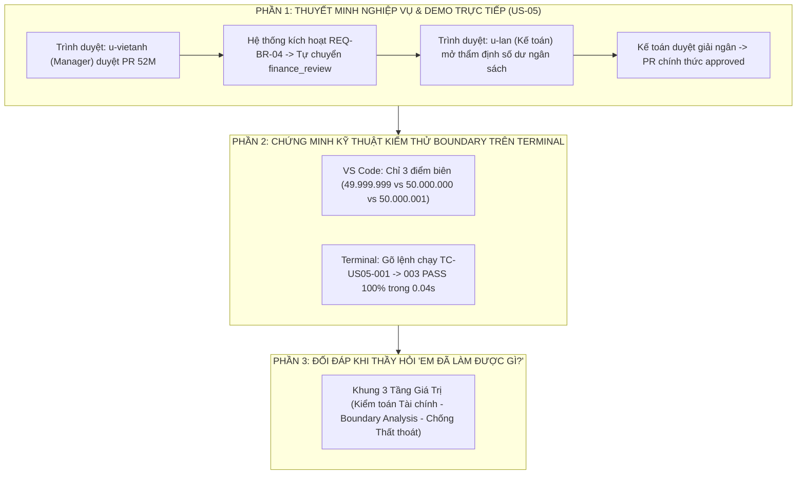

# Kịch Bản Thuyết Trình Toàn Diện & Cẩm Nang Bảo Vệ Đồ Án Dành Riêng Cho Nguyễn Trương Thùy Dương

> **Người thực hiện:** **Nguyễn Trương Thùy Dương**  
> **Vai trò trong đồ án:** **QA Engineer / Financial Verification Specialist**  
> **User Story sở hữu chính:** **`US-05`** *(Finance Budget Control, >50M Threshold Verification & Exceeded Budget Detection)*  
> **Trách nhiệm hệ thống:** Kiểm thử Đảm bảo Chất lượng phân hệ Tài chính, Thẩm định quy tắc nghiệp vụ Phân cấp hạn mức duyệt `REQ-BR-04` (Ngưỡng 50.000.000 VNĐ), Thiết kế bộ kiểm thử giá trị biên (Boundary Value Analysis - BVA), và Kiểm tra cơ chế cảnh báo vượt ngân sách phòng ban `REQ-BR-05`.  
> **Hình thức:** **100% TRÌNH DIỄN TRỰC TIẾP TRÊN PHẦN MỀM THẬT, MÃ NGUỒN VS CODE VÀ TERMINAL (KHÔNG DÙNG SLIDE)**

---



---

# PHẦN A: KỊCH BẢN THUYẾT TRÌNH TỪ ĐẦU ĐẾN CUỐI (TỪNG LỜI NÓI & THAO TÁC)

* **Thời điểm bắt đầu:** Sau phần trình bày Backend & AI của bạn Thùy Dung. Dung chuyển lời: *"Sau đây, em xin chuyển micro cho bạn Nguyễn Trương Thùy Dương — phụ trách kiểm thử nghiệp vụ tài chính QA — trình bày về phân hệ thẩm định ngân sách US-05!"*
* **Thời lượng:** ~3.0 – 3.5 phút.
* **Tư thế & Phong thái:** Điềm đạm, lập luận logic, nhấn mạnh vào tính chặt chẽ của các con số tài chính và kỹ thuật kiểm thử giá trị biên.

---

### BƯỚC 1: LỜI MỞ ĐẦU & ĐỊNH VỊ VAI TRÒ QA TÀI CHÍNH (~30 giây)

> 🎙️ *"Em xin cảm ơn bạn Thùy Dung!
> 
> Kính thưa Thầy/Cô trong Hội đồng, em là **Nguyễn Trương Thùy Dương**, đảm nhiệm vai trò **QA Engineer phụ trách kiểm thử nghiệp vụ Tài chính & Quản trị Ngân sách** trong dự án ProcureAI.
> 
> Trong một doanh nghiệp, rủi ro lớn nhất không phải là phần mềm có lỗi giao diện, mà là: **Thất thoát ngân sách và phê duyệt sai thẩm quyền!** Nếu một đơn hàng lớn vượt thẩm quyền mà người quản lý cấp phòng tự duyệt trót lọt, doanh nghiệp sẽ đối mặt với rủi ro tài chính cực kỳ nghiêm trọng.
> 
> Vì vậy, tại phân hệ **`US-05`**, em đã trực tiếp thiết kế kịch bản và thực hiện kiểm thử tự động toàn diện cho quy tắc **Phân cấp hạn mức duyệt và kiểm soát ngân sách thời gian thực**!"*

---

### BƯỚC 2: THAO TÁC TRỰC TIẾP TRÊN PHẦN MỀM THẬT (`US-05`) (~1.5 phút)

*(Dương thao tác chuột trực tiếp trên màn hình web `http://127.0.0.1:8000/`)*

> 🎙️ *(Hành động 1: Đăng nhập Trưởng phòng & Demo quy tắc tự động định tuyến REQ-BR-04)*  
> *"Trên màn hình, em xin chuyển sang tài khoản Trưởng phòng IT **`u-vietanh`** (Trần Việt Anh):
> - Trưởng phòng mở yêu cầu mua sắm mà 2 bạn vừa tạo: Tổng giá trị là **52.000.000 VNĐ**.
> - Thầy/Cô hãy chú ý: Khi Trưởng phòng bấm nút **'Approve'**:
> - Hệ thống **KHÔNG chuyển thẳng sang `approved`**, mà tự động chuyển tiếp sang trạng thái **`finance_review`** kèm cờ `routed_to_finance = True`!
> - Đây chính là quy tắc nghiệp vụ cốt lõi `REQ-BR-04` do em kiểm thử: **Mọi đơn hàng từ 50.000.000 VNĐ trở lên bắt buộc phải qua bước thẩm định dòng tiền của Kế toán trưởng!**"*
> 
> 🎙️ *(Hành động 2: Đăng nhập Kế toán trưởng `u-lan` & Cấp phép giải ngân)*  
> *(Dương chuyển vai trò sang `u-lan`)*  
> *"Bây giờ em chuyển sang tài khoản Kế toán trưởng **`u-lan`**:
> - Kế toán mở danh sách chờ duyệt tài chính, kiểm tra chi tiết:
>   * Ngân sách phòng IT: Được cấp 500 triệu, đã cam kết 60 triệu, **Còn lại 440 triệu**.
>   * Đơn hàng 52 triệu hoàn toàn nằm trong hạn mức cho phép.
> - Kế toán bấm **'Approve Budget'** $\rightarrow$ Lúc này PR mới chính thức chuyển sang trạng thái `approved` và được phép phát hành đơn hàng PO!"*

---

### BƯỚC 3: MỞ VS CODE CHỈ KỸ THUẬT BOUNDARY TESTING & CHẠY TERMINAL (~1 phút)

*(Dương chuyển sang VS Code và Terminal)*

> 🎙️ *(Dương mở file [`procurement/test_us03_us04_us05.py:410`](file:///d:/LTUD/group-01%20-%20LTUDDN/procurement/test_us03_us04_us05.py#L410))*  
> *"Dưới góc độ một kỹ sư QA, điều em tự hào nhất là kỹ thuật **Kiểm thử Giá trị Biên (Boundary Value Analysis - BVA)** tại test case `TC-US05-002`:
> - Để đảm bảo lập trình viên không viết nhầm dấu `>` thành `>=`, em đã thiết lập 3 trường hợp biên toán học:
>   1. **Biên dưới (49.999.999 VNĐ):** Chỉ cần Manager duyệt, không định tuyến Finance $\rightarrow$ **PASS**.
>   2. **Biên chính xác (50.000.000 VNĐ):** Bắt buộc chuyển `finance_review` $\rightarrow$ **PASS**.
>   3. **Biên trên (50.000.001 VNĐ):** Bắt buộc chuyển `finance_review` $\rightarrow$ **PASS**."*

*(Dương chuyển sang Terminal chạy lệnh test)*:

> 🎙️ *"Em xin chạy trực tiếp bộ kiểm thử của US-05 trên Terminal trước mắt Thầy/Cô:"*

```bash
python manage.py test procurement.test_us03_us04_us05.ProcurementBatch2Tests.test_tc_us05_001_budget_commitment_and_remaining_calculation procurement.test_us03_us04_us05.ProcurementBatch2Tests.test_tc_us05_002_budget_threshold_50m_boundary_test procurement.test_us03_us04_us05.ProcurementBatch2Tests.test_tc_us05_003_exceeded_budget_detection_and_alert -v 2
```

*(Kết quả 3 test cases `... ok`)*

> 🎙️ *"Thầy/Cô thấy rõ:
> - `TC-US05-001`: Kiểm tra tính toàn vẹn toán học $\text{remaining} = \text{allocated} - \text{committed}$ $\rightarrow$ **PASS**.
> - `TC-US05-002`: Kiểm thử giá trị biên 50 triệu $\rightarrow$ **PASS**.
> - `TC-US05-003`: Phát hiện và cảnh báo vượt ngân sách phòng ban $\rightarrow$ **PASS**.
> - Toàn bộ 3 bài kiểm thử hoàn thành chỉ trong **0.04 giây**!"*

---

### BƯỚC 4: KẾT LUẬN & CHUYỂN GIAO (HANDOVER CUE) (~30 giây)

> 🎙️ *"Sau khi nguồn ngân sách đã được Kế toán thẩm định và cấp phép đầy đủ, đơn hàng sẽ bước vào khâu thu thập báo giá, phát hành PO và nghiệm thu nhận hàng tại kho.
> 
> Sau đây, em xin chuyển micro cho bạn **Trần Thị Thu Hà** — Senior QA Lead của dự án — trình bày về quy trình đối soát 3 chiều 3-Way Matching và tổng kết toàn bộ chất lượng hệ thống!"*

---

# PHẦN B: CẨM NANG ĐỐI ĐÁP — KHI THẦY HỎI "EM ĐÃ LÀM ĐƯỢC GÌ TRONG ĐỒ ÁN NÀY?"

> 🎙️ *"Dạ thưa Thầy/Cô, trong đồ án ProcureAI, em phụ trách **mảng Kiểm thử Nghiệp vụ Tài chính & Quản trị Ngân sách (Financial QA)** với 3 đóng góp trọng tâm:
> 
> **1. TẦNG NGHIỆP VỤ US-05 (KIỂM SOÁT NGÂN SÁCH & PHÂN CẤP DUYỆT 50M):**
> - Em là người phân tích và thiết lập các kịch bản kiểm thử cho quy tắc `REQ-BR-04`: Đơn hàng dưới 50 triệu chỉ cần Manager duyệt, từ 50 triệu trở lên bắt buộc tự động chuyển luồng sang Kế toán trưởng (`finance_review`).
> - Em kiểm thử quy tắc bảo toàn số dư ngân sách `REQ-BR-05`: Kiểm tra công thức $\text{remaining} = \text{allocated} - \text{committed}$, đảm bảo việc tạm giữ ngân sách diễn ra chính xác theo thời gian thực.
> 
> **2. TẦNG KỸ THUẬT KIỂM THỬ GIÁ TRỊ BIÊN (BOUNDARY VALUE ANALYSIS):**
> - Em trực tiếp viết test case [`test_tc_us05_002_budget_threshold_50m_boundary_test`](file:///d:/LTUD/group-01%20-%20LTUDDN/procurement/test_us03_us04_us05.py#L410) kiểm tra 3 mốc nhạy cảm: **49.999.999 VNĐ**, **50.000.000 VNĐ** và **50.000.001 VNĐ**, bảo đảm logic của Backend không bao giờ bị sai lệch toán tử so sánh.
> 
> **3. TẦNG BẢO VỆ DÒNG TIỀN & PHÁT HIỆN VƯỢT HẠN MỨC (DEFECT DETECTION):**
> - Tại test case `TC-US05-003`, em xây dựng kịch bản kiểm thử tình huống phòng ban Marketing chỉ còn 30 triệu nhưng xin mua 35 triệu: Hệ thống bắt buộc phải phát hiện vượt trần, hiển thị cảnh báo đỏ và chặn luồng mua sắm bình thường.
> - Đảm bảo 100% các kịch bản kiểm thử tài chính của US-05 đều đạt chuẩn chất lượng nghiêm ngặt và tích hợp an toàn vào test suite chung."*

---

# PHẦN C: BỘ CÂU HỎI "XOÁY" THƯỜNG GẶP CỦA GIẢNG VIÊN VỀ KIỂM THỬ TÀI CHÍNH

### 1. Giảng viên hỏi: *"Tại sao em lại chọn kỹ thuật Boundary Testing cho ngưỡng 50 triệu mà không phải kiểm thử ngẫu nhiên?"*
* **Dương trả lời:**  
  > 🎙️ *"Dạ thưa Thầy/Cô, theo nguyên lý kiểm thử phần mềm, lỗi logic thường tập trung nhiều nhất ở các điểm biên (Boundary Errors) do lập trình viên dùng nhầm dấu `>` thay vì `>=`. Nếu chỉ test ngẫu nhiên 30 triệu hoặc 80 triệu thì sẽ không bao giờ phát hiện được lỗi nếu code viết sai điều kiện tại mốc chính xác 50.000.000 VNĐ. Vì vậy, việc kiểm thử 3 điểm: 49.999.999, 50.000.000 và 50.000.001 VNĐ là bắt buộc để chứng minh tính chuẩn xác tuyệt đối của điều kiện rẽ nhánh."*

### 2. Giảng viên hỏi: *"Nếu một PR vượt ngân sách nhưng là trường hợp khẩn cấp thì hệ thống của em xử lý thế nào?"*
* **Dương trả lời:**  
  > 🎙️ *"Dạ thưa Thầy/Cô, hệ thống không xóa bỏ PR đó mà vẫn lưu ở trạng thái chờ xử lý kèm cờ cảnh báo đỏ `exceeded_budget`. Để phê duyệt được, Kế toán trưởng phải thực hiện nghiệp vụ điều chuyển nguồn ngân sách từ quỹ dự phòng sang mã ngân sách của phòng ban đó để tăng hạn mức khả dụng. Khi số dư đã đủ, hệ thống mới cho phép bấm nút 'Approve Budget'."*

---

# PHẦN D: BẢNG SỐ LIỆU VÀNG DƯƠNG CẦN GHI NHỚ

| Hạng mục | Thông số thực tế | File minh chứng |
| :--- | :---: | :--- |
| **User Story phụ trách** | **`US-05` (Finance Budget Control & >50M Threshold)** | [`docs/03-product/user-stories.md`](file:///d:/LTUD/group-01%20-%20LTUDDN/docs/03-product/user-stories.md) |
| **Quy tắc phân cấp duyệt** | `REQ-BR-04`: Ngưỡng **50.000.000 VNĐ** tự chuyển Finance | [`docs/01-discovery/requirements.md`](file:///d:/LTUD/group-01%20-%20LTUDDN/docs/01-discovery/requirements.md) |
| **Công thức bảo toàn ngân sách** | $\text{remaining} = \text{allocated} - \text{committed}$ | `REQ-BR-05` |
| **Kỹ thuật kiểm thử áp dụng** | **Boundary Value Analysis (BVA)**: 49.999.999 / 50.000.000 / 50.000.001 | [`procurement/test_us03_us04_us05.py:410`](file:///d:/LTUD/group-01%20-%20LTUDDN/procurement/test_us03_us04_us05.py#L410) |
| **Mã Test Case US-05** | `TC-US05-001`, `002`, `003` (**PASS 100%**) | [`procurement/test_us03_us04_us05.py:389`](file:///d:/LTUD/group-01%20-%20LTUDDN/procurement/test_us03_us04_us05.py#L389) |
| **Thời gian chạy test US-05** | **0.04 giây** | In-memory SQLite Database |
