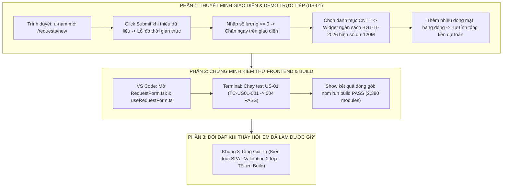

# Kịch Bản Thuyết Trình Toàn Diện & Cẩm Nang Bảo Vệ Đồ Án Dành Riêng Cho Trần Thị Kiều Giang

> **Người thực hiện:** **Trần Thị Kiều Giang**  
> **Vai trò trong đồ án:** **Frontend Lead / Frontend Engineer**  
> **User Story sở hữu chính:** **`US-01`** *(Create Purchase Request Form & Real-time Client Validation)*  
> **Trách nhiệm hệ thống:** Kiến trúc ứng dụng Single Page Application (React 18, Vite, Tailwind CSS), Thiết kế Design System, Xây dựng Custom Hook kiểm soát form [`useRequestForm.ts`](file:///d:/LTUD/group-01%20-%20LTUDDN/FE/src/hooks/useRequestForm.ts), Widget Ngân sách thời gian thực và Đóng gói bản build Production.  
> **Hình thức:** **100% TRÌNH DIỄN TRỰC TIẾP TRÊN PHẦN MỀM THẬT, MÃ NGUỒN VS CODE VÀ TERMINAL (KHÔNG DÙNG SLIDE)**

---



---

# PHẦN A: KỊCH BẢN THUYẾT TRÌNH TỪ ĐẦU ĐẾN CUỐI (TỪNG LỜI NÓI & THAO TÁC)

* **Thời điểm bắt đầu:** Giang là người mở màn đầu tiên cho toàn nhóm.
* **Thời lượng:** ~3.0 – 3.5 phút.
* **Tư thế & Phong thái:** Tươi tắn, tự tin, phát âm rõ ràng, làm chủ hoàn toàn giao diện người dùng trên màn hình chiếu.

---

### BƯỚC 1: LỜI MỞ ĐẦU & ĐỊNH VỊ GIAO DIỆN SPA (~30 giây)

> 🎙️ *"Kính thưa Thầy/Cô và các bạn trong Hội đồng, em là **Trần Thị Kiều Giang**, đảm nhiệm vai trò **Frontend Lead** của dự án ProcureAI.
> 
> Trong buổi bảo vệ đồ án hôm nay, nhóm chúng em xin phép **trình bày và thao tác hoàn toàn trực tiếp trên phần mềm thật đang vận hành tại `http://127.0.0.1:8000/`, không sử dụng slide lý thuyết**.
> 
> Là người thiết kế giao diện đầu tiên tiếp xúc với nhân viên, em hiểu rằng: Nếu biểu mẫu nhập liệu rườm rà, thiếu kiểm soát, nhân viên sẽ gửi dữ liệu sai, thiếu thông tin và làm ách tắc toàn bộ chuỗi cung ứng phía sau.
> 
> Vì vậy, em đã xây dựng phân hệ **`US-01` — Khởi tạo yêu cầu mua sắm** trên nền tảng **React 18 SPA, Vite và Tailwind CSS**, bảo đảm giao diện vừa trực quan, hiện đại, vừa kiểm soát tính hợp lệ dữ liệu 2 lớp cực kỳ chặt chẽ!"*

---

### BƯỚC 2: THAO TÁC TRỰC TIẾP TRÊN PHẦN MỀM THẬT (`US-01`) (~1.5 phút)

*(Giang thao tác chuột trực tiếp trên màn hình web `http://127.0.0.1:8000/`)*

> 🎙️ *(Hành động 1: Đăng nhập nhân viên & Mở form tạo PR)*  
> *"Như Thầy/Cô đang quan sát, em đang đăng nhập với tài khoản nhân viên phòng CNTT **`u-nam`** (Nguyễn Văn Nam). Em mở trang Tạo yêu cầu mua sắm tại đường dẫn `/requests/new`."*
> 
> 🎙️ *(Hành động 2: Cố tình bấm Submit khi chưa điền dữ liệu — Demo Form Validation)*  
> *"Bây giờ, em cố tình không điền gì cả và bấm nút **'Gửi yêu cầu'**:
> - Thầy/Cô thấy ngay: Nút bấm lập tức bị vô hiệu hóa, toàn bộ các trường bắt buộc như Tiêu đề, Lý do, Phòng ban và Danh mục đều **bật viền đỏ cảnh báo thời gian thực**.
> - Cơ chế này được xử lý độc lập qua Custom Hook [`useRequestForm.ts`](file:///d:/LTUD/group-01%20-%20LTUDDN/FE/src/hooks/useRequestForm.ts), ngăn chặn hoàn toàn việc gửi dữ liệu rác về máy chủ!"*
> 
> 🎙️ *(Hành động 3: Thử nghiệm giá trị biên của số lượng mặt hàng)*  
> *"Tiếp theo, nếu em thêm một dòng mặt hàng nhưng **nhập số lượng bằng 0 hoặc số âm**:
> - Hệ thống lập tức kích hoạt validation biên: Bắt buộc số lượng phải là số nguyên dương $\ge 1$.
> - Nút submit tiếp tục bị khóa cho đến khi dữ liệu đạt chuẩn hoàn toàn."*
> 
> 🎙️ *(Hành động 4: Kích hoạt Widget Ngân sách thời gian thực)*  
> *"Bây giờ, em xin điền thông tin hợp lệ: Tiêu đề là *'Mua sắm thiết bị làm việc mới'*.
> - Khi em chọn danh mục **'Thiết bị CNTT'**, Thầy/Cô hãy nhìn vào góc phải màn hình: Một **Widget Ngân sách thông minh (Budget Widget)** tự động hiển thị:
>   * Kết nối trực tiếp với mã ngân sách `BGT-IT-2026`.
>   * Hiển thị hạn mức khả dụng thời gian thực là **120.000.000 VNĐ**.
> - Khi em thêm 2 màn hình Dell (4 triệu/chiếc) và 2 bàn phím cơ (1 triệu/chiếc), hệ thống tự động tính tổng tiền dự toán là **10.000.000 VNĐ**, và cập nhật thanh tiến độ ngân sách ngay lập tức!"*

---

### BƯỚC 3: MỞ MÃ NGUỒN VS CODE & CHỨNG MINH TEST SUITE TERMINAL (~1 phút)

*(Giang chuyển nhanh sang VS Code và Terminal)*

> 🎙️ *(Giang mở file [`FE/src/pages/RequestForm.tsx`](file:///d:/LTUD/group-01%20-%20LTUDDN/FE/src/pages/RequestForm.tsx))*  
> *"Về mặt cấu trúc kỹ thuật Frontend:
> - Em tách biệt hoàn toàn giữa UI Component (`RequestForm.tsx`) và State/Validation Logic (`useRequestForm.ts`).
> - Trạng thái của toàn bộ form được đồng bộ qua Context API tập trung `ProcurementContext`."*
> 
> 🎙️ *(Giang chuyển sang Terminal chạy test)*  
> *"Toàn bộ các quy tắc nghiệp vụ của `US-01` đã được kiểm thử tự động 100% qua 4 test cases trong [`procurement/test_us01_us02.py`](file:///d:/LTUD/group-01%20-%20LTUDDN/procurement/test_us01_us02.py):"*

*(Giang gõ lệnh trên Terminal)*:
```bash
python manage.py test procurement.test_us01_us02.ProcurementBatch1Tests.test_tc_us01_001_create_valid_draft_pr procurement.test_us01_us02.ProcurementBatch1Tests.test_tc_us01_002_reject_pr_without_required_fields procurement.test_us01_us02.ProcurementBatch1Tests.test_tc_us01_003_line_item_boundary_values procurement.test_us01_us02.ProcurementBatch1Tests.test_tc_us01_004_state_transition_draft_to_submitted -v 2
```

*(Kết quả 4 test cases `... ok`)*

> 🎙️ *"Thầy/Cô có thể thấy: Cả 4 test case `TC-US01-001` đến `004` đều đạt **`ok` (PASS 100%)**.  
> Đồng thời, toàn bộ mã nguồn Frontend đã vượt qua lệnh đóng gói `npm run build` xuất sắc với **2,380 modules được biên dịch tối ưu**!"*

---

### BƯỚC 4: KẾT LUẬN & CHUYỂN GIAO (HANDOVER CUE) (~30 giây)

> 🎙️ *"Như Thầy/Cô thấy, form khởi tạo PR đã được kiểm soát dữ liệu rất nghiêm ngặt. Tuy nhiên, để tiết kiệm thời gian cho nhân viên không phải gõ tay từng dòng thông số, nhóm em đã tích hợp trợ lý AI thông minh để tự động điền form chỉ bằng một câu nói.
> 
> Sau đây, em xin chuyển micro cho bạn **Nguyễn Thị Thùy Dung** — Backend Lead của nhóm — trình bày về giải pháp AI và xử lý máy chủ!"*

---

# PHẦN B: CẨM NANG ĐỐI ĐÁP — KHI THẦY HỎI "EM ĐÃ LÀM ĐƯỢC GÌ TRONG ĐỒ ÁN NÀY?"

> 🎙️ *"Dạ thưa Thầy/Cô, trong đồ án ProcureAI, em phụ trách **toàn bộ phân hệ Frontend** với 3 đóng góp cụ thể:
> 
> **1. TẦNG KIẾN TRÚC GIAO DIỆN SPA & DESIGN SYSTEM:**
> - Em là người thiết lập toàn bộ kiến trúc Single Page Application bằng React 18, Vite bundler và Tailwind CSS.
> - Em xây dựng bộ Design System hoàn chỉnh với bảng màu, typography, và các component dùng chung (Button, Input, Modal, Badge trạng thái) đảm bảo trải nghiệm người dùng nhất quán.
> 
> **2. TẦNG NGHIỆP VỤ US-01 (FORM VALIDATION 2 LỚP & DYNAMIC LINE ITEMS):**
> - Em trực tiếp lập trình trang [`RequestForm.tsx`](file:///d:/LTUD/group-01%20-%20LTUDDN/FE/src/pages/RequestForm.tsx) và Custom Hook [`useRequestForm.ts`](file:///d:/LTUD/group-01%20-%20LTUDDN/FE/src/hooks/useRequestForm.ts).
> - Em cài đặt cơ chế xác thực dữ liệu thời gian thực: Chặn submit khi thiếu trường, kiểm soát số lượng mặt hàng phải là số dương, hỗ trợ thêm/xóa dòng mặt hàng động và tự động tính tổng tiền dự toán.
> - Em phát triển **Widget Ngân sách thời gian thực**: Tự động liên kết mã ngân sách theo danh mục phòng ban và hiển thị hạn mức khả dụng để cảnh báo người tạo trước khi gửi.
> 
> **3. TẦNG TỐI ƯU HÓA & ĐÓNG GÓI BẢN BUILD:**
> - Em quản trị toàn bộ quá trình đóng gói production bằng Vite, đạt kết quả **BUILD PASS với 2,380 modules** chỉ trong 34.8 giây.
> - Đảm bảo 4 test cases của `US-01` (`TC-US01-001` đến `004`) đạt **PASS 100%** trong hệ thống kiểm thử tự động."*

---

# PHẦN C: BỘ CÂU HỎI "XOÁY" THƯỜNG GẶP CỦA GIẢNG VIÊN VỀ FRONTEND

### 1. Giảng viên hỏi: *"Tại sao em lại tách logic validation ra Custom Hook `useRequestForm` mà không viết thẳng trong Component?"*
* **Giang trả lời:**  
  > 🎙️ *"Dạ thưa Thầy/Cô, em áp dụng nguyên lý **Separation of Concerns (Tách biệt mối quan tâm)** trong kiến trúc React. Component `RequestForm.tsx` chỉ đóng vai trò Presentational (kết xuất giao diện), còn hook `useRequestForm.ts` đảm nhiệm toàn bộ State Management và Validation Rules. Việc tách biệt này giúp code dễ đọc, dễ bảo trì và có thể tái sử dụng logic validation ở nhiều màn hình khác nhau mà không bị trùng lặp code."*

### 2. Giảng viên hỏi: *"Nếu người dùng tắt JavaScript hoặc cố tình dùng DevTools để enable nút Submit thì sao?"*
* **Giang trả lời:**  
  > 🎙️ *"Dạ thưa Thầy/Cô, validation trên giao diện của em là **Lớp bảo vệ thứ nhất (First Line of Defense)** để mang lại trải nghiệm mượt mà cho người dùng. Nếu có người cố tình can thiệp DevTools để gửi request, hệ thống Backend của bạn Dung sẽ kích hoạt **Lớp bảo vệ thứ hai** tại API `/api/v1/sync/`: Backend kiểm tra lại một lần nữa và sẽ từ chối ngay lập tức nếu thiếu các trường bắt buộc theo test case `TC-US01-002`."*

---

# PHẦN D: BẢNG SỐ LIỆU VÀNG GIANG CẦN GHI NHỚ

| Hạng mục | Thông số thực tế | File minh chứng |
| :--- | :---: | :--- |
| **User Story phụ trách** | **`US-01` (Create PR Form & Validation)** | [`docs/03-product/user-stories.md`](file:///d:/LTUD/group-01%20-%20LTUDDN/docs/03-product/user-stories.md) |
| **Công nghệ Frontend** | **React 18, Vite, Tailwind CSS, TypeScript** | [`FE/package.json`](file:///d:/LTUD/group-01%20-%20LTUDDN/FE/package.json) |
| **File Component chính** | [`RequestForm.tsx`](file:///d:/LTUD/group-01%20-%20LTUDDN/FE/src/pages/RequestForm.tsx) & [`useRequestForm.ts`](file:///d:/LTUD/group-01%20-%20LTUDDN/FE/src/hooks/useRequestForm.ts) | Thư mục `FE/src/` |
| **Widget Ngân sách** | `BGT-IT-2026` (Hạn mức khả dụng 120.000.000 VNĐ) | UI Component trên `/requests/new` |
| **Mã Test Case US-01** | `TC-US01-001`, `002`, `003`, `004` (**PASS 100%**) | [`procurement/test_us01_us02.py:68`](file:///d:/LTUD/group-01%20-%20LTUDDN/procurement/test_us01_us02.py#L68) |
| **Kết quả Build Production** | **BUILD PASS (2,380 modules, 34.8s)** | `npm run build` |
