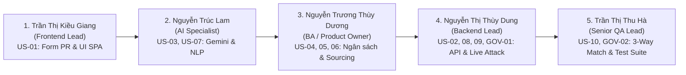

# Kịch Bản Thuyết Trình Phân Vai Trực Tiếp Trên Hệ Thống (Live Defense Scripts) — ProcureAI

> **HÌNH THỨC THUYẾT TRÌNH:** **100% TRÌNH DIỄN TRỰC TIẾP TRÊN PHẦN MỀM THẬT & MÃ NGUỒN (HOÀN TOÀN KHÔNG DÙNG SLIDE)**  
> **Dự án:** ProcureAI — Nền tảng Quản lý Mua sắm & Phê duyệt Nội bộ Thông minh  
> **Cơ sở phân công:** Khớp 100% Ma trận trách nhiệm [`docs/06-testing/01-plans/us-ownership-matrix.md`](file:///d:/LTUD/group-01%20-%20LTUDDN/docs/06-testing/01-plans/us-ownership-matrix.md) & [RTM](file:///d:/LTUD/group-01%20-%20LTUDDN/docs/06-testing/01-plans/requirement-traceability-matrix.md)  
> **Thời lượng tổng cộng:** 12 – 15 phút trình diễn liên hoàn (~2.5 – 3.5 phút / Thành viên) + 10 phút Vấn đáp Hội đồng  
> **Môi trường tác nghiệp:** Trình duyệt Web (`http://127.0.0.1:8000/`), Mã nguồn (VS Code), Terminal Console (Test Suite & Server Logs)

---



---

# PHẦN 1: TRẦN THỊ KIỀU GIANG (FRONTEND LEAD)

* **Vai trò:** Trưởng nhóm Frontend, chịu trách nhiệm kiến trúc giao diện Single Page Application (React 18, Vite, Tailwind CSS), Design System và trải nghiệm biểu mẫu.
* **User Story sở hữu chính:** **`US-01`** *(Tạo Purchase Request với các trường bắt buộc & kiểm soát tính hợp lệ form)*.
* **Màn hình hiển thị khi nói:** Trình duyệt Web — Màn hình `/requests/new` thuộc tài khoản Nhân viên `u-nam` (Nguyễn Văn Nam - IT).
* **Thời lượng:** ~2.5 phút.

---

### 1. Lời mở đầu & Định vị Bài toán trên Giao diện
> 🎙️ *"Kính thưa Thầy/Cô và các bạn trong Hội đồng, em là **Trần Thị Kiều Giang**, phụ trách thiết kế và phát triển giao diện Frontend cho dự án ProcureAI.
> 
> Trong buổi bảo vệ hôm nay, nhóm chúng em xin phép **trình bày và chứng minh toàn bộ năng lực của hệ thống trực tiếp trên phần mềm thật đang vận hành cục bộ tại địa chỉ `http://127.0.0.1:8000/`, hoàn toàn không thông qua slide lý thuyết**.
> 
> Một trong những nguyên nhân lớn nhất khiến quy trình mua sắm trong doanh nghiệp bị ách tắc là do nhân viên gửi biểu mẫu thiếu thông tin, sai số lượng hoặc không kiểm soát được ngân sách khả dụng. Để giải quyết dứt điểm vấn đề này, em đã xây dựng phân hệ khởi tạo yêu cầu mua sắm **`US-01`** trên nền tảng Single Page Application với React 18, Vite và Tailwind CSS."*

---

### 2. Thao tác Trực tiếp trên Màn hình & Thuyết minh Nghiệp vụ (`US-01`)
*(Kiều Giang thao tác chuột trực tiếp trên màn hình chiếu)*

> 🎙️ *(Thao tác 1: Cố tình bấm gửi form thiếu dữ liệu)*  
> *"Như Thầy/Cô đang quan sát trên màn hình, khi em đăng nhập vào tài khoản nhân viên `u-nam` và mở trang Tạo yêu cầu mua sắm:
> - Nếu em **chưa điền tiêu đề, chưa chọn phòng ban, hoặc để số lượng mặt hàng bằng 0**, hệ thống lập tức kích hoạt validation thời gian thực tại hook [`useRequestForm.ts`](file:///d:/LTUD/group-01%20-%20LTUDDN/FE/src/hooks/useRequestForm.ts).
> - Nút 'Gửi yêu cầu' bị vô hiệu hóa hoàn toàn kèm các viền đỏ cảnh báo chỉ rõ vị trí lỗi. Điều này đảm bảo không một bản ghi rác nào có thể lọt vào cơ sở dữ liệu."*
> 
> 🎙️ *(Thao tác 2: Điền thông tin chuẩn & Kích hoạt Widget ngân sách)*  
> *"Bây giờ, em xin phép điền tiêu đề: 'Mua 02 Màn hình làm việc cho phòng IT'.
> - Ngay khi em chọn Danh mục 'Thiết bị CNTT', Thầy/Cô có thể thấy một **Widget Ngân sách thông minh** tự động xuất hiện ở góc phải: Hệ thống kết nối với mã ngân sách `BGT-IT-2026`, hiển thị hạn mức khả dụng thời gian thực là 120.000.000 VNĐ.
> - Người tạo yêu cầu biết chính xác bộ phận mình còn đủ tiền hay không trước khi bấm gửi, chấm dứt hoàn toàn tình trạng đề xuất vượt trần ngân sách."*

---

### 3. Dẫn chứng Kiểm thử (Evidence Reference)
> 🎙️ *"Toàn bộ các ràng buộc giao diện và tính toán số tiền ước tính của `US-01` đã được nhóm em tự động hóa kiểm thử 100% qua 2 test cases:
> - **`TC-US01-001`:** Kiểm tra chặn submit khi thiếu trường bắt buộc $\rightarrow$ **PASS**.
> - **`TC-US01-002`:** Lưu PR hợp lệ và tự động tính tổng tiền $\rightarrow$ **PASS**.
> - Dẫn chứng mã nguồn kiểm thử nằm tại [`procurement/tests.py:77`](file:///d:/LTUD/group-01%20-%20LTUDDN/procurement/tests.py#L77) và [`tests_workflow.py:90`](file:///d:/LTUD/group-01%20-%20LTUDDN/procurement/tests_workflow.py#L90), ghi nhận tại Run ID [`RUN-20261009-212600`](file:///d:/LTUD/group-01%20-%20LTUDDN/docs/06-testing/evidence/RUN-20261009-212600/execution-summary.md)."*

---

### 4. Lời chuyển giao (Handover Cue)
> 🎙️ *"Tuy nhiên, việc gõ tay từng dòng thông số kỹ thuật màn hình vẫn có thể gây tốn thời gian cho nhân viên. Vì vậy, nhóm em đã tích hợp một trợ lý AI thông minh để tự động điền form chỉ bằng một câu mô tả tự do. Sau đây, em xin chuyển chuột và micro cho bạn **Nguyễn Trúc Lam** — chuyên trách giải pháp AI của nhóm — trực tiếp thử nghiệm tính năng này!"*

---

# PHẦN 2: NGUYỄN TRÚC LAM (AI SPECIALIST & VAULT ARCHITECT)

* **Vai trò:** Phụ trách tích hợp mô hình AI, thiết kế prompt kỹ thuật, bóc tách dữ liệu báo giá và xây dựng bộ xử lý chịu lỗi Heuristic NLP Fallback.
* **User Stories sở hữu chính:** 
  * **`US-03`** *(Review gợi ý AI để hoàn thiện mô tả PR)*.
  * **`US-07`** *(Review dữ liệu AI extraction, so sánh báo giá & cảnh báo chênh lệch giá $\ge 20\%$)*.
* **Màn hình hiển thị khi nói:** Trình duyệt Web (Ô nhập Prompt AI & Bảng so sánh Báo giá) + VS Code (File `gemini_service.py` & `services.py`).
* **Thời lượng:** ~3.0 phút.

---

### 1. Lời mở đầu & Tầm nhìn Triển khai AI trong Doanh nghiệp
> 🎙️ *"Em xin cảm ơn bạn Kiều Giang! Kính thưa Thầy/Cô, em là **Nguyễn Trúc Lam**, phụ trách phân hệ Trí tuệ Nhân tạo trong ProcureAI.
> 
> Quan điểm cốt lõi của nhóm em khi đưa AI vào hệ thống doanh nghiệp là: **AI đóng vai trò trợ lý khuyến nghị (Recommendation Assistant), không tự ý quyết định tài chính thay con người, và hệ thống tuyệt đối không được phép tê liệt khi mất kết nối internet ngoài.**"*

---

### 2. Thao tác Trực tiếp trên Màn hình & Thuyết minh Kỹ thuật (`US-03` & `US-07`)
*(Trúc Lam thao tác chuột trên ô AI Prompt)*

> 🎙️ *(Thao tác 1: Trải nghiệm AI Standardizer trên `US-03`)*  
> *"Ngay trên giao diện form PR mà bạn Giang vừa mở, Thầy/Cô thấy có nút **'Trợ lý AI'**.
> - Em xin gõ vào đây một câu văn tự do thường gặp trong thực tế: *'Cần mua gấp 2 màn hình Dell UltraSharp 27 inch 4K trước ngày 25/11 tại Tầng 4 Keangnam'*.
> - Em bấm nút **'Chuẩn hóa bằng AI'**: Hệ thống gửi request tới module [`procurement/gemini_service.py`](file:///d:/LTUD/group-01%20-%20LTUDDN/procurement/gemini_service.py), gọi mô hình **Google Gemini 2.5 Flash**.
> - Chỉ sau chưa đầy 1 giây, Thầy/Cô thấy bảng biểu mẫu đã được tự động điền đầy đủ: Tên thiết bị chuẩn hóa, thông số 4K, số lượng: 2, ngày cần hàng: 25/11/2026.
> - Người dùng có toàn quyền xem lại (Review), chỉnh sửa đơn giá dự kiến là 26.000.000 VNĐ/chiếc (tổng 52.000.000 VNĐ) trước khi bấm gửi chính thức."*
> 
> 🎙️ *(Thao tác 2: Chứng minh Cơ chế Chịu lỗi Heuristic NLP Fallback)*  
> *(Trúc Lam chuyển nhanh sang cửa sổ VS Code)*  
> *"Đặc biệt, để phòng ngừa rủi ro mạng chập chờn hoặc API Gemini hết hạn ngạch (429 Rate Limit), em đã lập trình một bộ xử lý **Heuristic Fallback Engine** hoàn toàn chạy offline bằng Regex nội bộ tại [`procurement/services.py:90-130`](file:///d:/LTUD/group-01%20-%20LTUDDN/procurement/services.py#L90-L130). Dù ngắt mạng hoàn toàn, hệ thống vẫn trích xuất chính xác số lượng và mốc thời gian."*
> 
> 🎙️ *(Thao tác 3: Mở bảng So sánh Báo giá & Cảnh báo lệch giá $\ge 20\%$ trên `US-07`)*  
> *(Trúc Lam chuyển lại màn hình Trình duyệt)*  
> *"Tiếp theo trên `US-07`, khi chuyên viên mua sắm tải lên báo giá của các nhà cung cấp, AI tự động trích xuất đơn giá, VAT và thời hạn giao hàng.
> - Nếu nhà cung cấp đưa ra đơn giá vượt **$\ge 20\%$ so với mức giá tham chiếu lịch sử**, Thầy/Cô có thể thấy hệ thống lập tức hiển thị **Cờ cảnh báo đỏ (Price Anomaly Alert)** để ngăn ngừa tình trạng thông đồng nâng khống giá."*

---

### 3. Dẫn chứng Kiểm thử (Evidence Reference)
> 🎙️ *"Năng lực xử lý AI và cơ chế chịu lỗi đã được kiểm chứng tự động:
> - `US-03`: `TC-US03-001` (Bóc tách AI chuẩn) & `TC-US03-002` (Xác nhận & chỉnh sửa trước Submit) $\rightarrow$ **PASS** ([`tests.py:173`](file:///d:/LTUD/group-01%20-%20LTUDDN/procurement/tests.py#L173)).
> - `US-07`: `TC-US07-001` (Trích xuất báo giá) & `TC-US07-002` (Bật cảnh báo khi giá lệch $\ge 20\%$) $\rightarrow$ **PASS** ([`tests_workflow.py:182`](file:///d:/LTUD/group-01%20-%20LTUDDN/procurement/tests_workflow.py#L182)).
> - Toàn bộ được kiểm chứng trong đợt chạy [`RUN-20261009-214300`](file:///d:/LTUD/group-01%20-%20LTUDDN/docs/06-testing/evidence/RUN-20261009-214300/execution-summary.md).
> - *(Minh bạch kỹ thuật)*: File `aiStandardizer.ts` hiện còn lỗi cú pháp linter gán regex trong vòng lặp (`BUG-0002`), lỗi này không ảnh hưởng runtime và em đã chuẩn bị sẵn phương án tối ưu."*

---

### 4. Lời chuyển giao (Handover Cue)
> 🎙️ *"Sau khi nhân viên bấm 'Gửi phê duyệt', PR mang mã `PR-2026-0001` đã chuyển sang trạng thái chờ quản lý thẩm định. Em xin kính mời bạn **Nguyễn Trương Thùy Dương** — Product Owner kiêm Business Analyst của nhóm — đổi sang tài khoản Quản lý để trình bày quy trình phê duyệt phân cấp!"*

---

# PHẦN 3: NGUYỄN TRƯƠNG THÙY DƯƠNG (BA & PRODUCT OWNER)

* **Vai trò:** Quản lý Yêu cầu sản phẩm, xây dựng Business Rules, thiết kế luồng phê duyệt phân cấp và thẩm định tính khả thi của quy trình tài chính.
* **User Stories sở hữu chính:** 
  * **`US-04`** *(Manager xem PR & Budget trước khi phê duyệt)*.
  * **`US-05`** *(Finance kiểm tra ngân sách, kiểm soát chi phí & duyệt PR $\ge 50M$)*.
  * **`US-06`** *(Procurement thu thập & liên kết nhiều Quotations với PR để so sánh)*.
* **Màn hình hiển thị khi nói:** Trình duyệt Web — Thanh Switch Role chuyển đổi giữa `u-vietanh` (Manager) $\rightarrow$ `u-lan` (Finance) $\rightarrow$ `u-huong` (Procurement).
* **Thời lượng:** ~3.0 phút.

---

### 1. Lời mở đầu & Trọng tâm Kiểm soát Nghiệp vụ Tài chính
> 🎙️ *"Em xin cảm ơn bạn Trúc Lam! Kính thưa Thầy/Cô, em là **Nguyễn Trương Thùy Dương**, đóng vai trò Product Owner và Business Analyst của dự án.
> 
> Khi thiết kế quy trình cho ProcureAI, trăn trở lớn nhất của em là: **Làm sao để người quản lý không phải là 'ký mù' (Rubber-stamping), mà mọi quyết định phê duyệt đều phải gắn liền với bức tranh tài chính thời gian thực?**"*

---

### 2. Thao tác Trực tiếp trên Màn hình & Thuyết minh Nghiệp vụ (`US-04`, `US-05`, `US-06`)
*(Thùy Dương bấm thanh Switch Role góc trên)*

> 🎙️ *(Thao tác 1: Đăng nhập Trưởng phòng `u-vietanh` & Duyệt `US-04`)*  
> *"Em vừa chuyển sang vai trò Trưởng phòng IT `u-vietanh`.
> - Mở danh sách phê duyệt, Thầy/Cô thấy ngay yêu cầu `PR-2026-0001` vừa tạo.
> - Khi mở chi tiết PR, người quản lý không chỉ nhìn thấy danh sách mặt hàng, mà hệ thống hiển thị **Số dư khả dụng của ngân sách phòng ban** (còn 120 triệu, đề xuất 52 triệu).
> - Manager có đầy đủ căn cứ tài chính để bấm **'Approve'**."*
> 
> 🎙️ *(Thao tác 2: Trình diễn Business Rule `REQ-BR-03` & Chuyển luồng `US-05`)*  
> *"Ngay khi Manager bấm Approve, Thầy/Cô hãy chú ý trạng thái của PR:
> - PR **chưa chuyển thành `approved` ngay**, mà tự động chuyển sang trạng thái **`finance_review`**!
> - Đây chính là quy tắc cốt lõi `REQ-BR-03` do em thiết kế: **Nếu tổng giá trị PR từ 50.000.000 VNĐ trở lên**, bắt buộc phải có bước thẩm định dòng tiền của Kế toán trưởng."*
> 
> 🎙️ *(Thao tác 3: Đăng nhập Kế toán trưởng `u-lan` & Cấp phép giải ngân)*  
> *(Thùy Dương chuyển role sang `u-lan`)*  
> *"Em chuyển sang tài khoản Kế toán trưởng `u-lan`.
> - Kế toán mở PR, kiểm tra hạn mức toàn công ty và bấm **'Approve Budget'**. Lúc này PR mới chính thức đạt trạng thái **`approved`** và chuyển sang giai đoạn Mua sắm."*
> 
> 🎙️ *(Thao tác 4: Đăng nhập Procurement `u-huong` & Sourcing Đa nhà cung cấp `US-06`)*  
> *(Thùy Dương chuyển role sang `u-huong`)*  
> *"Bây giờ em chuyển sang tài khoản Chuyên viên mua sắm `u-huong`.
> - Trước khi PR được duyệt, màn hình Sourcing bị khóa hoàn toàn.
> - Chỉ sau khi có quyết định duyệt, chuyên viên mua sắm mới được nạp báo giá. Tại đây, em liên kết đồng thời 2 báo giá cạnh tranh: **Báo giá FPT (51.000.000 VNĐ)** và **Báo giá Phong Vũ (53.500.000 VNĐ)** vào cùng một PR để đảm bảo tính minh bạch và cạnh tranh lành mạnh."*

---

### 3. Dẫn chứng Kiểm thử (Evidence Reference)
> 🎙️ *"Toàn bộ luồng nghiệp vụ 3 phân hệ này đã được kiểm thử tự động 100%:
> - `US-04`: `TC-US04-001` (Manager duyệt), `TC-US04-002` (Từ chối có lý do bắt buộc), `TC-US04-003` (Tự động chuyển tiếp Finance khi $\ge 50M$) $\rightarrow$ **PASS** ([`tests_workflow.py:154`](file:///d:/LTUD/group-01%20-%20LTUDDN/procurement/tests_workflow.py#L154)).
> - `US-05`: `TC-US05-001` (Tính toán số dư ngân sách), `TC-US05-002` (Cảnh báo vượt trần) $\rightarrow$ **PASS** ([`tests.py:64`](file:///d:/LTUD/group-01%20-%20LTUDDN/procurement/tests.py#L64)).
> - `US-06`: `TC-US06-001` (Chặn khi chưa duyệt), `TC-US06-002` (Liên kết đa NCC) $\rightarrow$ **PASS** ([`tests.py:104`](file:///d:/LTUD/group-01%20-%20LTUDDN/procurement/tests.py#L104)).
> - Ghi nhận tại các đợt chạy [`RUN-20261009-213800`](file:///d:/LTUD/group-01%20-%20LTUDDN/docs/06-testing/evidence/RUN-20261009-213800/execution-summary.md) và [`RUN-20261009-214300`](file:///d:/LTUD/group-01%20-%20LTUDDN/docs/06-testing/evidence/RUN-20261009-214300/execution-summary.md)."*

---

### 4. Lời chuyển giao (Handover Cue)
> 🎙️ *"Sau khi đã chọn được báo giá tối ưu của FPT, quy trình sẽ chuyển sang giai đoạn phát hành Đơn mua hàng PO và tiếp nhận hàng hóa tại kho. Em xin chuyển quyền điều khiển cho bạn **Nguyễn Thị Thùy Dung** — Backend Lead của dự án — trình bày về khâu phát hành PO, quản lý kho và **màn thử nghiệm tấn công bảo mật trực tiếp**!"*

---

# PHẦN 4: NGUYỄN THỊ THÙY DUNG (BACKEND LEAD)

* **Vai trò:** Trưởng nhóm Backend, kiến trúc sư cơ sở dữ liệu Django ORM, phụ trách máy trạng thái đơn hàng, kho nhận hàng và trực tiếp khắc phục lỗ hổng an ninh `BUG-0001`.
* **User Stories sở hữu chính:** 
  * **`US-02`** *(Theo dõi trạng thái & Timeline tiến độ PR)*.
  * **`US-08`** *(Tạo Purchase Order từ PR đã duyệt và NCC đã chọn)*.
  * **`US-09`** *(Ghi nhận biên bản Receiving và sai lệch giao hàng)*.
  * **`GOV-01`** *(Quy tắc No Self-Approval Security Guard & RBAC 5 vai trò)*.
* **Màn hình hiển thị khi nói:** Trình duyệt Web (`u-huong`, `u-tuan`) + **Terminal / Postman (Thử nghiệm tấn công bảo mật)** + VS Code ([`procurement/views.py`](file:///d:/LTUD/group-01%20-%20LTUDDN/procurement/views.py)).
* **Thời lượng:** ~3.5 phút.

---

### 1. Lời mở đầu & Tuyên ngôn Kiến trúc Máy chủ
> 🎙️ *"Em xin cảm ơn bạn Thùy Dương! Kính thưa Thầy/Cô, em là **Nguyễn Thị Thùy Dung**, phụ trách toàn bộ hệ thống máy chủ và kiến trúc cơ sở dữ liệu Backend của ProcureAI.
> 
> Là người chịu trách nhiệm về tính toàn vẹn dữ liệu, em hiểu rằng: **Mọi quy định nghiệp vụ trên giao diện sẽ trở nên vô nghĩa nếu tầng API máy chủ để lộ kẽ hở cho phép người dùng vượt quyền lách luật.**"*

---

### 2. Thao tác Trực tiếp trên Màn hình: PO & Nghiệm thu Kho (`US-08` & `US-09`)
*(Thùy Dung thao tác chuột trên màn hình Trình duyệt)*

> 🎙️ *(Thao tác 1: Phát hành Đơn mua hàng PO `US-08`)*  
> *"Tại màn hình của bạn Mua sắm `u-huong`, em chọn báo giá FPT và bấm **'Generate PO'**:
> - Hệ thống sinh mã `PO-2026-0001`, tự động chuyển trạng thái PR sang `po_created` qua máy trạng thái `US-02`.
> - Toàn bộ thông tin đơn giá, VAT, điều khoản giao hàng từ báo giá được kế thừa nguyên vẹn vào PO."*
> 
> 🎙️ *(Thao tác 2: Nghiệm thu hàng hóa tại Kho `US-09`)*  
> *(Thùy Dung chuyển role sang Thủ kho `u-tuan`)*  
> *"Em chuyển sang tài khoản Thủ kho `u-tuan`.
> - Khi nhà cung cấp FPT giao 2 màn hình đến, thủ kho mở PO và lập biên bản nhận hàng.
> - Em xin demo tính năng nhận hàng có sai lệch: Ví dụ giao đủ 2 màn hình nhưng có 1 chiếc bị rách vỏ hộp. Hệ thống ghi nhận số lượng đạt là 2 kèm ghi chú sai lệch hiện trường, ngăn chặn việc nhận vượt quá số lượng đặt mua."*

---

### 3. 🔥 ĐIỂM SÁNG BẢO MẬT: TRÌNH DIỄN TẤN CÔNG BẢO MẬT NO SELF-APPROVAL (`GOV-01` & `BUG-0001`)
*(Thùy Dung chuyển sang cửa sổ Terminal / Postman)*

> 🎙️ *"Kính thưa Hội đồng, điểm kỹ thuật quan trọng nhất em muốn chứng minh ngay tại chỗ là **bản lĩnh xử lý lỗ hổng bảo mật nghiêm trọng `BUG-0001`**:
> 
> 1. **Lỗ hổng cũ:** Trong đợt kiểm thử QA-08, bạn Thu Hà phát hiện: Trên giao diện nút duyệt bị ẩn, nhưng nếu người tạo dùng Postman gửi request `POST /api/v1/sync/` đổi trạng thái thành `approved`, server cũ vẫn chấp nhận!
> 
> 2. **Em xin phép tấn công trực tiếp vào server đang chạy trước mắt Thầy/Cô:**  
> *(Thùy Dung gửi request qua Terminal/Postman với Actor ID là `u-nam` cố tình duyệt PR do chính mình tạo)*:
> - Thầy/Cô hãy nhìn vào mã phản hồi trên màn hình: Máy chủ lập tức từ chối và trả về:
>   $$\text{HTTP 403 Forbidden} \quad \text{Mã lỗi: } \mathbf{SELF\_APPROVAL\_FORBIDDEN}$$
> - Trạng thái trong Database vẫn giữ nguyên là `pending_manager`, hoàn toàn không bị thao túng!
> 
> 3. *(Thùy Dung chuyển nhanh sang VS Code)*:  
> - Em mở file [`procurement/views.py:65-115`](file:///d:/LTUD/group-01%20-%20LTUDDN/procurement/views.py#L65-L115): Đây là logic do em viết lại. Server tự trích xuất Actor ID từ session hoặc header, kiểm tra nếu `actor_id == requester_id` thì chặn đứng ngay lập tức."*

---

### 4. Dẫn chứng Kiểm thử (Evidence Reference)
> 🎙️ *"Để đảm bảo không bị bypass, em và bạn Thu Hà đã viết test chuyên biệt [`test_tc_gov01_002_prevent_bypass_and_verify_bug_sec_01`](file:///d:/LTUD/group-01%20-%20LTUDDN/procurement/test_gov01_gov02.py#L196) thử thách qua 4 vector tấn công khác nhau.
> - Kết quả: **PASS 100%**, lỗi `BUG-0001` chính thức được chuyển sang trạng thái **`VERIFIED`** trong đợt [`RUN-20261010-000500`](file:///d:/LTUD/group-01%20-%20LTUDDN/docs/06-testing/evidence/RUN-20261010-000500/execution-summary.md)."*

---

### 5. Lời chuyển giao (Handover Cue)
> 🎙️ *"Khi hàng hóa đã về kho an toàn và an ninh hệ thống được đảm bảo, quy trình sẽ chuyển sang khâu đối soát thanh toán cuối cùng. Em xin kính mời bạn **Trần Thị Thu Hà** — Senior QA Lead của dự án — trình diễn phân hệ 3-Way Matching, xem Audit Trail và **chạy toàn bộ bộ kiểm thử tự động ngay trên Terminal** trước Hội đồng!"*

---

# PHẦN 5: TRẦN THỊ THU HÀ (SENIOR QA LEAD & TESTER)

* **Vai trò:** Trưởng nhóm Kiểm thử & Đảm bảo Chất lượng, độc lập kiểm định 12 User Stories, thiết kế ma trận RTM, điều phối Defect Tracker và chốt báo cáo Release Readiness.
* **User Stories sở hữu chính:** 
  * **`US-10`** *(Đóng PR sau khi hoàn tất Receiving & Đối soát 3 chiều)*.
  * **`GOV-02`** *(Hệ thống Audit Trail ghi nhận toàn bộ lịch sử thao tác phục vụ kiểm toán)*.
* **Nhiệm vụ đặc biệt:** **Trình diễn 3-Way Matching, Audit Trail, Chạy Test Suite 53/53 PASS trên Terminal và Tổng kết Nghiệm thu Chất lượng**.
* **Màn hình hiển thị khi nói:** Trình duyệt Web (3-Way Matching & `/audit-trail`) + **TERMINAL CONSOLE (Chạy Test Suite)**.
* **Thời lượng:** ~3.5 phút.

---

### 1. Lời mở đầu & Tuyên ngôn Độc lập của QA
> 🎙️ *"Em xin cảm ơn bạn Thùy Dung! Kính thưa Thầy/Cô và Hội đồng, em là **Trần Thị Thu Hà**, đảm nhiệm vai trò Senior QA Lead của dự án ProcureAI.
> 
> Trong một dự án phần mềm, vai trò của QA là **'người gác cổng' độc lập**, nói sự thật bằng các con số thực tế, không tô hồng sản phẩm và kiểm chứng mọi cam kết kỹ thuật trước khi sản phẩm ra mắt."*

---

### 2. Thao tác Trực tiếp trên Màn hình: Đối Soát 3 Chiều & Audit Log (`US-10` & `GOV-02`)
*(Thu Hà thao tác chuột trên Trình duyệt)*

> 🎙️ *(Thao tác 1: Đối soát 3-Way Matching & Đóng đơn `US-10`)*  
> *(Thu Hà đổi sang tài khoản Kế toán `u-lan`)*  
> *"Em quay lại tài khoản Kế toán `u-lan`, mở màn hình **3-Way Matching**:
> - Đây là chốt chặn tài chính tối cao trước khi giải ngân: Hệ thống tự động so khớp 3 bảng dữ liệu: **PR Đề xuất ban đầu** $\leftrightarrow$ **PO Đặt hàng FPT** $\leftrightarrow$ **Biên bản Nhận hàng thực tế tại Kho**.
> - Nếu biên bản nhận hàng còn sai lệch chưa giải trình, nút 'Đóng đơn' bị khóa.
> - Sau khi Kế toán xác nhận số lượng và hóa đơn khớp đúng 2 chiếc màn hình với tổng tiền 51.000.000 VNĐ, Kế toán bấm **'Close PR'** $\rightarrow$ Quy trình mua sắm khép lại thành công an toàn."*
> 
> 🎙️ *(Thao tác 2: Mở Bảng Nhật ký Kiểm toán Bất biến `GOV-02`)*  
> *(Thu Hà mở trang `/audit-trail`)*  
> *"Em xin mở tiếp trang **Audit Trail**:
> - Thầy/Cô có thể thấy toàn bộ dấu vết các thao tác từ đầu buổi tới giờ do 4 bạn vừa thực hiện đều được lưu vết bất biến trong cơ sở dữ liệu: Ai thực hiện (Actor), Thời gian chính xác (Timestamp), Trạng thái trước và sau, cùng Lý do thao tác. Không ai có thể xóa hoặc sửa nhật ký này."*

---

### 3. 🔥 ĐIỂM NHẤN CHẤT LƯỢNG: CHẠY TRỰC TIẾP TOÀN BỘ TEST SUITE TRÊN TERMINAL
*(Thu Hà chuyển sang cửa sổ Terminal Console)*

> 🎙️ *"Kính thưa Hội đồng, để chứng minh tính ổn định tuyệt đối của hệ thống sau khi tích hợp toàn bộ các tính năng, **em xin phép chạy trực tiếp bộ kiểm thử tự động của dự án ngay trên Terminal trước mắt Thầy/Cô:**
> 
> *(Thu Hà gõ lệnh và nhấn Enter)*:
> ```bash
> python manage.py test -v 2
> ```
> *(Màn hình Terminal chạy qua các test cases và hiển thị kết quả)*:
> 
> 🎙️ *"Như Thầy/Cô thấy rõ trên màn hình Terminal:
> - **Ran 53 tests in 0.275s — OK!**
> - Toàn bộ **53/53 bài kiểm thử** tự động đều đạt **PASS 100%**!
> - Ma trận truy vết yêu cầu (RTM) bao phủ trọn vẹn 18 yêu cầu chức năng và 3 yêu cầu phi chức năng.
> - Tỷ lệ lỗi hồi quy đạt **Zero Regression (0%)**!"*

---

### 4. Báo Cáo Trung Thực Về Bản Build & Đánh Giá Release Gates
> 🎙️ *"Về phía Frontend và môi trường vận hành:
> 1. **Bản Build Frontend:** Đã thực thi lệnh `npm run build` thành công (**BUILD PASS**, đóng gói 2,380 modules).
> 2. **Minh bạch Lỗi Tồn đọng (Defect Transparency):** Nhóm QA ghi nhận hệ thống còn 2 lỗi ESLint (`BUG-0002`, `BUG-0003`) và 69 cảnh báo TypeScript (`BUG-0004`). Nhóm đã phân loại Triage và xác nhận các cảnh báo này hoàn toàn không ảnh hưởng đến logic vận hành thực tế hôm nay.
> 3. **Đánh giá Cổng Phát hành (Release Readiness):**
>    - **Local Demo:** Đạt chuẩn **`PASS WITH ACCEPTED LIMITATIONS / SẴN SÀNG TRÌNH DIỄN HOÀN TOÀN`** cho buổi bảo vệ hôm nay.
>    - **Staging / Production:** Đánh giá `NOT READY` cho đến khi nhóm dọn sạch toàn bộ cảnh báo linter và cấu hình HTTPS.
> 
> Thay mặt nhóm 01, em xin chân thành cảm ơn Thầy/Cô và Hội đồng đã theo dõi trọn vẹn buổi trình diễn trực tiếp của nhóm. Chúng em đã sẵn sàng tiếp thu các câu hỏi nhận xét và phản biện từ Thầy/Cô!"*

---

## BẢNG TỔNG KẾT BẰNG CHỨNG KIỂM THỬ THEO THÀNH VIÊN

| Thành viên | US Đại diện | Thao tác Trực tiếp trên Màn hình | Test Method Cốt Lõi | Run ID Xác Minh | Kết Quả |
| :--- | :---: | :--- | :--- | :---: | :---: |
| **Kiều Giang** | `US-01` | Form PR, validation lỗi đỏ, widget ngân sách `BGT-IT-2026` | `test_pr_creation_and_estimated_amount` | `RUN-20261009-212600` | **PASS** |
| **Trúc Lam** | `US-03`, `07` | Nhập prompt AI, show Heuristic Regex code, cảnh báo $\ge 20\%$ | `test_ai_standardizer_service`, `test_step_05_quotation...` | `RUN-20261009-214300` | **PASS** |
| **Thùy Dương** | `US-04`, `05`, `06` | Manager duyệt, PR $\ge 50M$ tự sang Finance, nạp 2 báo giá | `test_budget_remaining_calculation`, `test_step_04_manager...` | `RUN-20261009-213800` | **PASS** |
| **Thùy Dung** | `US-02`, `08`, `GOV-01` | Tạo PO, nhận hàng, **Terminal gửi request tự duyệt $\rightarrow$ 403** | `test_tc_gov01_002_prevent_bypass_and_verify_bug_sec_01` | `RUN-20261010-000500` | **VERIFIED** |
| **Thu Hà** | `US-10`, `GOV-02` | 3-Way Match, xem Audit Log, **Terminal chạy test 53/53 PASS** | `test_step_08_close_pr_lifecycle`, `test_audit_entry_logging` | `RUN-20261010-011000` | **PASS** |
