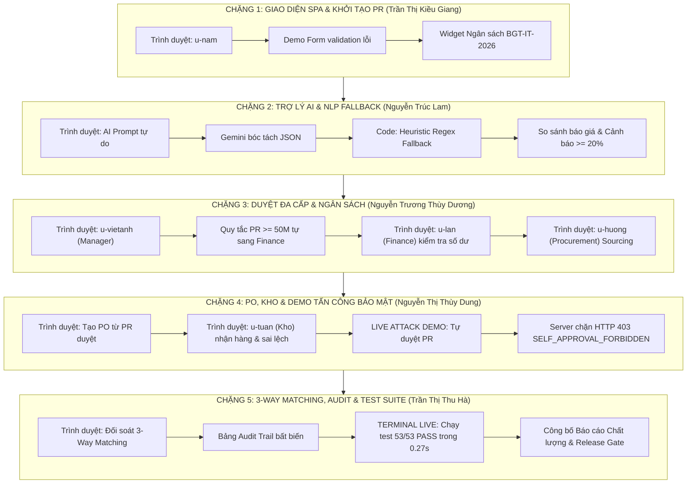

# Đề Cương Thuyết Trình Trực Tiếp Trên Hệ Thống (Live System Walkthrough Outline) — ProcureAI
> **HÌNH THỨC THUYẾT TRÌNH:** **100% TRÌNH DIỄN TRỰC TIẾP TRÊN PHẦN MỀM THẬT & MÃ NGUỒN (KHÔNG DÙNG SLIDE)**  
> **Dự án:** ProcureAI — Nền tảng Quản lý Mua sắm & Phê duyệt Nội bộ Thông minh  
> **Môi trường vận hành:** Trình duyệt Web (`http://127.0.0.1:8000/`), Mã nguồn (VS Code), Terminal Console (Django Test Suite & Server)  
> **Tổng thời lượng:** 12 – 15 phút trình diễn liên hoàn + 10 phút Vấn đáp Hội đồng (Q&A Defense)  
> **Phân công 5 thành viên:** Khớp 100% Ma trận trách nhiệm [`docs/06-testing/01-plans/us-ownership-matrix.md`](file:///d:/LTUD/group-01%20-%20LTUDDN/docs/06-testing/01-plans/us-ownership-matrix.md)

---



---

## CHẶNG 1: TỔNG QUAN HỆ THỐNG, GIAO DIỆN SPA & KHỞI TẠO PR (US-01)
* **Người thực hiện:** **Trần Thị Kiều Giang** (Frontend Lead).
* **Màn hình hiển thị chính:** Trình duyệt Web — Màn hình Đăng nhập / Bảng điều khiển tài khoản Nhân viên (`u-nam`) tại `http://127.0.0.1:8000/`.
* **Mục tiêu chặng:** Giới thiệu ấn tượng đầu tiên về giao diện SPA, nỗi đau nghiệp vụ mua sắm nội bộ và cơ chế kiểm soát dữ liệu đầu vào.
* **Các điểm trình diễn trực tiếp trên màn hình:**
  1. **Mở giao diện ProcureAI:** Giới thiệu ngăn xếp công nghệ Frontend (React 18, Vite, Tailwind CSS, kiến trúc Single Page Application).
  2. **Thao tác Form Tạo PR (`US-01`):**
     - Mở trang `/requests/new`.
     - Cố tình để trống trường bắt buộc và số lượng mặt hàng $\le 0$, bấm nút *Submit* $\rightarrow$ Hệ thống lập tức kích hoạt validation đỏ, nút bấm bị vô hiệu hóa, ngăn chặn hoàn toàn rác dữ liệu.
     - Điền thông tin hợp lệ, chọn Danh mục "Thiết bị CNTT" $\rightarrow$ Widget ngân sách tự động xuất hiện hiển thị số dư khả dụng của mã `BGT-IT-2026`.
  3. **Chứng minh Bằng chứng (Evidence):**
     - Dẫn chứng mã nguồn test [`procurement/tests.py:77`](file:///d:/LTUD/group-01%20-%20LTUDDN/procurement/tests.py#L77) (`test_pr_creation_and_estimated_amount`) và [`tests_workflow.py:90`](file:///d:/LTUD/group-01%20-%20LTUDDN/procurement/tests_workflow.py#L90).
     - Test cases `TC-US01-001`, `TC-US01-002` đạt **PASS 100%** trong đợt kiểm thử [`RUN-20261009-212600`](file:///d:/LTUD/group-01%20-%20LTUDDN/docs/06-testing/evidence/RUN-20261009-212600/execution-summary.md).
* **Chuyển giao (Handover):** Mời **Nguyễn Trúc Lam** trực tiếp gõ lệnh thử nghiệm trợ lý AI ngay trên ô nhập liệu vừa tạo.

---

## CHẶNG 2: TRỢ LÝ AI CHUẨN HÓA & PHÁT HIỆN GIÁ BẤT THƯỜNG (US-03, US-07)
* **Người thực hiện:** **Nguyễn Trúc Lam** (AI Specialist & Vault Architect).
* **Màn hình hiển thị chính:** Trình duyệt Web (Phân hệ AI Assistant & So sánh Báo giá) + VS Code (Mã nguồn Gateway AI & Heuristic Fallback).
* **Mục tiêu chặng:** Chứng minh năng lực AI hỗ trợ con người, khả năng bóc tách cấu trúc phức tạp và năng lực chịu lỗi khi mất kết nối mạng.
* **Các điểm trình diễn trực tiếp trên màn hình:**
  1. **Trải nghiệm Trợ lý AI (`US-03`):**
     - Gõ văn bản tự do: *"Cần mua gấp 2 màn hình Dell UltraSharp 27 inch 4K trước ngày 25/11/2026 tại Tầng 4 Keangnam"*.
     - Bấm *"Chuẩn hóa bằng AI"* $\rightarrow$ Kết quả bóc tách thành công bảng JSON với đầy đủ quy cách, số lượng, ngày cần hàng và gợi ý danh mục chuẩn.
     - Thao tác người dùng xác nhận / chỉnh sửa trước khi lưu (Human-in-the-loop).
  2. **Trình diễn Cơ chế Chịu lỗi Heuristic NLP Fallback (Trình chiếu VS Code):**
     - Mở file [`procurement/gemini_service.py`](file:///d:/LTUD/group-01%20-%20LTUDDN/procurement/gemini_service.py) và [`procurement/services.py:90-130`](file:///d:/LTUD/group-01%20-%20LTUDDN/procurement/services.py#L90-L130).
     - Chứng minh cho Hội đồng: Nếu API Google Gemini gặp sự cố 429 hoặc mất mạng, bộ phân tích Heuristic Regex nội bộ tự động kích hoạt xử lý offline, đảm bảo hệ thống không bao giờ bị dừng hoạt động.
  3. **Bóc tách Báo giá & Cảnh báo lệch giá $\ge 20\%$ (`US-07`):**
     - Mở màn hình So sánh báo giá, hiển thị dữ liệu báo giá đa NCC.
     - Chỉ vào dòng cảnh báo đỏ: Khi đơn giá báo giá vượt $\ge 20\%$ so với mức giá tham chiếu lịch sử, hệ thống tự động bật cờ cảnh báo rủi ro "độn giá".
  4. **Chứng minh Bằng chứng (Evidence):**
     - Dẫn chứng test method `test_ai_standardizer_service` tại [`procurement/tests.py:173`](file:///d:/LTUD/group-01%20-%20LTUDDN/procurement/tests.py#L173) và `test_step_05_quotation_collection_and_anomaly` tại [`tests_workflow.py:182`](file:///d:/LTUD/group-01%20-%20LTUDDN/procurement/tests_workflow.py#L182).
     - Đạt **PASS 100%** trong đợt kiểm thử [`RUN-20261009-214300`](file:///d:/LTUD/group-01%20-%20LTUDDN/docs/06-testing/evidence/RUN-20261009-214300/execution-summary.md).
* **Chuyển giao (Handover):** Mời **Nguyễn Trương Thùy Dương** chuyển sang tài khoản Trưởng phòng để thực hiện quy trình phê duyệt phân cấp.

---

## CHẶNG 3: DUYỆT ĐA CẤP, KIỂM SOÁT NGÂN SÁCH & SOURCING (US-04, US-05, US-06)
* **Người thực hiện:** **Nguyễn Trương Thùy Dương** (BA & Product Owner).
* **Màn hình hiển thị chính:** Trình duyệt Web — Chuyển đổi giữa tài khoản Trưởng phòng (`u-vietanh`), Kế toán trưởng (`u-lan`), và Chuyên viên mua sắm (`u-huong`).
* **Mục tiêu chặng:** Trình diễn quy tắc nghiệp vụ quản trị chi phí chặt chẽ, phê duyệt có cơ sở tài chính và tính minh bạch trong tìm kiếm nhà cung cấp.
* **Các điểm trình diễn trực tiếp trên màn hình:**
  1. **Trưởng phòng phê duyệt gắn liền số dư ngân sách (`US-04`):**
     - Đăng nhập `u-vietanh`. Mở danh sách PR chờ duyệt.
     - Mở PR vừa tạo: Màn hình hiển thị chi tiết mặt hàng song hành cùng **Hạn mức khả dụng của ngân sách phòng ban**.
     - Nhấn *"Approve"* $\rightarrow$ Trình diễn Business Rule `REQ-BR-03`: Vì tổng giá trị PR $> 50.000.000$ VNĐ, hệ thống tự động chuyển tiếp sang trạng thái `finance_review` thay vì kết thúc bước duyệt.
  2. **Kế toán kiểm soát chi phí & cấp phép ngân sách (`US-05`):**
     - Đổi sang tài khoản Kế toán trưởng `u-lan`.
     - Mở PR ở trạng thái `finance_review`: Thẩm định hạn mức doanh nghiệp và bấm chấp thuận giải ngân $\rightarrow$ PR chuyển trạng thái `approved`.
  3. **Sourcing liên kết đa báo giá (`US-06`):**
     - Đổi sang tài khoản Chuyên viên mua sắm `u-huong`.
     - Chỉ vào quy tắc: Khi PR chưa duyệt, màn hình Sourcing bị khóa; chỉ sau khi duyệt, chức năng thêm báo giá mới mở.
     - Liên kết 2 báo giá cạnh tranh (Phong Vũ vs FPT) vào cùng một PR.
  4. **Chứng minh Bằng chứng (Evidence):**
     - Dẫn chứng test method `test_budget_remaining_calculation` tại [`tests.py:64`](file:///d:/LTUD/group-01%20-%20LTUDDN/procurement/tests.py#L64) và `test_step_04_manager_approval` tại [`tests_workflow.py:154`](file:///d:/LTUD/group-01%20-%20LTUDDN/procurement/tests_workflow.py#L154).
     - Toàn bộ `TC-US04-001/002/003`, `TC-US05-001/002`, `TC-US06-001/002` đạt **PASS 100%** trong [`RUN-20261009-213800`](file:///d:/LTUD/group-01%20-%20LTUDDN/docs/06-testing/evidence/RUN-20261009-213800/execution-summary.md).
* **Chuyển giao (Handover):** Mời **Nguyễn Thị Thùy Dung** trình diễn phát hành PO, nhận hàng và màn thử nghiệm tấn công bảo mật trực tiếp.

---

## CHẶNG 4: PHÁT HÀNH ĐƠN PO, KHO NHẬN HÀNG & THỬ NGHIỆM TẤN CÔNG BẢO MẬT (US-02, US-08, US-09, GOV-01)
* **Người thực hiện:** **Nguyễn Thị Thùy Dung** (Backend Lead).
* **Màn hình hiển thị chính:** Trình duyệt Web (Phát hành PO & Nghiệm thu Kho) + **Terminal / Postman (Thử nghiệm tấn công bảo mật)** + VS Code (Mã nguồn chặn bảo mật).
* **Mục tiêu chặng:** Trình bày chuỗi cung ứng thực thi, máy trạng thái bất biến và chứng minh tính an ninh vượt trội sau khi vá lỗi nghiêm trọng `BUG-0001`.
* **Các điểm trình diễn trực tiếp trên màn hình:**
  1. **Khởi tạo Đơn mua hàng PO chuẩn hóa (`US-08`):**
     - Tại tài khoản `u-huong`, chọn báo giá trúng thầu của FPT và nhấn *"Generate PO"*.
     - Hệ thống sinh mã `PO-2026-0001`, tự động kế thừa bảng giá, điều khoản thanh toán, thuế VAT và thời gian giao hàng.
  2. **Biên bản Nghiệm thu giao nhận hàng (`US-09`):**
     - Đổi sang tài khoản Thủ kho `u-tuan`.
     - Mở PO-2026-0001 và tạo biên bản giao nhận hàng: Demo nhận hàng thực tế, ghi nhận sai lệch hàng hóa. Số lượng nhận bị chặn nếu vượt quá số lượng đặt trên PO.
  3. **🔥 ĐIỂM NHẤN: LIVE ATTACK DEMO — BẢO MẬT NO SELF-APPROVAL (`GOV-01` & `BUG-0001`):**
     - **Mô phỏng tấn công:** Mở Terminal hoặc cửa sổ Console, gửi request `POST /api/v1/sync/` cố tình chuyển trạng thái PR sang `approved` bằng chính tài khoản người tạo (`u-nam`).
     - **Kết quả trên màn hình:** Server lập tức từ chối và trả về:
       $$\text{HTTP 403 Forbidden} \quad \text{Payload: } \{\text{"error"}: \text{"SELF\_APPROVAL\_FORBIDDEN"}\}$$
     - **Mở code minh chứng trong VS Code:** Mở [`procurement/views.py:65-115`](file:///d:/LTUD/group-01%20-%20LTUDDN/procurement/views.py#L65-L115), giải thích trực tiếp cho Hội đồng thuật toán kiểm tra Actor ID nghiêm ngặt ở tầng backend.
  4. **Chứng minh Bằng chứng (Evidence):**
     - Test method [`test_tc_gov01_002_prevent_bypass_and_verify_bug_sec_01`](file:///d:/LTUD/group-01%20-%20LTUDDN/procurement/test_gov01_gov02.py#L196) thử thách 4 vector tấn công đạt **PASS 100%**.
     - Lỗi `BUG-0001` chính thức được chuyển sang trạng thái **`VERIFIED`** trong đợt [`RUN-20261010-000500`](file:///d:/LTUD/group-01%20-%20LTUDDN/docs/06-testing/evidence/RUN-20261010-000500/execution-summary.md).
* **Chuyển giao (Handover):** Mời **Trần Thị Thu Hà** hoàn tất chặng đối soát tài chính cuối cùng và mở màn hình chạy kiểm thử trực tiếp trước Hội đồng.

---

## CHẶNG 5: ĐỐI SOÁT 3 CHIỀU, AUDIT TRAIL BẤT BIẾN & CHẠY TEST SUITE TRỰC TIẾP (US-10, GOV-02 & TỔNG KẾT QA)
* **Người thực hiện:** **Trần Thị Thu Hà** (Senior QA Lead & Tester).
* **Màn hình hiển thị chính:** Trình duyệt Web (Màn hình 3-Way Matching & Audit Log) + **TERMINAL CONSOLE (Chạy Test Suite & Build)**.
* **Mục tiêu chặng:** Chốt hạ vòng đời mua sắm an toàn và chứng minh chất lượng phần mềm bằng việc thực thi kiểm thử trực tiếp trước Hội đồng.
* **Các điểm trình diễn trực tiếp trên màn hình:**
  1. **Đối soát 3 chiều & Đóng đơn hàng (`US-10`):**
     - Đổi sang tài khoản Kế toán `u-lan`, mở màn hình *3-Way Matching*.
     - Hệ thống tự động đặt 3 bảng dữ liệu song song: **PR Đề xuất** $\leftrightarrow$ **PO Đặt hàng** $\leftrightarrow$ **Biên bản Nhận hàng thực tế**.
     - Cố tình bấm Close khi biên bản nhận hàng còn sai lệch chưa giải trình $\rightarrow$ Hệ thống từ chối đóng. Sau khi đối soát hợp lệ $\rightarrow$ Cho phép Kế toán bấm *"Close PR"* thành công.
  2. **Trình diễn Bảng Nhật ký Kiểm toán Bất biến (`GOV-02`):**
     - Mở trang `/audit-trail`: Chỉ trực tiếp cho Hội đồng thấy chuỗi bản ghi kiểm toán được tạo tự động qua từng bước của 4 bạn vừa demo: Người thực hiện, Dấu thời gian (Timestamp), Hành vi, và Lý do nghiệp vụ.
  3. **🔥 ĐIỂM NHẤN CHẤT LƯỢNG: CHẠY TRỰC TIẾP TOÀN BỘ TEST SUITE TRÊN TERMINAL:**
     - Chuyển sang cửa sổ Terminal, chạy lệnh:
       ```bash
       python manage.py test -v 2
       ```
     - Chỉ vào màn hình kết quả chạy thực tế: **Ran 53 tests in ~0.28s — OK (PASS 100%)**.
     - Không một test case nào bị bỏ sót, tỷ lệ hồi quy **Zero Regression (0%)**.
  4. **Báo cáo Trung thực về Bản Build & Lỗi Linter:**
     - Chiếu kết quả đóng gói: `npm run build` hoàn tất xuất sắc (**BUILD PASS**, 34.8s, 2,380 modules).
     - Minh bạch kỹ thuật: Thẳng thắn nêu 2 cảnh báo ESLint (`BUG-0002`, `BUG-0003`) và 69 cảnh báo TypeScript (`BUG-0004`), phân tích rõ các lỗi này không ảnh hưởng đến runtime chạy thực tế.
  5. **Tuyên bố Nghiệm thu & Chuyển sang Vấn đáp:**
     - Đánh giá cổng phát hành: **`LOCAL DEMO: PASS WITH ACCEPTED LIMITATIONS / SẴN SÀNG VẬN HÀNH BẢO VỆ ĐỒ ÁN`**.
     - Chính thức mời Thầy/Cô và Hội đồng đặt câu hỏi phản biện.

---

## BẢNG TỔNG HỢP PHÂN CÔNG ĐIỀU PHỐI MÀN HÌNH (SCREEN ALLOCATION)

| Thứ tự | Người trình bày | Vai trò chính | Màn hình phần mềm hiển thị | Hành động chứng minh (Live Action) | Test Evidence |
| :---: | :--- | :--- | :--- | :--- | :--- |
| **Chặng 1** | **Kiều Giang** | Frontend Lead | Trình duyệt: `/requests/new` (`u-nam`) | Demo form validation lỗi đỏ; widget ngân sách `BGT-IT-2026` | `TC-US01-001, 002` (PASS) |
| **Chặng 2** | **Trúc Lam** | AI Specialist | Trình duyệt + VS Code (`gemini_service.py`) | Gõ prompt AI tự do; show Heuristic Fallback Regex; cảnh báo giá $\ge 20\%$ | `TC-US03-001, TC-US07-002` (PASS) |
| **Chặng 3** | **Thùy Dương** | BA / PO | Trình duyệt: `u-vietanh` $\rightarrow$ `u-lan` $\rightarrow$ `u-huong` | Duyệt PR $> 50M$ tự sang Finance; đối chiếu ngân sách; nạp đa báo giá | `TC-US04-003, TC-US05-001, TC-US06-002` (PASS) |
| **Chặng 4** | **Thùy Dung** | Backend Lead | Trình duyệt (`u-huong`, `u-tuan`) + **Terminal tấn công** | Tạo PO, nhận hàng; **Gửi request tự duyệt PR $\rightarrow$ HTTP 403 Forbidden** | `TC-GOV01-002` (VERIFIED) |
| **Chặng 5** | **Thu Hà** | Senior QA Lead | Trình duyệt (3-Way, Audit Log) + **Terminal Test Suite** | Đối soát 3 bên; xem Audit Trail; **Gõ chạy 53/53 tests PASS trực tiếp** | `TC-US10-001, TC-GOV02-001` (PASS) |
