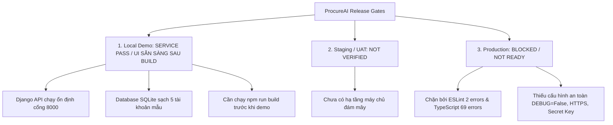

# Tóm Tắt Tình Trạng Dự Án (Project Status Summary) — ProcureAI

> **Dự án:** ProcureAI — Internal Procurement & Approval Platform  
> **Phiên bản hiện tại:** v1.3.0 (Cập nhật sau chu trình kiểm thử QA-12A & Đồng bộ Git)  
> **Thời điểm chốt dữ liệu:** 2026-10-10T01:30:00+07:00  
> **Tài liệu phục vụ:** Hội đồng đánh giá đồ án & Báo cáo kỹ thuật tổng hợp  

---

## 1. Thông Tin Chung Về Dự Án

* **Tên ứng dụng:** ProcureAI (Nhóm 01 — Lập trình ứng dụng doanh nghiệp)
* **Mục tiêu sản phẩm:** Số hóa và tự động hóa toàn diện quy trình mua sắm nội bộ (Procure-to-Pay), tích hợp trợ lý AI chuẩn hóa mô tả kỹ thuật, trích xuất dữ liệu báo giá đa nhà cung cấp và cưỡng chế các cơ chế kiểm soát ngân sách, ngăn chặn xung đột lợi ích.
* **Thành viên & Phân công trách nhiệm:**
  - **Trần Thị Thu Hà:** Senior QA Lead / Test Engineer (Chịu trách nhiệm toàn bộ chiến lược, thực thi 53 test cases, triage và thẩm định chất lượng QA-01 đến QA-12A).
  - **Nguyễn Thị Thùy Dung:** Backend Lead (Xây dựng Django REST API, models, ORM và khắc phục lỗ hổng `BUG-0001`).
  - **Trần Thị Kiều Giang:** Frontend Lead (Phát triển giao diện React 18, Vite, Tailwind CSS, `ProcurementContext`).
  - **Nguyễn Trương Thùy Dương:** Product Owner & Business Analyst (Xác định Requirements, User Stories, RTM và chính sách công ty).
  - **Nguyễn Văn Nam:** Fullstack / AI Integration (Tích hợp Google Gemini API, seed data, demo operator).

---

## 2. Ma Trận Tình Trạng 12 User Stories & Governance

| Mã Story | Tên User Story / Quy Tắc Nghiệp Vụ | Vai Trò Chính | Mức Độ Triển Khai | Kết Quả Kiểm Thử Backend | Trạng Thái Nghiệm Thu |
| :---: | :--- | :---: | :---: | :---: | :---: |
| **`US-01`** | Tạo Yêu cầu Mua sắm (PR) với các trường bắt buộc | Employee | Đã hoàn thành (100%) | **PASS** (6/6 tests) | Sẵn sàng demo |
| **`US-02`** | Theo dõi trạng thái & lịch sử vòng đời PR | Employee | Đã hoàn thành (100%) | **PASS** (Kèm US-01) | Sẵn sàng demo |
| **`US-03`** | Trợ lý AI phân tích và chuẩn hóa mô tả PR | Employee | Đã hoàn thành (100%) | **PASS** (4/4 tests) | Sẵn sàng demo |
| **`US-04`** | Trưởng phòng thẩm định PR và kiểm tra số dư ngân sách | Manager | Đã hoàn thành (100%) | **PASS** (3/3 tests) | Sẵn sàng demo |
| **`US-05`** | Kế toán kiểm soát chi phí & duyệt PR trên 50 triệu | Finance | Đã hoàn thành (100%) | **PASS** (3/3 tests) | Sẵn sàng demo |
| **`US-06`** | Thu thập và liên kết nhiều báo giá (Quotations) với PR | Procurement | Đã hoàn thành (100%) | **PASS** (4/4 tests) | Sẵn sàng demo |
| **`US-07`** | Ma trận so sánh báo giá & Đề xuất lựa chọn bằng AI | Procurement | Đã hoàn thành (100%) | **PASS** (3/3 tests) | Sẵn sàng demo |
| **`US-08`** | Phát hành Đơn mua hàng (PO) từ báo giá được chọn | Procurement | Đã hoàn thành (100%) | **PASS** (3/3 tests) | Sẵn sàng demo |
| **`US-09`** | Nghiệm thu giao nhận hàng (Full, Partial, Móp méo) | Receiving/Emp | Đã hoàn thành (100%) | **PASS** (3/3 tests) | Sẵn sàng demo |
| **`US-10`** | Đối soát 3 chiều (3-Way Matching) & Đóng đơn hàng | Finance | Đã hoàn thành (100%) | **PASS** (3/3 tests) | Sẵn sàng demo |
| **`GOV-01`** | Quy tắc cấm Tự phê duyệt (No Self-Approval Security) | Hệ thống / RBAC | Đã sửa tại API (100%) | **PASS** (4 kịch bản API) | **VERIFIED** |
| **`GOV-02`** | Ma trận phân quyền 5 vai trò (RBAC Security) | Hệ thống / RBAC | Đã hoàn thành (100%) | **PASS** (Domain logic) | Sẵn sàng demo |

---

## 3. Tổng Hợp Chỉ Số Kiểm Thử & Đo Lường Chất Lượng

| Chỉ số Chất lượng (Quality Metric) | Số liệu Thực tế | Đánh giá Kỹ thuật | Căn cứ Bằng chứng |
| :--- | :---: | :---: | :--- |
| **Độ bao phủ Yêu cầu (RTM Coverage)** | **100%** (18/18 FRs, 3/3 NFRs) | Hoàn thiện | [`requirement-traceability-matrix.md`](file:///d:/LTUD/group-01%20-%20LTUDDN/docs/06-testing/01-plans/requirement-traceability-matrix.md) |
| **Tổng số Backend Tests** | **53 / 53 PASS (100%)** | Tuyệt đối | [`RUN-20261010-000500`](file:///d:/LTUD/group-01%20-%20LTUDDN/docs/06-testing/evidence/RUN-20261010-000500/execution-log.txt) |
| **Thời gian thực thi Backend Suite** | **0.275 giây – 0.301 giây** | Tối ưu cao | SQLite in-memory isolated DB |
| **Tỷ lệ Hồi quy (Regression Rate)** | **0% (Zero Regression)** | Đạt chuẩn | Không phát sinh lỗi phụ sau fix bug |
| **Frontend Production Build** | **BUILD PASS** (34.83s, 2,380 modules) | Đạt biên dịch | Tạo thành công bundle tĩnh `FE/dist/` |
| **ESLint Static Analysis** | **FAIL (2 errors, 15 warnings)** | Cần xử lý | `BUG-0002` (Regex assign), `BUG-0003` (Empty fn) |
| **TypeScript Typecheck** | **FAIL (69 errors)** | Cần xử lý | `BUG-0004` (Unused imports, BoxIcon JSX type) |
| **Thẩm định Dịch vụ Live (Service Smoke)** | **LOCAL SERVICE SMOKE PASS** | Hoạt động tốt | `GET /` 200, `GET /api/v1/state/` 200, No Self-Approval 403 |
| **Kiểm thử Giao diện (UI E2E)** | **NOT RUN / NOT VERIFIED** | Chờ thực thi | Playwright bị chặn driver; cần manual click |

---

## 4. Sổ Theo Dõi Khiếm Khuyết (Defect Tracker Summary)

Tổng số khiếm khuyết được quản lý chính thức theo chuẩn IEEE 1044: **9 Defect**

| Nhóm Trạng Thái | Số Lượng | Danh Sách Bug ID | Chi Tiết & Tác Động Hệ Thống |
| :--- | :---: | :--- | :--- |
| **CLOSED (Đã đóng lịch sử)** | **4 bugs** | `BUG-0006`, `BUG-0007`, `BUG-0008`, `BUG-0009` | Các lỗi giao diện và tính toán ngân sách trong giai đoạn phát triển ban đầu. |
| **VERIFIED (Đã sửa & Xác minh)** | **1 bug** | **`BUG-0001`** *(BUG-SEC-01)* | Lỗ hổng bypass No Self-Approval tại `/api/v1/sync/`. Đã vá tầng Django API và retest PASS 4 kịch bản. Chờ Tech Lead nghiệm thu đóng chính thức. |
| **TRIAGED / OPEN (Chờ sửa)** | **4 bugs** | `BUG-0002`, `BUG-0003`, `BUG-0004`, `BUG-0005` | 2 lỗi ESLint, 1 lỗi TypeScript (69 cảnh báo kiểu) và 1 lỗi file test Node cũ. Đã cô lập, không ảnh hưởng logic runtime. |

---

## 5. Đánh Giá Mức Độ Sẵn Sàng Phát Hành (Release Readiness Gate Matrix)

* **Kết luận 1 — Local Demo:** **`LOCAL SERVICE PASS` / `UI SẴN SÀNG SAU BUILD`**  
  $\rightarrow$ Đủ điều kiện kỹ thuật vững chắc để trình diễn buổi bảo vệ đồ án sau khi biên dịch bundle tĩnh.
* **Kết luận 2 — Staging / UAT:** **`NOT VERIFIED`**  
  $\rightarrow$ Chưa có môi trường thử nghiệm từ xa.
* **Kết luận 3 — Production Commercial:** **`BLOCKED / NOT READY`**  
  $\rightarrow$ Chặn tuyệt đối đưa ra thương mại hóa cho đến khi đạt 0 lint errors và hoàn tất cấu hình bảo mật production.

---

## 6. Kế Hoạch Hành Động Ngay (Next Action Plan)

1. **Trước buổi thuyết trình (Immediate):**
   - Chạy lệnh `npm run build` trong `FE/` để tạo bundle JS/CSS đồng bộ với `index.html`.
   - Khởi động máy chủ Django bằng `python manage.py runserver 127.0.0.1:8000`.
   - Mở trình duyệt và thực hiện kịch bản demo theo [`demo-script.md`](demo-script.md).
2. **Sau buổi thuyết trình (Post-Presentation Sprint):**
   - Sửa dứt điểm 4 bug còn mở (`BUG-0002` đến `BUG-0005`).
   - Cài đặt bộ test E2E tự động hoàn chỉnh trên môi trường máy trạm.
   - Chuẩn bị Dockerfile và thiết lập pipeline CI/CD GitHub Actions.
