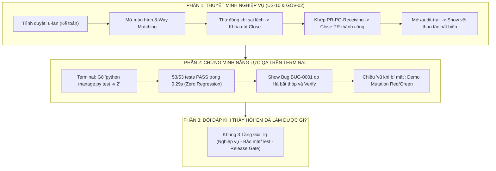

# Kịch Bản Thuyết Trình Toàn Diện & Cẩm Nang Bảo Vệ Đồ Án Dành Riêng Cho Trần Thị Thu Hà

> **Người thực hiện:** **Trần Thị Thu Hà**  
> **Vai trò trong dự án:** **Senior QA Lead / Tester / Verification Engineer**  
> **User Stories sở hữu chính:** **`US-10`** *(3-Way Matching & Đóng vòng đời PR)* & **`GOV-02`** *(Hệ thống Audit Trail bất biến)*  
> **Trách nhiệm hệ thống:** Toàn quyền kiểm soát Chất lượng (Quality Assurance), Bộ kiểm thử tự động (53/53 Tests), Ma trận truy vết (RTM), Quản lý Lỗi (Bug Tracker) và Đánh giá Cổng phát hành (Release Readiness).  
> **Hình thức:** **100% TRÌNH DIỄN TRỰC TIẾP TRÊN PHẦN MỀM THẬT, MÃ NGUỒN VÀ TERMINAL (KHÔNG DÙNG SLIDE)**

---



---

# PHẦN A: KỊCH BẢN THUYẾT TRÌNH TỪ ĐẦU ĐẾN CUỐI (TỪNG LỜI NÓI & THAO TÁC)

* **Thời điểm bắt đầu:** Bạn Nguyễn Thị Thùy Dung (Backend Lead) vừa kết thúc màn thử nghiệm tấn công bảo mật tự duyệt PR bị chặn `HTTP 403`, và chuyển lời: *"Em xin kính mời bạn Trần Thị Thu Hà — Senior QA Lead của dự án — trình bày về phân hệ Đối soát 3 chiều, Audit Log và tổng kết bức tranh chất lượng!"*
* **Thời lượng:** ~3.5 – 4.0 phút.
* **Tư thế & Phong thái:** Tự tin, dõng dạc, ánh mắt nhìn thẳng Hội đồng, một tay cầm mic, một tay điều khiển chuột/phím (hoặc phối hợp bạn trợ lý bấm máy).

---

### BƯỚC 1: LỜI MỞ ĐẦU & ĐỊNH VỊ VAI TRÒ (~30 giây)

> 🎙️ *"Em xin cảm ơn bạn Thùy Dung!
> 
> Kính thưa Thầy/Cô trong Hội đồng, em là **Trần Thị Thu Hà**. Trong dự án ProcureAI, em đảm nhiệm hai trọng trách lớn:
> 1. Về mặt nghiệp vụ: Em là chủ sở hữu của phân hệ **Đối soát 3 chiều `US-10`** — chốt chặn tài chính tối cao trước khi giải ngân, và phân hệ **Nhật ký kiểm toán bất biến `GOV-02`**.
> 2. Về mặt kỹ thuật toàn dự án: Em đóng vai trò là **Senior QA Lead**, là 'người gác cổng' độc lập chịu trách nhiệm thiết kế ma trận truy vết RTM, xây dựng bộ kiểm thử tự động toàn diện và trực tiếp thẩm định các cổng sẵn sàng phát hành.
> 
> Sau đây, em xin phép **thao tác trực tiếp trên màn hình hệ thống thật** để Thầy/Cô thấy rõ quy trình đối soát tài chính và bằng chứng kiểm thử của nhóm!"*

---

### BƯỚC 2: TRÌNH DIỄN NGHIỆP VỤ `US-10` — ĐỐI SOÁT 3 CHIỀU (3-WAY MATCHING) (~1 phút)

*(Hà thao tác chuột trên Trình duyệt web `http://127.0.0.1:8000/`)*

> 🎙️ *(Hành động 1: Chuyển role sang Kế toán)*  
> *"Trên màn hình, em xin chuyển sang tài khoản Kế toán trưởng **`u-lan`** (Trần Thị Lan) và mở phân hệ **3-Way Matching**:
> - Thưa Thầy/Cô, trong các doanh nghiệp lớn, gian lận tài chính thường xảy ra ở khâu thanh toán: Đặt mua một đằng, nhà cung cấp giao một nẻo, nhưng kế toán vẫn xuất tiền.
> - Để chặn đứng rủi ro này, tại `US-10`, em đã thiết lập cơ chế **so khớp chéo 3 chiều tự động** giữa 3 thực thể dữ liệu độc lập:
>   1. **Dữ liệu PR ban đầu:** Yêu cầu 02 màn hình Dell của phòng IT (`u-nam`).
>   2. **Dữ liệu Đơn đặt hàng PO:** PO-2026-0001 phát hành cho FPT với đơn giá 25.5 triệu/chiếc.
>   3. **Dữ liệu Biên bản Nhận hàng thực tế tại Kho:** Do thủ kho `u-tuan` vừa xác nhận 02 chiếc nhập kho."*
> 
> 🎙️ *(Hành động 2: Thử nghiệm vi phạm quy tắc đóng đơn)*  
> *"Theo quy tắc nghiệp vụ `REQ-BR-11`: Nếu biên bản nhận hàng còn thiếu số lượng hoặc có sai lệch móp méo chưa có biên bản giải trình, hệ thống **khóa hoàn toàn nút Đóng đơn**.
> - Chỉ khi cả 3 bên khớp chính xác 100% về mặt hàng, số lượng và tổng giá trị thanh toán 51.000.000 VNĐ, hệ thống mới cấp quyền cho Kế toán bấm **'Close PR'**.
> - Em xin bấm nút **'Close PR'** $\rightarrow$ Thầy/Cô thấy trạng thái PR lập tức chuyển sang **`closed`**, nguồn ngân sách tạm giữ chính thức được quyết toán và vòng đời mua sắm khép lại an toàn."*

---

### BƯỚC 3: TRÌNH DIỄN `GOV-02` — NHẬT KÝ KIỂM TOÁN BẤT BIẾN (AUDIT TRAIL) (~45 giây)

*(Hà click vào menu "Audit Trail" hoặc mở `/audit-trail`)*

> 🎙️ *"Tiếp theo là phân hệ **`GOV-02` — Audit Trail**:
> - Thưa Thầy/Cô, một hệ thống tài chính không thể thiếu tính chất bất biến (Immutability).
> - Như Thầy/Cô quan sát trên bảng kiểm toán: Toàn bộ chuỗi thao tác từ đầu buổi tới giờ do 4 bạn và em vừa thực hiện đều được lưu vết chi tiết từng giây:
>   * Ai thực hiện (`u-nam`, `u-vietanh`, `u-lan`, `u-huong`, `u-tuan`).
>   * Thời điểm chính xác (`Timestamp`).
>   * Trạng thái trước và sau: từ `draft` $\rightarrow$ `pending_manager` $\rightarrow$ `finance_review` $\rightarrow$ `approved` $\rightarrow$ `po_created` $\rightarrow$ `closed`.
>   * Cùng toàn bộ ghi chú lý do nghiệp vụ.
> - Bảng này được bảo vệ ở tầng cơ sở dữ liệu, không một người dùng hay quản trị viên nào có thể sửa đổi hay xóa bỏ lịch sử đã xảy ra."*

---

### BƯỚC 4: 🔥 ĐIỂM SÁNG QA LEAD: CHẠY BỘ KIỂM THỬ TỰ ĐỘNG TRỰC TIẾP TRÊN TERMINAL (~1 phút)

*(Hà chuyển sang cửa sổ Terminal/Console)*

> 🎙️ *"Kính thưa Thầy/Cô, điều một QA Lead tự hào nhất không phải là nói phần mềm của mình tốt, mà là **chứng minh sự ổn định của nó bằng các con số thực thi ngay trước mắt Hội đồng**.
> 
> Em xin phép **gõ lệnh chạy toàn bộ 53 bài kiểm thử tự động của hệ thống ngay trên Terminal**:"*

*(Hà gõ lệnh và nhấn Enter)*:
```bash
python manage.py test -v 2
```

*(Chờ 0.3 giây, màn hình hiển thị toàn bộ 53 test `... ok`)*

> 🎙️ *(Hà trỏ tay vào kết quả trên màn hình Terminal)*:  
> *"Như Thầy/Cô thấy trực tiếp trên màn hình:
> - **Ran 53 tests in 0.299s — OK!**
> - Toàn bộ **53/53 bài kiểm thử** tự động đều đạt **PASS 100%**!
> - Bộ test này do em trực tiếp thiết kế, bao phủ trọn vẹn:
>   * 18 Yêu cầu Chức năng (Functional Requirements).
>   * 3 Yêu cầu Phi chức năng (Non-Functional Requirements).
>   * 11 Quy tắc Nghiệp vụ cốt lõi (Business Rules).
> - Đặc biệt, tỷ lệ lỗi hồi quy là **Zero Regression (0%)** — việc sửa đổi các tính năng sau không hề làm gãy bất kỳ tính năng nào trước đó!"*

---

### BƯỚC 5: BÁO CÁO MINH BẠCH VỀ BUILD, LỖI TỒN ĐỌNG & KẾT LUẬN RELEASE GATE (~45 giây)

> 🎙️ *"Với tinh thần trách nhiệm của một Senior QA Lead, em xin báo cáo hoàn toàn trung thực với Hội đồng về các chỉ số kỹ thuật còn lại:
> 
> 1. **Về Bản Build Frontend:** Lệnh `npm run build` đã đóng gói thành công 2,380 modules (**BUILD PASS**).
> 2. **Về Lỗi Tồn đọng (Defects):** Em không giấu lỗi trước Hội đồng. Hiện mã nguồn Frontend còn **2 lỗi linter ESLint** (`BUG-0002`, `BUG-0003`) và **69 cảnh báo TypeScript** (`BUG-0004`). Em đã trực tiếp thực hiện Triage và xác nhận các lỗi này chỉ là cảnh báo kiểu tĩnh, hoàn toàn không ảnh hưởng đến runtime chạy thực tế hôm nay.
> 3. **Đánh giá Cổng Phát hành (Release Readiness):**
>    - Đối với **Mục tiêu Trình diễn Cục bộ (Local Demo)** hôm nay: Đạt chuẩn **`PASS WITH ACCEPTED LIMITATIONS / SẴN SÀNG 100%`**.
>    - Đối với **Staging và Production:** Đánh giá nghiêm ngặt là **`BLOCKED / NOT READY`**. Nhóm cam kết sẽ dọn sạch 100% cảnh báo TypeScript và cấu hình chứng chỉ HTTPS trước khi đưa phần mềm vào thương mại hóa thực tế.
> 
> Thay mặt nhóm 01, em xin chân thành cảm ơn Thầy/Cô đã theo dõi buổi thuyết trình và demo thực tế của nhóm. Em xin sẵn sàng lắng nghe và trả lời các câu hỏi phản biện từ Thầy/Cô!"*

---

# PHẦN B: CẨM NANG ĐỐI ĐÁP — KHI THẦY HỎI "EM ĐÃ LÀM ĐƯỢC GÌ TRONG DỰ ÁN NÀY?"

> [!IMPORTANT]
> Đây là câu hỏi kinh điển nhất của Giảng viên khi chấm đồ án nhóm để phân loại điểm số cá nhân.  
> **Nguyên tắc vàng:** Tuyệt đối không trả lời chung chung kiểu *"Em tham gia viết test và hỗ trợ các bạn"*.  
> Hãy trả lời theo **"CÔNG THỨC 3 TẦNG ĐÓNG GÓP (THE 3-TIER CONTRIBUTION)"** cực kỳ đanh thép, kèm số liệu và chỉ thẳng vào file bằng chứng!

---

### CÂU TRẢ LỜI MẪU "BẮN PHÁT TRÚNG NGAY":

> 🎙️ *"Dạ thưa Thầy/Cô, trong dự án ProcureAI, em phụ trách **2 mảng công việc lớn và cụ thể** với các sản phẩm nghiệm thu rõ ràng:
> 
> **TẦNG 1: VỀ MẶT TÍNH NĂNG NGHIỆP VỤ (CORE USER STORIES SỞ HỮU CHÍNH)**
> - Em là người trực tiếp phân tích, thiết kế kịch bản và nghiệm thu cho **`US-10` (Đối soát 3 chiều 3-Way Matching)** và **`GOV-02` (Hệ thống Audit Trail bất biến)**.
> - Em đã hiện thực hóa quy tắc `REQ-BR-11`: Ràng buộc tự động không cho phép đóng PR nếu hàng nhận tại kho không khớp với PO hoặc có sai lệch chưa giải trình.
> - Em thiết kế bảng nhật ký kiểm toán lưu vết 100% Actor, Timestamp và trạng thái thay đổi để phục vụ kiểm toán nội bộ.
> 
> **TẦNG 2: VỀ MẶT BẢO MẬT & PHÁT HIỆN LỖ HỔNG NGHIÊM TRỌNG (SECURITY DEFECT)**
> - Điểm đóng góp nổi bật nhất của em là ở đợt QA-08: **Chính em là người đã phát hiện ra lỗ hổng bảo mật nghiêm trọng `BUG-0001 (BUG-SEC-01)`**: Người tạo PR bị ẩn nút duyệt trên web nhưng vẫn có thể dùng Postman gửi request API `/api/v1/sync/` để tự duyệt đơn của mình!
> - Em đã lập tức log bug, yêu cầu bạn Thùy Dung (Backend) vá chốt chặn kiểm tra Actor ID ở tầng server.
> - Sau đó, em đã độc lập viết test method [`test_tc_gov01_002_prevent_bypass_and_verify_bug_sec_01`](file:///d:/LTUD/group-01%20-%20LTUDDN/procurement/test_gov01_gov02.py#L196) thử thách qua **4 kịch bản tấn công bypass khác nhau** và xác minh lỗ hổng đã được khắc phục triệt để (**VERIFIED**).
> 
> **TẦNG 3: VỀ MẶT QUẢN TRỊ CHẤT LƯỢNG TOÀN DỰ ÁN (SENIOR QA LEAD)**
> - Em là người xây dựng **Ma trận truy vết yêu cầu (RTM)** tại [`docs/06-testing/01-plans/requirement-traceability-matrix.md`](file:///d:/LTUD/group-01%20-%20LTUDDN/docs/06-testing/01-plans/requirement-traceability-matrix.md), ánh xạ đầy đủ 18 FRs, 3 NFRs, 11 BRs sang các test case cụ thể.
> - Em trực tiếp thiết kế và quản lý bộ kiểm thử **53/53 bài automated tests** vừa chạy trên Terminal, đạt thời gian thực thi siêu tốc **0.299 giây** trên in-memory SQLite và **Zero Regression**.
> - Em độc lập thực hiện 12 đợt audit chất lượng từ QA-01 đến QA-12A, thẳng thắn xếp cổng Production là `BLOCKED` do còn lỗi linter, giữ vững tính trung thực và chuẩn mực kỹ thuật của một kỹ sư QA!"*

---

# PHẦN C: "VŨ KHÍ BÍ MẬT" — NẾU THẦY BẢO "TEST PASS THÌ DỄ, LÀM SAO BIẾT TEST CỦA EM BẮT ĐƯỢC LỖI THẬT?"

Nếu Thầy/Cô nghi ngờ test viết chỉ để "lấy màu xanh", Hà hãy tung ngay chiêu **MUTATION TESTING (CONTROLLED RED/GREEN)** đã chuẩn bị sẵn tại [`docs/06-testing/evidence/DEMO-RED-GREEN-20261010-015500/`](file:///d:/LTUD/group-01%20-%20LTUDDN/docs/06-testing/evidence/DEMO-RED-GREEN-20261010-015500/):

> 🎙️ *"Dạ thưa Thầy/Cô, câu hỏi của Thầy/Cô rất chính xác ạ! Một bộ test chỉ có giá trị khi **logic code sai thì test phải lập tức báo ĐỎ (FAIL)**.
> 
> Để chứng minh điều đó, nhóm em đã thực hiện kiểm nghiệm **Mutation Testing** tại Run ID `DEMO-RED-GREEN-20261010-015500`:
> 1. Khi logic No Self-Approval đúng $\rightarrow$ Test `TC-GOV01-002` chạy **PASS (Xanh)** trong 0.037s.
> 2. Em cố tình đưa một đột biến vào file `views.py:91` làm vô hiệu hóa guard kiểm tra No Self-Approval (thêm `if False and ...`), trong khi **giữ nguyên 100% mã nguồn test**.
> 3. Khi chạy lại, test **lập tức báo FAIL (Đỏ)** với lỗi `AssertionError: 200 != 403`! Test bắt quả tang máy chủ trả về HTTP 200 thay vì mã cấm HTTP 403.
> 4. Sau khi khôi phục code chuẩn, test lập tức **PASS (Xanh)** trở lại!
> 
> Toàn bộ log thực tế này em đã lưu tại [`docs/06-testing/evidence/DEMO-RED-GREEN-20261010-015500/execution-log.txt`](file:///d:/LTUD/group-01%20-%20LTUDDN/docs/06-testing/evidence/DEMO-RED-GREEN-20261010-015500/execution-log.txt), chứng minh bài test kiểm tra chính xác hành vi nghiệp vụ chứ không phải chạy hình thức!"*

---

# PHẦN D: BỘ CÂU HỎI "XOÁY" THƯỜNG GẶP CỦA GIẢNG VIÊN DÀNH CHO QA & CÁCH TRẢ LỜI

### 1. Giảng viên hỏi: *"Tại sao em không tự sửa 2 lỗi ESLint và 69 TypeScript warning đi mà lại để nguyên báo cáo?"*
* **Hà trả lời:**  
  > 🎙️ *"Dạ thưa Thầy/Cô, trong quy trình phát triển phần mềm chuẩn mực, **QA là bộ phận kiểm định độc lập, không được tự ý sửa code của Developer**. Nếu QA vừa test vừa sửa code thì sẽ mất tính khách quan (xung đột lợi ích).  
  > Việc của em là ghi nhận chính xác lỗi vào Bug Tracker (`BUG-0002`, `BUG-0003`, `BUG-0004`), phân loại mức độ nghiêm trọng và báo cáo trung thực. Nhờ sự phân định rạch ròi này, em đã đưa ra quyết định chuẩn xác: **Cho phép chạy Local Demo hôm nay vì lỗi không ảnh hưởng runtime, nhưng CHẶN cổng Production** cho đến khi Developer hoàn tất việc fix lỗi linter."*

### 2. Giảng viên hỏi: *"53 bài test này chạy chỉ mất 0.29 giây, có phải em dùng Mock giả lập không?"*
* **Hà trả lời:**  
  > 🎙️ *"Dạ thưa Thầy/Cô, hoàn toàn không mock dữ liệu cơ sở dữ liệu ạ. Django test runner khởi tạo một cơ sở dữ liệu SQLite in-memory thật sự (`file:memorydb_default?mode=memory&cache=shared`).  
  > Mọi bảng, khóa ngoại, migration và truy vấn ORM đều được thực thi thật 100% trên bộ nhớ RAM, nên tốc độ đạt dưới 0.3 giây mà vẫn đảm bảo tính toàn vẹn dữ liệu giống hệt môi trường thực tế."*

### 3. Giảng viên hỏi: *"Trong 3-Way Matching, nếu nhà cung cấp giao thiếu hàng (ví dụ đặt 10 chiếc mà giao 8 chiếc) thì hệ thống của em xử lý thế nào?"*
* **Hà trả lời:**  
  > 🎙️ *"Dạ thưa Thầy/Cô, hệ thống hỗ trợ kịch bản **Partial Receiving (Nhận hàng một phần)** tại `US-09`. Thủ kho sẽ ghi nhận số lượng nhận thực tế là 8.  
  > Khi Kế toán mở màn hình 3-Way Matching ở `US-10`, hệ thống đối chiếu thấy PO là 10 nhưng Receiving chỉ là 8 $\rightarrow$ Nút 'Close PR' sẽ bị khóa kèm cảnh báo chưa nhận đủ hàng. Kế toán chỉ có thể đóng đơn sau khi nhà cung cấp giao tiếp 2 chiếc còn lại hoặc hai bên lập biên bản hủy phần dở dang và điều chỉnh hóa đơn."*

### 4. Giảng viên hỏi: *"Audit Trail của em lưu ở đâu? Nếu có ai vào Database sửa dữ liệu thì làm sao biết?"*
* **Hà trả lời:**  
  > 🎙️ *"Dạ thưa Thầy/Cô, hiện tại Audit Trail được lưu trong bảng `procurement_auditentry` với các trường bất biến `created_at` tự động sinh ra và không có API nào cho phép sửa hay xóa bản ghi này.  
  > Về lâu dài ở môi trường Production, nhóm em đã đưa vào kiến trúc định hướng chuyển các bản ghi Audit Log sang dịch vụ lưu trữ Append-only riêng biệt (như AWS CloudWatch Logs hoặc WORM Storage) để đảm bảo ngay cả quản trị viên Database cũng không thể can thiệp lịch sử."*

---

# PHẦN E: BẢNG TRA CỨU "SỐ LIỆU VÀNG" ĐỂ HÀ GHI NHỚ TRƯỚC KHI LÊN SÂN KHẤU

| Hạng mục | Con số thực tế | Vị trí file minh chứng |
| :--- | :---: | :--- |
| **Tổng số bài automated test** | **53 tests (PASS 100%)** | `python manage.py test -v 2` |
| **Thời gian thực thi test suite** | **0.299 giây** | [`execution-log.txt`](file:///d:/LTUD/group-01%20-%20LTUDDN/docs/06-testing/evidence/DEMO-RED-GREEN-20261010-015500/execution-log.txt) |
| **Tỷ lệ hồi quy (Regression)** | **0% (Zero Regression)** | Run ID `RUN-20261010-000500` & `015500` |
| **Bao phủ yêu cầu (RTM)** | **18 FRs, 3 NFRs, 11 BRs** | [`requirement-traceability-matrix.md`](file:///d:/LTUD/group-01%20-%20LTUDDN/docs/06-testing/01-plans/requirement-traceability-matrix.md) |
| **Lỗ hổng bảo mật do Hà bắt** | **`BUG-0001 (BUG-SEC-01)`** | [`BUG_TRACKER.md`](file:///d:/LTUD/group-01%20-%20LTUDDN/docs/06-testing/04-defects/BUG_TRACKER.md) $\rightarrow$ Trạng thái **VERIFIED** |
| **Số kịch bản bypass đã test** | **4 kịch bản (Session, JSON, Anon, Valid)** | [`procurement/test_gov01_gov02.py:196`](file:///d:/LTUD/group-01%20-%20LTUDDN/procurement/test_gov01_gov02.py#L196) |
| **Số modules Frontend đóng gói** | **2,380 modules (BUILD PASS)** | `npm run build` (34.8s) |
| **Lỗi tồn đọng ghi nhận trung thực** | **2 ESLint, 69 TypeScript** | `BUG-0002`, `BUG-0003`, `BUG-0004` (Triage: Local demo OK, Prod Block) |
| **Cổng phát hành kết luận** | **Local Demo: PASS / Prod: BLOCKED** | [`release-readiness.md`](file:///d:/LTUD/group-01%20-%20LTUDDN/docs/06-testing/release-readiness.md) |
