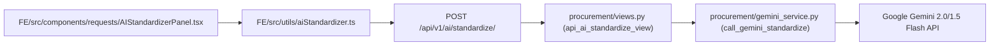

```mermaid
flowchart LR
    FE1["FE/src/pages/RequestForm.tsx\n(Giao diện Form)"] --> FE2["FE/src/hooks/useRequestForm.ts\n(Validation & State)"]
    FE2 --> FE3["FE/src/utils/procurementActions.ts\n(createRequestAction)"]
    FE3 --> FE4["FE/src/contexts/ProcurementContext.tsx\n(dispatch POST /api/v1/sync/)"]
    FE4 --> BE1["api/index.py\n(Vercel Entrypoint)"]
    BE1 --> BE2["procurement/views.py\n(api_sync_view)"]
    BE2 --> BE3["procurement/mongodb.py\n(save_state_to_cache)"]
    BE3 --> DB[("MongoDB Atlas Cloud\nprocure_state Collection")]
```

# 🎓 Hướng Dẫn Chi Tiết Triển Khai Backend & Trình Bày Giảng Viên Theo Từng User Story (ProcureAI Master BE Guide)

Tài liệu này được biên soạn chuẩn hóa nhằm hướng dẫn lập trình viên Backend (BE) nắm vững **10 User Stories**, kiến trúc kỹ thuật, liên kết yêu cầu (Requirements Traceability), ma trận dữ liệu và luồng liên kết từng tệp tin từ Frontend đến Backend. Đồng thời, tài liệu cung cấp **Bộ Kịch Bản Trình Bày Thuyết Phục Giảng Viên** giúp trả lời sắc bén mọi câu hỏi phản biện.

---

## 📌 Bảng Tổng Quan Traceability & Ước Tính Thời Gian (Est. Time Summary)

| US ID | Tên User Story | Trách Nhiệm Vai Trò | Traceability Requirements | Est. Time | Trạng Thái |
| :---: | :--- | :---: | :--- | :---: | :---: |
| **US-01** | Tạo Purchase Request hợp lệ | Employee | REQ-FR-01, REQ-FR-02, REQ-BR-01, CON-01 | 8h (1 MD) |  Hoàn thành |
| **US-02** | Theo dõi trạng thái PR | Employee | REQ-FR-04, REQ-NFR-01, CON-01 | 4h (0.5 MD) |  Hoàn thành |
| **US-03** | AI Chuẩn hóa PR & Auto-fill | Employee | REQ-FR-03, REQ-BR-01, ASM-03 | 12h (1.5 MD) |  Hoàn thành |
| **US-04** | Manager Phê duyệt & Chuyển Finance | Manager | REQ-FR-05, REQ-FR-06, REQ-BR-03, REQ-BR-04, ASM-05 | 10h (1.2 MD) |  Hoàn thành |
| **US-05** | Finance Duyệt Ngân sách & Cảnh báo | Finance | REQ-FR-08, REQ-FR-09, REQ-BR-04, REQ-BR-05 | 8h (1 MD) |  Hoàn thành |
| **US-06** | Thu thập Báo giá & Ma trận so sánh | Procurement | REQ-FR-10, REQ-FR-11, REQ-FR-12, REQ-BR-06, REQ-BR-07 | 12h (1.5 MD) |  Hoàn thành |
| **US-07** | AI Recommendation & Cảnh báo giá | Procurement | REQ-FR-13, REQ-FR-14, REQ-FR-15, REQ-BR-08, REQ-BR-09 | 14h (1.75 MD) |  Hoàn thành |
| **US-08** | Tạo Đơn đặt hàng (Purchase Order) | Procurement | REQ-FR-16, REQ-BR-10 | 8h (1 MD) |  Hoàn thành |
| **US-09** | Ghi nhận Nhận hàng (Receiving) | Procurement | REQ-FR-17, ASM-06 | 8h (1 MD) |  Hoàn thành |
| **US-10** | Khóa đơn mua sắm & Đối soát 3 bên | Finance / Admin | REQ-FR-18, REQ-BR-11, REQ-NFR-03 | 6h (0.75 MD) |  Hoàn thành |

---

## 🛠️ HƯỚNG DẪN CHI TIẾT THEO TỪNG USER STORY

---

### 1. US-01: Tạo Purchase Request Hợp Lệ (Create Purchase Request)

- **Mã User Story:** `US-01`
- **Mô tả:** *"Là Employee, tôi muốn tạo PR với các trường bắt buộc để gửi yêu cầu mua sắm hợp lệ."*
- **Liên kết Requirements (Traceability):** `REQ-FR-01`, `REQ-FR-02`, `REQ-BR-01`, `CON-01`.
- **Tiêu chí chấp nhận (Acceptance Criteria / DoD):**
  1. Bắt buộc nhập: Tiêu đề ($\ge 5$ ký tự), Category, Department, Cost Center, Budget Code, Ngày cần hàng (sau ngày hôm nay), Địa điểm giao hàng, Lý do mua sắm ($\ge 20$ ký tự), và tối thiểu 1 sản phẩm.
  2. Mỗi sản phẩm phải có tên, thông số, số lượng $>0$ và đơn giá dự toán $>0$.
  3. Không thể Submit khi thiếu trường bắt buộc.
- **Thời gian ước tính (Est. Time):** **8 Giờ** (1 Man-Day).

#### 🏗️ Cấu Trúc Backend Cần Thiết:
- **Model Django:** `PurchaseRequest`, `PRLineItem` trong [procurement/models.py](file:///d:/LTUDDN/group-01%20-%20LTUDDN/procurement/models.py).
- **Validation Rules:** [FE/src/utils/rules.ts](file:///d:/LTUDDN/group-01%20-%20LTUDDN/FE/src/utils/rules.ts) (`validatePR`).
- **REST API Endpoint:** `POST /api/v1/sync/` xử lý tạo mới PR và cập nhật MongoDB Atlas Collection `procure_state`.

#### 🔗 Cách Hoàn Thành Từ FE Đến BE Qua Từng Tệp Tin:

---

### 2. US-02: Theo Dõi Trạng Thái Purchase Request (Track PR Status)

- **Mã User Story:** `US-02`
- **Mô tả:** *"Là Employee, tôi muốn theo dõi trạng thái PR để biết yêu cầu đang ở bước nào trong quy trình."*
- **Liên kết Requirements (Traceability):** `REQ-FR-04`, `REQ-NFR-01`, `CON-01`.
- **Tiêu chí chấp nhận (Acceptance Criteria / DoD):**
  1. Hiển thị WorkflowStepper 7 bước chuẩn xác: `Request` $\rightarrow$ `Approve` $\rightarrow$ `Collect Quotations` $\rightarrow$ `Compare` $\rightarrow$ `PO` $\rightarrow$ `Receive` $\rightarrow$ `Close`.
  2. Hiển thị nhãn Badge màu tương ứng (`draft`, `pending_manager`, `finance_review`, `approved`, `supplier_selected`, `po_created`, `partially_received`, `received`, `closed`).
- **Thời gian ước tính (Est. Time):** **4 Giờ** (0.5 Man-Day).

#### 🏗️ Cấu Trúc Backend Cần Thiết:
- **Workflow State Engine:** [FE/src/utils/workflow.ts](file:///d:/LTUDDN/group-01%20-%20LTUDDN/FE/src/utils/workflow.ts) (`STATUS_META`, `workflowStates`).
- **REST API Endpoint:** `GET /api/v1/state/` Polling định kỳ 5s lấy dữ liệu mới nhất từ Cloud DB.

#### 🔗 Cách Hoàn Thành Từ FE Đến BE Qua Từng Tệp Tin:
`FE/src/components/workflow/WorkflowStepper.tsx` $\longleftarrow$ `FE/src/pages/RequestDetail.tsx` $\longleftarrow$ `FE/src/contexts/ProcurementContext.tsx` (`fetchState()`) $\longleftarrow$ `GET /api/v1/state/` $\longleftarrow$ [procurement/views.py](file:///d:/LTUDDN/group-01%20-%20LTUDDN/procurement/views.py) (`api_state_view`) $\longleftarrow$ [procurement/mongodb.py](file:///d:/LTUDDN/group-01%20-%20LTUDDN/procurement/mongodb.py) (`load_state_from_cache`).

---

### 3. US-03: AI Chuẩn Hóa PR & Tự Động Điền (AI PR Standardizer & Auto-Fill)

- **Mã User Story:** `US-03`
- **Mô tả:** *"Là Employee, tôi muốn review gợi ý AI để hoàn thiện mô tả PR bằng câu lệnh tiếng Việt tự nhiên."*
- **Liên kết Requirements (Traceability):** `REQ-FR-03`, `REQ-BR-01`, `ASM-03`.
- **Tiêu chí chấp nhận (Acceptance Criteria / DoD):**
  1. Phân tích văn bản tiếng Việt thô thành JSON chuẩn 9 trường thông tin.
  2. Phân loại chuẩn xác 6 danh mục (*Nội thất văn phòng, Thiết bị CNTT, Văn phòng phẩm, Thiết bị phòng họp, In ấn & Marketing, Phần mềm & Dịch vụ*).
  3. Khi nhấn "Use this", tự động điền toàn bộ thông tin vào Form. Người dùng có quyền sửa/bỏ qua.
- **Thời gian ước tính (Est. Time):** **12 Giờ** (1.5 Man-Days).

#### 🏗️ Cấu Trúc Backend Cần Thiết:
- **AI Integration Module:** [procurement/gemini_service.py](file:///d:/LTUDDN/group-01%20-%20LTUDDN/procurement/gemini_service.py) (Gọi Google Gemini 2.0 / 1.5 Flash API).
- **Fallback NLP Classifier:** [FE/src/utils/aiStandardizer.ts](file:///d:/LTUDDN/group-01%20-%20LTUDDN/FE/src/utils/aiStandardizer.ts) & [FE/src/data/aiCatalog.ts](file:///d:/LTUDDN/group-01%20-%20LTUDDN/FE/src/data/aiCatalog.ts).
- **REST API Endpoint:** `POST /api/v1/ai/standardize/`.

#### 🔗 Cách Hoàn Thành Từ FE Đến BE Qua Từng Tệp Tin:

---

### 4. US-04: Manager Phê Duyệt & Chuyển Finance (Manager Approval & Delegation)

- **Mã User Story:** `US-04`
- **Mô tả:** *"Là Manager, tôi muốn xem PR và Budget khả dụng trước khi đưa ra quyết định duyệt đơn."*
- **Liên kết Requirements (Traceability):** `REQ-FR-05`, `REQ-FR-06`, `REQ-BR-03`, `REQ-BR-04`, `ASM-05`.
- **Tiêu chí chấp nhận (Acceptance Criteria / DoD):**
  1. Áp dụng tắc **No Self-Approval**: Người tạo đơn không thể tự duyệt đơn của chính mình.
  2. Đơn $\le 50$ triệu VND: Manager nhấn `Approve` $\rightarrow$ Chuyển thẳng sang trạng thái `approved`.
  3. Đơn $> 50$ triệu VND (`ASM-05`): Manager nhấn `Approve & Chuyển Finance` $\rightarrow$ Tự động chuyển đơn sang trạng thái `finance_review`.
- **Thời gian ước tính (Est. Time):** **10 Giờ** (1.2 Man-Days).

#### 🏗️ Cấu Trúc Backend Cần Thiết:
- **Approval Action Engine:** [FE/src/utils/procurementActions.ts](file:///d:/LTUDDN/group-01%20-%20LTUDDN/FE/src/utils/procurementActions.ts) (`managerDecide`).
- **Guard Rules:** [FE/src/utils/rules.ts](file:///d:/LTUDDN/group-01%20-%20LTUDDN/FE/src/utils/rules.ts) (`managerGuard`, `FINANCE_THRESHOLD = 50_000_000`).

#### 🔗 Cách Hoàn Thành Từ FE Đến BE Qua Từng Tệp Tin:
`FE/src/components/approvals/DecisionPanel.tsx` $\rightarrow$ `managerDecide()` $\rightarrow$ `withAudit()` $\rightarrow$ `dispatch(POST /api/v1/sync/)` $\rightarrow$ `views.py` $\rightarrow$ `mongodb.py` (Lưu vào Cloud DB).

---

### 5. US-05: Finance Phê Duyệt Ngân Sách & Cảnh Báo Vượt Budget (Finance Budget Review)

- **Mã User Story:** `US-05`
- **Mô tả:** *"Là Finance, tôi muốn kiểm tra PR với Budget để kiểm soát chi phí doanh nghiệp."*
- **Liên kết Requirements (Traceability):** `REQ-FR-08`, `REQ-FR-09`, `REQ-BR-04`, `REQ-BR-05`.
- **Tiêu chí chấp nhận (Acceptance Criteria / DoD):**
  1. Hiển thị thông số Budget: Đã cấp (Allocated), Đã cam kết (Committed), Khả dụng (Available).
  2. Cảnh báo màu vàng khi giá trị PR vượt Budget khả dụng.
  3. Khi duyệt đơn vượt Budget, bắt buộc người dùng nhập lý do căn cứ điều chuyển ngân sách ($\ge 5$ ký tự).
  4. Cập nhật cộng dồn số tiền cam kết vào `committed` của Budget tương ứng.
- **Thời gian ước tính (Est. Time):** **8 Giờ** (1 Man-Day).

#### 🏗️ Cấu Trúc Backend Cần Thiết:
- **Budget Action Engine:** [FE/src/utils/procurementActions.ts](file:///d:/LTUDDN/group-01%20-%20LTUDDN/FE/src/utils/procurementActions.ts) (`financeDecide`, `commitBudget`).
- **Budget Check Logic:** [FE/src/utils/rules.ts](file:///d:/LTUDDN/group-01%20-%20LTUDDN/FE/src/utils/rules.ts) (`budgetCheck`, `financeGuard`).

---

### 6. US-06: Thu Thập Báo Giá & Ma Trận So Sánh (Collect Quotations & Compare)

- **Mã User Story:** `US-06`
- **Mô tả:** *"Là Procurement, tôi muốn liên kết nhiều Báo giá (Quotation) với PR để so sánh minh bạch."*
- **Liên kết Requirements (Traceability):** `REQ-FR-10`, `REQ-FR-11`, `REQ-FR-12`, `REQ-BR-06`, `REQ-BR-07`.
- **Tiêu chí chấp nhận (Acceptance Criteria / DoD):**
  1. Chỉ thực hiện khi PR ở bước `approved`. Thu thập tối thiểu 2 báo giá (`MIN_QUOTATIONS = 2`).
  2. Hỗ trợ tệp đính kèm dạng PDF hoặc Excel (`.pdf`, `.xlsx`, `.xls`).
  3. Lập ma trận so sánh từng dòng đơn giá, thuế VAT, phí vận chuyển, tổng tiền, thời gian giao hàng và thời hạn bảo hành.
- **Thời gian ước tính (Est. Time):** **12 Giờ** (1.5 Man-Days).

#### 🏗️ Cấu Trúc Backend Cần Thiết:
- **Quotation Action Engine:** [FE/src/utils/procurementActions.ts](file:///d:/LTUDDN/group-01%20-%20LTUDDN/FE/src/utils/procurementActions.ts) (`addQuotation`, `updateQuotation`, `confirmQuotation`).
- **Comparison UI Component:** [FE/src/components/sourcing/ComparisonMatrix.tsx](file:///d:/LTUDDN/group-01%20-%20LTUDDN/FE/src/components/sourcing/ComparisonMatrix.tsx).

---

### 7. US-07: AI Extraction Review & Recommendation Engine (AI Sourcing Scoring)

- **Mã User Story:** `US-07`
- **Mô tả:** *"Là Procurement, tôi muốn review dữ liệu AI trích xuất và xem đề xuất AI để chọn NCC tối ưu."*
- **Liên kết Requirements (Traceability):** `REQ-FR-13`, `REQ-FR-14`, `REQ-FR-15`, `REQ-BR-08`, `REQ-BR-09`.
- **Tiêu chí chấp nhận (Acceptance Criteria / DoD):**
  1. Cho phép bấm "Xem file gốc" để đối chiếu chứng từ gốc trong `SourceFileDialog.tsx`.
  2. **Công thức AI Recommendation Matrix:**
     $$\text{Score} = (S_{\text{Price}} \times 60\%) + (S_{\text{Delivery}} \times 20\%) + (S_{\text{Warranty}} \times 20\%) - P_{\text{Anomaly}}$$
  3. Cảnh báo & Trừ 10 điểm Penalty ($P_{\text{Anomaly}} = 10$) nếu đơn giá cao hơn $\ge 20\%$ so với lịch sử giá tham chiếu (`ANOMALY_THRESHOLD = 0.2`).
  4. Tuân thủ tắc **Human-in-the-loop (`REQ-BR-08`)**: AI chỉ gợi ý, Procurement tự bấm chọn NCC. Nếu chọn khác AI, bắt buộc nhập lý do.
- **Thời gian ước tính (Est. Time):** **14 Giờ** (1.75 Man-Days).

#### 🏗️ Cấu Trúc Backend Cần Thiết:
- **Scoring Engine:** [FE/src/utils/rules.ts](file:///d:/LTUDDN/group-01%20-%20LTUDDN/FE/src/utils/rules.ts) (`recommend`, `quotationAnomalies`, `lineAnomaly`).
- **Price History Reference:** [FE/src/data/priceReferences.ts](file:///d:/LTUDDN/group-01%20-%20LTUDDN/FE/src/data/priceReferences.ts).

---

### 8. US-08: Tạo Đơn Đặt Hàng Purchase Order (PO Creation)

- **Mã User Story:** `US-08`
- **Mô tả:** *"Là Procurement, tôi muốn tạo PO từ PR đã duyệt và Supplier đã được chọn."*
- **Liên kết Requirements (Traceability):** `REQ-FR-16`, `REQ-BR-10`.
- **Tiêu chí chấp nhận (Acceptance Criteria / DoD):**
  1. PO chỉ được tạo sau khi PR đã `approved` và đã chọn Supplier (`supplier_selected`).
  2. Khóa không cho sửa thông tin báo giá đã chọn khi tạo PO (`ASM-04`).
  3. Cấp mã PO tự động chuẩn dạng `PO-2026-XXXX`.
- **Thời gian ước tính (Est. Time):** **8 Giờ** (1 Man-Day).

#### 🏗️ Cấu Trúc Backend Cần Thiết:
- **PO Engine:** [FE/src/utils/procurementActions.ts](file:///d:/LTUDDN/group-01%20-%20LTUDDN/FE/src/utils/procurementActions.ts) (`createPO`).
- **PO Detail Page:** `FE/src/pages/PODetail.tsx`.

---

### 9. US-09: Ghi Nhận Nhận Hàng (Receiving & Partial Delivery)

- **Mã User Story:** `US-09`
- **Mô tả:** *"Là người có quyền, tôi muốn ghi nhận Receiving và các sai lệch thực tế."*
- **Liên kết Requirements (Traceability):** `REQ-FR-17`, `ASM-06`.
- **Tiêu chí chấp nhận (Acceptance Criteria / DoD):**
  1. Phân quyền: Chỉ `procurement` có cờ `canReceive: true` mới được ghi nhận.
  2. Hỗ trợ nhận đủ (Full) hoặc nhận làm nhiều đợt (Partial).
  3. Tổng số lượng nhận không được vượt quá số lượng trên PO (`ASM-06`).
- **Thời gian ước tính (Est. Time):** **8 Giờ** (1 Man-Day).

#### 🏗️ Cấu Trúc Backend Cần Thiết:
- **Receiving Action Engine:** [FE/src/utils/procurementActions.ts](file:///d:/LTUDDN/group-01%20-%20LTUDDN/FE/src/utils/procurementActions.ts) (`recordReceiving`).
- **Receiving Progress Calculation:** [FE/src/utils/rules.ts](file:///d:/LTUDDN/group-01%20-%20LTUDDN/FE/src/utils/rules.ts) (`receivingProgress`, `receivedByItem`).

---

### 10. US-10: Khóa Đơn Mua Sắm & Đối Soát 3 Bên (Close PR & 3-Way Reconcile)

- **Mã User Story:** `US-10`
- **Mô tả:** *"Là Finance / Admin, tôi muốn Close PR sau khi các bước mua sắm và đối soát hoàn tất."*
- **Liên kết Requirements (Traceability):** `REQ-FR-18`, `REQ-BR-11`, `REQ-NFR-03`.
- **Tiêu chí chấp nhận (Acceptance Criteria / DoD):**
  1. Kiểm tra đối soát 3 bên: **PR (Nhu cầu) ↔ PO (Đặt hàng) ↔ Receiving (Thực nhận)**.
  2. Từ chối Close nếu Receiving chưa đạt 100% hoặc PO chưa được đánh dấu `reconciled`.
  3. Khi Close, lưu vết Audit Log hoàn chỉnh toàn bộ vòng đời đơn.
- **Thời gian ước tính (Est. Time):** **6 Giờ** (0.75 Man-Day).

#### 🏗️ Cấu Trúc Backend Cần Thiết:
- **Close & Reconcile Engine:** [FE/src/utils/procurementActions.ts](file:///d:/LTUDDN/group-01%20-%20LTUDDN/FE/src/utils/procurementActions.ts) (`closePR`, `reconcilePO`).
- **Blocker Checking:** [FE/src/utils/rules.ts](file:///d:/LTUDDN/group-01%20-%20LTUDDN/FE/src/utils/rules.ts) (`closeBlockers`).

---

## 🎤 BỘ KỊCH BẢN TRÌNH BÀY THUYẾT PHỤC GIẢNG VIÊN (DEFENSE GUIDE)

### ❓ Câu Hỏi 1: *"Tại sao ứng dụng lại chạy Serverless trên Vercel mà vẫn đồng bộ dữ liệu Realtime giữa 5 vai trò được?"*
> **🎯 Cách Trả Lời Thuyết Phục:**
> *"Thưa Thầy/Cô, do Vercel Serverless Functions là mô hình Ephemeral Containers (mỗi API request có thể chạy trên một container tạm thời khác nhau), nhóm em đã xây dựng kiến trúc **Single Source of Truth tập trung trên Cloud với MongoDB Atlas Database**. Khi bất kỳ vai trò nào thao tác (ví dụ: Employee tạo đơn), Client gửi `POST /api/v1/sync/` ghi trực tiếp bản ghi vào CSDL Cloud. Các trình duyệt khác duy trì cơ chế **Smart Polling 5s** gọi `GET /api/v1/state/` để nạp dữ liệu mới nhất và thực hiện hợp nhất trạng thái thông minh (Smart State Merging), đảm bảo dữ liệu luôn đồng bộ 100% thời gian thực."*

---

### ❓ Câu Hỏi 2: *"AI đóng vai trò gì trong hệ thống? Liệu AI có tự quyết định thay con người không?"*
> **🎯 Cách Trả Lời Thuyết Phục:**
> *"Thưa Thầy/Cô, hệ thống tuân thủ triệt để nguyên tắc **Human-in-the-loop (`REQ-BR-08`, `ASM-03`)**: AI chỉ đóng vai trò **Trợ lý hỗ trợ (Decision Support)**, hoàn toàn không tự quyền phê duyệt hay tự chọn nhà cung cấp. 
> - **Ở bước Tạo đơn (US-03):** AI dùng Gemini 2.0/1.5 Flash trích xuất câu lệnh ngôn ngữ tự nhiên thành Form 9 trường, nhưng người dùng vẫn có quyền sửa hoặc bỏ qua khi bấm 'Use this'.
> - **Ở bước Sourcing (US-07):** AI tự động tính ma trận điểm số (Giá 60%, Giao hàng 20%, Bảo hành 20%, trừ 10 điểm nếu đơn giá cao $\ge 20\%$ so với lịch sử) để **gợi ý (Recommendation)**, nhưng Chuyên viên Thu mua (Procurement) mới là người nhấn nút chọn NCC cuối cùng."*

---

### ❓ Câu Hỏi 3: *"Cơ chế Phân quyền (RBAC) và Quy tắc duyệt 50 triệu được cài đặt ở đâu?"*
> **🎯 Cách Trả Lời Thuyết Phục:**
> *"Thưa Thầy/Cô, hệ thống phân quyền 5 vai trò dựa trên bảng ma trận quyền tại `FE/src/utils/permissions.ts`. Quy tắc duyệt 50 triệu được quy định tại `FE/src/utils/rules.ts` (`FINANCE_THRESHOLD = 50_000_000`). 
> - Đối với đơn $\le 50$ triệu: Manager phê duyệt trực tiếp là hoàn tất.
> - Đối với đơn $> 50$ triệu (`ASM-05`): Nút Approve của Manager được nâng cấp thành **'Approve & Chuyển Finance'**, vừa ghi nhận Manager duyệt vừa tự động chuyển đơn sang bước `finance_review` để Kế toán duyệt tiếp."*

---

### ❓ Câu Hỏi 4: *"Lỡ API Gemini bị nghẽn mạng hoặc hết Quota thì hệ thống xử lý thế nào?"*
> **🎯 Cách Trả Lời Thuyết Phục:**
> *"Thưa Thầy/Cô, hệ thống thiết kế cơ chế **Fallback 3 lớp** đảm bảo trải nghiệm không bao giờ bị gián đoạn:
> 1. Trực tiếp gọi Gemini 2.0 / 1.5 Flash API qua Backend Django ([gemini_service.py](file:///d:/LTUDDN/group-01%20-%20LTUDDN/procurement/gemini_service.py)).
> 2. Nếu Gemini API gặp sự cố, hệ thống chuyển sang **Bộ phân tích NLP quy tắc nội bộ** ([aiStandardizer.ts](file:///d:/LTUDDN/group-01%20-%20LTUDDN/FE/src/utils/aiStandardizer.ts)) tự động nhận diện từ khóa của 6 nhóm danh mục.
> 3. Người dùng vẫn luôn có thể tự nhập dữ liệu thủ công bình thường mà không bị phụ thuộc vào AI."*

---

### ❓ Câu Hỏi 5: *"Quy trình mua sắm có thể nhảy cóc từ Tạo đơn sang Tạo PO luôn được không?"*
> **🎯 Cách Trả Lời Thuyết Phục:**
> *"Thưa Thầy/Cô, không thể nhảy cóc. Hệ thống cưỡng chế thứ tự quy trình nghiêm ngặt theo **Business Constraint `CON-01`**:
> $$\text{Request} \longrightarrow \text{Approve} \longrightarrow \text{Collect Quotations} \longrightarrow \text{Compare} \longrightarrow \text{PO} \longrightarrow \text{Receive} \longrightarrow \text{Close}$$
> Mọi hàm xử lý nghiệp vụ tại `procurementActions.ts` đều kiểm tra điều kiện đầu vào (`pr.status === 'approved'`, `pr.status === 'supplier_selected'`,...). Nếu chưa qua bước Approve hoặc chưa chọn Supplier thì hàm `createPO` sẽ báo lỗi ngay lập tức."*
